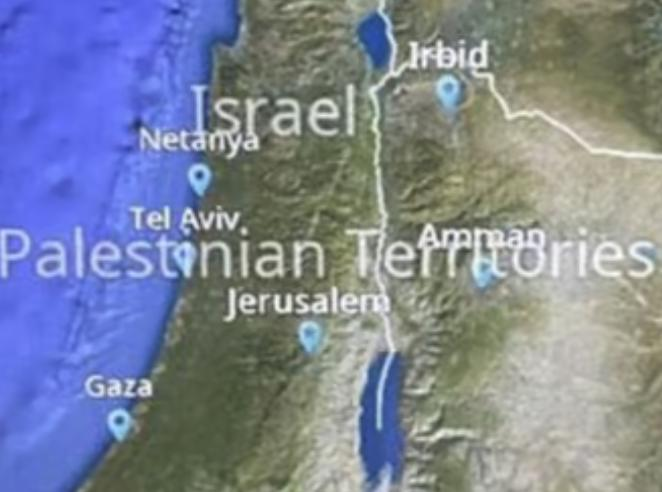

## Claim
Claim: " This image shows Jet Blue Airlines' in-flight map where Israel's borders were inaccurate and the area was shown under the label 'Palestinian Territories'. The indicent occured in September 2024."

## Actions
```
web_search("JetBlue in-flight map Israel Palestinian Territories")
reverse_search()
```

## Evidence
### Evidence from `web_search`
JetBlue Airways changed Israel's borders and labeled the area as "Palestinian Territories" on its in-flight map, which sparked outrage. The incident, which occurred in September 2024, was reported by The Jerusalem Post ([https://www.jpost.com/diaspora/article-818656](https://www.jpost.com/diaspora/article-818656)). JetBlue stated that the map app was provided by a third-party company and apologized, announcing a policy change.

Ynet News ([https://www.ynetnews.com/travel/article/bjgp0065hc](https://www.ynetnews.com/travel/article/bjgp0065hc)) also discussed the incident. View from the Wing ([https://viewfromthewing.com/jetblue-fires-seat-back-map-vendor-for-obliterating-israel/](https://viewfromthewing.com/jetblue-fires-seat-back-map-vendor-for-obliterating-israel/)) reported that JetBlue decided to switch to a new map vendor. , , , , 


## Elaboration
The evidence confirms the claim. JetBlue did change Israel's borders and labeled the area as "Palestinian Territories" on its in-flight map. The incident occurred in September 2024 and was reported by The Jerusalem Post. JetBlue apologized and announced a policy change.


## Final Judgement
The claim is accurate. Multiple reliable sources confirm that JetBlue's in-flight map inaccurately depicted Israel's borders and labeled the area as "Palestinian Territories" in September 2024.

`true`

### Verdict: TRUE

### Justification
The claim is accurate. Multiple sources, including The Jerusalem Post ([https://www.jpost.com/diaspora/article-818656](https://www.jpost.com/diaspora/article-818656)), confirm that JetBlue's in-flight map inaccurately depicted Israel's borders and labeled the area as "Palestinian Territories" in September 2024. JetBlue apologized and announced a policy change.
