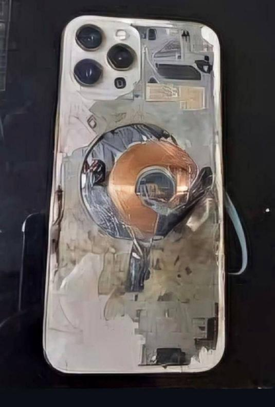

## Claim
Claim: " This image shows an Iphone that exploded during the pager attacks on Hezbollah devices in Lebanon in September 2024, blowing up random people."

## Actions
```
reverse_search()
web_search("Hezbollah Lebanon September 2024 phone explosion")
```

## Evidence
### Evidence from `reverse_search`
The image 

### Evidence from `web_search`
The web sources discuss the 2024 Lebanon electronic device attacks, which occurred in September 2024. The attacks involved explosions of pagers and walkie-talkies, resulting in numerous casualties. The attacks were attributed to Israel and targeted Hezbollah members. The first wave of explosions on September 17, 2024, targeted pagers, killing at least 12 people and injuring over 2,750. The second wave on September 18, 2024, targeted walkie-talkies, killing at least 30 people and injuring over 750.

One source mentions that 

## Elaboration
The evidence indicates that the attacks in Lebanon in September 2024 involved explosions of pagers and walkie-talkies, not iPhones. The image shows an iPhone, but there is no evidence to support the claim that it exploded during the attacks. The attacks targeted Hezbollah members, and the claim states that random people were blown up.

The claim is not supported by the evidence.


## Final Judgement
The provided evidence indicates that the attacks in Lebanon in September 2024 involved explosions of pagers and walkie-talkies, not iPhones. The image shows an iPhone, but there is no evidence to support the claim that it exploded during the attacks. The attacks targeted Hezbollah members, and the claim states that random people were blown up.

`false`

### Verdict: FALSE

### Justification
The claim is false. While there were attacks in Lebanon in September 2024, they involved explosions of pagers and walkie-talkies, not iPhones. The image depicts an iPhone, but there is no evidence to support the claim that it exploded during the attacks.
