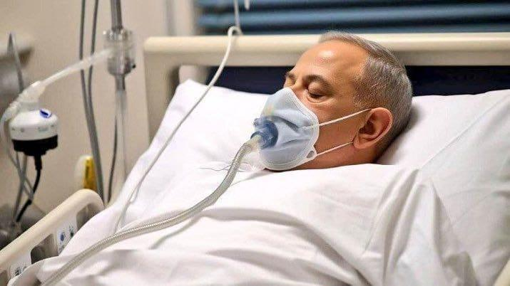

## Claim
Claim: " This is an authentic image of Benjamin Netanyahu being hospitalized in Tel Aviv in November 2024 due to a serious health issue."

## Actions
```
reverse_search()
web_search("Benjamin Netanyahu hospitalized November 2024")
```

## Evidence
### Evidence from `reverse_search`
The image () has been identified as potentially fake and AI-generated, according to PesaCheck ([https://pesacheck.org/fake-this-image-claiming-to-show-israeli-pm-benjamin-netanyahu-admitted-in-hospital-isnt-24197dac209e](https://pesacheck.org/fake-this-image-claiming-to-show-israeli-pm-benjamin-netanyahu-admitted-in-hospital-isnt-24197dac209e)). The image was shared with the claim that it shows Benjamin Netanyahu in a hospital bed in November 2024.

Webangah News Hub ([https://en.webangah.ir/2024-12-30/news=240102/](https://en.webangah.ir/2024-12-30/news=240102/)) and Dearborn.org ([https://dearborn.org/preview/officially-after-surgery-netanyahu-has-prostate-cancer-63813](https://dearborn.org/preview/officially-after-surgery-netanyahu-has-prostate-cancer-63813)) also feature the image, reporting on Netanyahu's prostate surgery and cancer diagnosis.


### Evidence from `web_search`
An article from Buffalo.edu, published on November 20, 2024, discusses an AI-generated image falsely claiming Benjamin Netanyahu was hospitalized, and mentions AFP Fact Check debunking the image. ([https://www.buffalo.edu/ai-data-science/news-events/news.host.html/content/shared/engineering/home/articles/media-mentions/2024-media-coverage/ai-generated-image-used-to-falsely-claim-netanyahu-hospitalized.detail.html](https://www.buffalo.edu/ai-data-science/news-events/news.host.html/content/shared/engineering/home/articles/media-mentions/2024-media-coverage/ai-generated-image-used-to-falsely-claim-netanyahu-hospitalized.detail.html))

CNN reports that Benjamin Netanyahu left a Jerusalem hospital on December 31, 2024, after prostate removal surgery.  is not present in the search result. ([https://www.cnn.com/2024/12/31/middleeast/netanyahu-hospital-prostate-budget-bill-intl-latam](https://www.cnn.com/2024/12/31/middleeast/netanyahu-hospital-prostate-budget-bill-intl-latam))


## Elaboration
The image is likely fake or AI-generated, as indicated by PesaCheck and the University at Buffalo. The image was used to falsely claim Netanyahu was hospitalized in November 2024.

While Netanyahu did undergo prostate surgery in December 2024, the CNN report does not include the image.


## Final Judgement
The image is likely fake or AI-generated, and was used to falsely claim Benjamin Netanyahu was hospitalized in November 2024. While Netanyahu did undergo prostate surgery in December 2024, the provided image is not associated with that event in reliable sources.

`false`

### Verdict: FALSE

### Justification
The claim is false. The image in question has been identified as potentially fake or AI-generated, and was used to falsely claim Benjamin Netanyahu was hospitalized in November 2024, as reported by PesaCheck ([https://pesacheck.org/fake-this-image-claiming-to-show-israeli-pm-benjamin-netanyahu-admitted-in-hospital-isnt-24197dac209e](https://pesacheck.org/fake-this-image-claiming-to-show-israeli-pm-benjamin-netanyahu-admitted-in-hospital-isnt-24197dac209e)) and the University at Buffalo ([https://www.buffalo.edu/ai-data-science/news-events/news.host.html/content/shared/engineering/home/articles/media-mentions/2024-media-coverage/ai-generated-image-used-to-falsely-claim-netanyahu-hospitalized.detail.html](https://www.buffalo.edu/ai-data-science/news-events/news.host.html/content/shared/engineering/home/articles/media-mentions/2024-media-coverage/ai-generated-image-used-to-falsely-claim-netanyahu-hospitalized.detail.html)). While Netanyahu did have surgery in December 2024, the image is not associated with that event in reliable sources.
