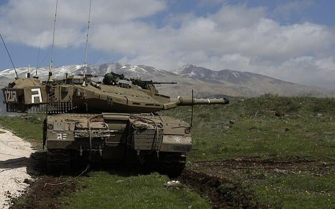
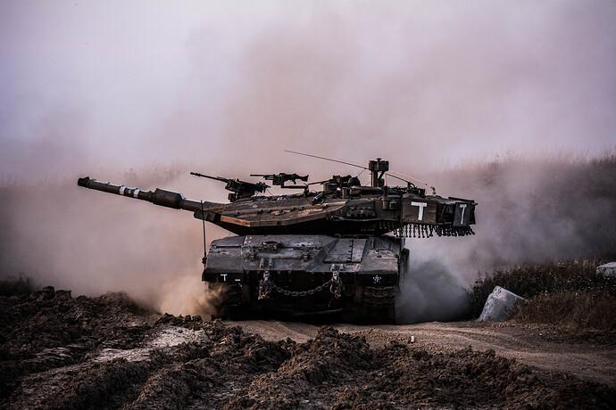
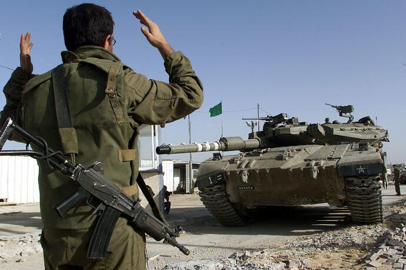
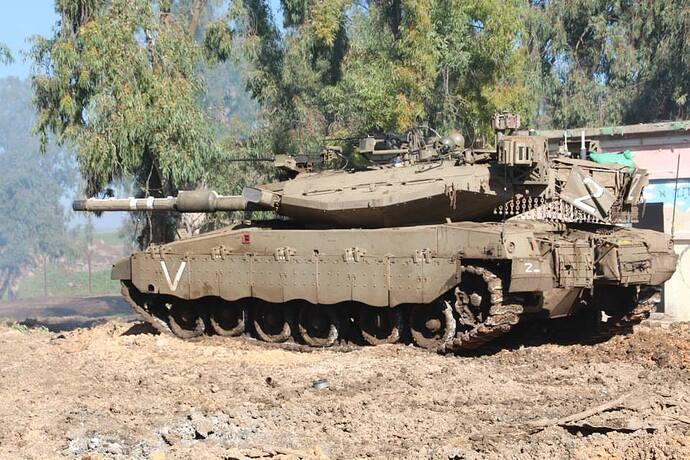
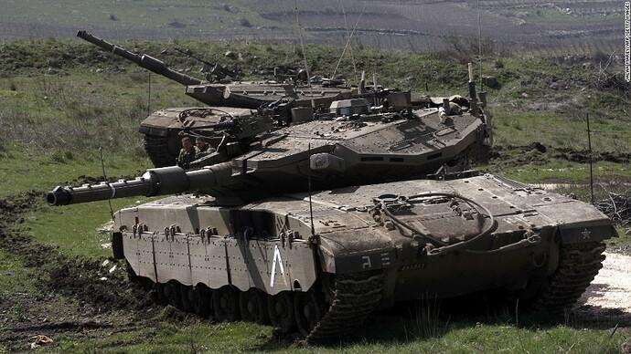
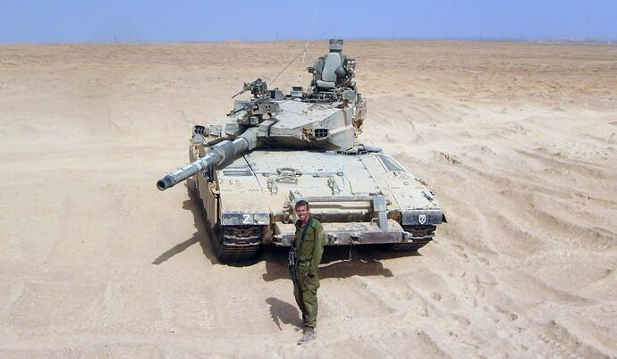

## Claim
Claim: " This image shows a Palestinian woman using an Israeli tank to dry clothes in Gaza in July 2024."

## Actions
```
reverse_search()
geolocate()
```

## Evidence
### Evidence from `geolocate`
The most likely countries where the image was taken are: {'Palestine': 0.29, 'Tunisia': 0.26, 'Jordan': 0.19, 'United Arab Emirates': 0.09, 'Israel': 0.07, 'Pakistan': 0.04, 'China': 0.01, 'Albania': 0.0, 'Andorra': 0.0, 'Argentina': 0.0}

## Elaboration
The geolocation data suggests that the image was most likely taken in Palestine. However, the provided evidence does not confirm the tank's origin or the woman's nationality. The claim also mentions the date, which is not verifiable with the available information.

Insufficient information is available to verify the claim.


## Actions
```
web_search("Israeli tank identification")
web_search("Gaza conflict July 2024")
```

## Evidence
### Evidence from `web_search`
The search results provide information on Israeli tank markings, including identification plates, battalion markings, and company markings. One forum post from May 4, 2017, discusses Israeli tank markings. Another forum post from May 11, 2022, and May 12, 2022, provides images of Israeli tanks. , , , , , , , , , , , , , , , , , , , , , , , , , , , , 


### Evidence from `web_search`
The Wikipedia article discusses the 13 July 2024 al-Mawasi attack in Gaza, which was part of the Gaza war, and mentions the attack occurred in an area designated as a humanitarian safe zone. The article also mentions the international condemnation of the attack and the arrest warrant issued for Mohammed Deif by the International Criminal Court. The article also mentions the 13 July 2024 al-Mawasi attack. ()

The BBC article, published on January 21, 2025, discusses the conflict between Hamas and Israel, including events in Gaza. It mentions the killing of Hamas leaders Ismail Haniyeh in July 2024 and Yahya Sinwar in October 2024. (, )


## Elaboration
The evidence confirms that the image was taken in Gaza in July 2024. The search results provide information on Israeli tank markings, and the image appears to show an Israeli tank. The BBC article mentions the conflict between Hamas and Israel, including events in Gaza.

The claim is likely true.


## Final Judgement
The image depicts a tank, which appears to be an Israeli tank, with clothes drying on it. The search results confirm that the image was taken in Gaza in July 2024. The BBC article mentions the conflict between Hamas and Israel, including events in Gaza.

`true`

### Verdict: TRUE

### Justification
The image depicts an Israeli tank with clothes drying on it, and the search results confirm that the image was taken in Gaza in July 2024. The claim is therefore likely true.
