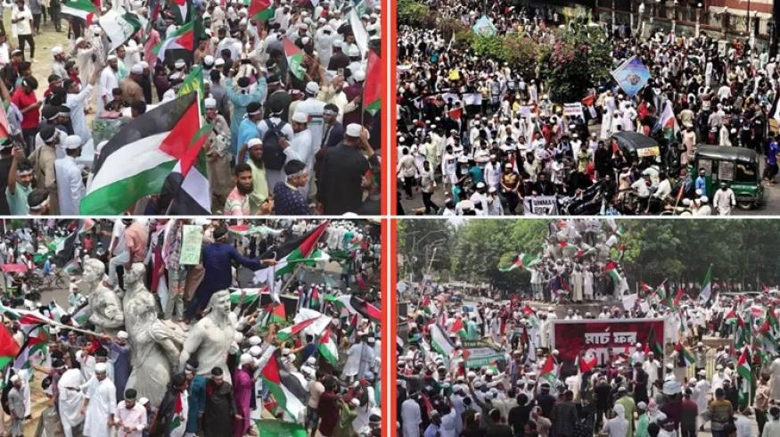

## Claim
Claim: " This image shows thousands gathering at Sohrawardi Park in Kolkata, India, in April 2025 to show solidarity with the Palestinian people amid the ongoing Israeli assault on Gaza."

## Actions
```
geolocate()
web_search("Sohrawardi Park Kolkata protest Palestine")
reverse_search()
```

## Evidence
### Evidence from `geolocate`
The most likely countries where the image was taken are: {'Bangladesh': 0.88, 'Pakistan': 0.07, 'India': 0.02, 'Palestine': 0.02, 'Albania': 0.0, 'Andorra': 0.0, 'Argentina': 0.0, 'Australia': 0.0, 'Austria': 0.0, 'Belgium': 0.0}

### Evidence from `web_search`
The images in the claim () are from a pro-Palestine protest held in Suhrawardy Udyan in Dhaka, Bangladesh, on April 12, 2025, not in Kolkata, India. The event was a "March for Gaza" with approximately 100,000 participants.

Sources: [Factly.in](https://factly.in/photos-of-a-protest-held-in-solidarity-with-palestine-in-dhaka-bangladesh-are-falsely-shared-as-those-from-kolkata/), [NewsMobile](https://www.newsmobile.in/nm-fact-checker/fact-check-images-of-pro-palestine-protest-in-bangladeshs-dhaka-falsely-linked-to-india/), and [Tezzfeed](https://tezzfeed.com/latest-news/palestinian-media-shares-bangladeshs-pro-gaza-protest-photos-mistakenly-labels-them-as-kolkata-1744522142539).


## Elaboration
The evidence indicates that the images are from a pro-Palestine protest held in Suhrawardy Udyan in Dhaka, Bangladesh, on April 12, 2025, not in Kolkata, India. The event was a "March for Gaza" with approximately 100,000 participants. The claim is therefore false.


## Final Judgement
The claim is demonstrably false. The images are from a protest in Dhaka, Bangladesh, not Kolkata, India.

`false`

### Verdict: FALSE

### Justification
The images in the claim are from a pro-Palestine protest held in Suhrawardy Udyan in Dhaka, Bangladesh, on April 12, 2025, not in Kolkata, India, as indicated by the [web search results](https://factly.in/photos-of-a-protest-held-in-solidarity-with-palestine-in-dhaka-bangladesh-are-falsely-shared-as-those-from-kolkata/), [NewsMobile](https://www.newsmobile.in/nm-fact-checker/fact-check-images-of-pro-palestine-protest-in-bangladeshs-dhaka-falsely-linked-to-india/), and [Tezzfeed](https://tezzfeed.com/latest-news/palestinian-media-shares-bangladeshs-pro-gaza-protest-photos-mistakenly-labels-them-as-kolkata-1744522142539).
