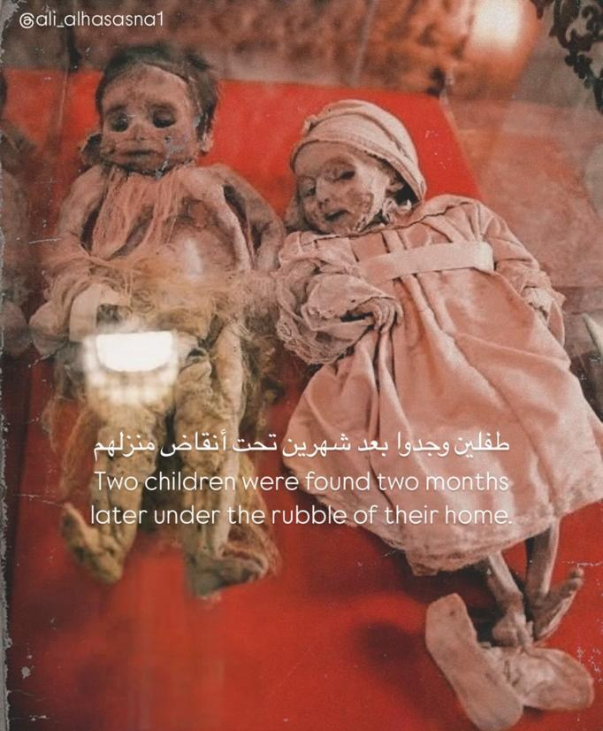

## Claim
Claim: " This image shows two children in Gaza in April 2025 found dead under the rubble of their home two months after an Israeli airstrike destroyed it."

## Actions
```
reverse_search()
web_search("children found under rubble Gaza")
```

## Evidence
### Evidence from `reverse_search`
From [Source](https://kashif.ps/en/index.php/2025/04/14/image-of-two-mummified-children-in-a-bolivian-museum-goes-viral-as-from-gaza/): Found exact image on website with title: Image of two mummified children in a Bolivian museum goes viral as ...
Content: The image in the claim shows two mummified children from a Bolivian museum, not children found under the rubble in Gaza. The image was posted on Instagram with the caption "Two children found two months later under the rubble of their home." The article was published on April 14, 2025, by Nadeen. , , .


### Evidence from `web_search`
The web sources discuss the situation of children in Gaza. Reliefweb ([https://reliefweb.int/report/occupied-palestinian-territory/gazas-missing-children-over-20000-children-estimated-be-lost-disappeared-detained-buried-under-rubble-or-mass-graves-0](https://reliefweb.int/report/occupied-palestinian-territory/gazas-missing-children-over-20000-children-estimated-be-lost-disappeared-detained-buried-under-rubble-or-mass-graves-0)) estimates that approximately 4,000 children are missing under the rubble, and over 14,000 children have been killed since October. Save the Children ([https://www.savethechildren.net/gaza-missing-children](https://www.savethechildren.net/gaza-missing-children)) reports at least 10,000 people missing under the rubble, with an estimated 5,160 children dead under the rubble.

The BBC News article ([https://www.bbc.com/news/world-middle-east-67614139](https://www.bbc.com/news/world-middle-east-67614139)) discusses children in Gaza who have lost their families and includes images of injured children. The image 

## Elaboration
The image in the claim is of mummified children from a Bolivian museum, not children found in Gaza. The reverse image search confirms this, citing an article that identifies the image's origin. The web search provides information about the situation of children in Gaza, but it does not relate to the image in the claim.

Therefore, the claim is false.


## Final Judgement
The image in the claim depicts mummified children from a Bolivian museum, not children found in Gaza. The reverse image search confirms this, identifying the image's origin. The claim misrepresents the image's context. `false`

### Verdict: FALSE

### Justification
The image in the claim, which purports to show children found in Gaza, actually depicts mummified children from a Bolivian museum, as confirmed by a reverse image search ([Source](https://kashif.ps/en/index.php/2025/04/14/image-of-two-mummified-children-in-a-bolivian-museum-goes-viral-as-from-gaza/)). Therefore, the claim is false.
