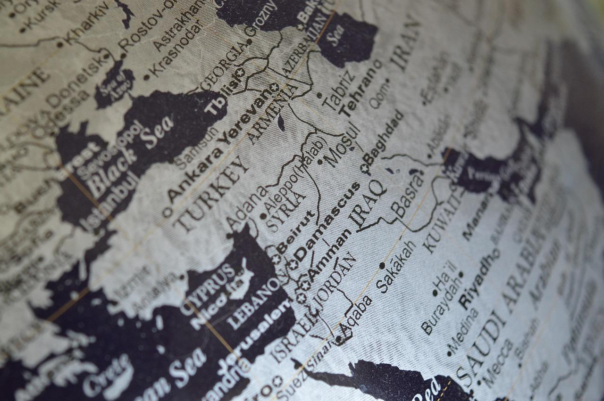

## Claim
Claim: "The Huthi rebels announced the final cessation of their military operations in international waters after Trump won the 2024 US presidential election."

## Actions
```
web_search("Huthi rebels military operations international waters cessation Trump 2024")
```

## Evidence
### Evidence from `web_search`
The 2025 United States–Houthi ceasefire, which took effect on May 6, 2025, ended the March–May 2025 United States attacks in Yemen and US–UK airstrikes on Yemen, according to a Wikipedia article (<image:k> - [Source](https://en.wikipedia.org/wiki/2025_United_States%E2%80%93Houthi_ceasefire)). The ceasefire was brokered by Oman. An article from the Arab Center Washington DC discusses a ceasefire deal between the US and the Houthis, announced by Donald Trump on May 6, 2025, where the Houthis agreed not to target American ships in the Red Sea in exchange for the US ceasing attacks on them (<image:k> - [Source](https://arabcenterdc.org/resource/implications-of-the-us-houthi-ceasefire-deal/)). The Associated Press reports that Donald Trump ordered airstrikes against Houthi-held areas in Yemen ([Source](https://apnews.com/article/trump-yemen-houthis-airstrikes-iran-explainer-06e5676098543ebab53a0cdeefd83731)).


## Elaboration
The evidence indicates that a ceasefire between the US and the Houthis was announced on May 6, 2025, after Donald Trump ordered airstrikes against Houthi-held areas in Yemen. The Houthis agreed not to target American ships in the Red Sea in exchange for the US ceasing attacks on them. The evidence does not explicitly state that the cessation of military operations in international waters was the *final* one.

The provided sources do not mention the cessation of Houthi military operations in international waters. The Arab Center DC article focuses on the ceasefire deal, and the Wikipedia article mentions the ceasefire ending US attacks in Yemen and US-UK airstrikes.

The claim is partially supported by the evidence, as a ceasefire was agreed upon. However, the evidence does not fully support the claim because it does not explicitly mention the final cessation of military operations in international waters.


## Actions
```
web_search("Huthi rebels military operations international waters cessation")
```

## Evidence
### Evidence from `web_search`
The Wikipedia article on the Red Sea crisis ([Source](https://en.wikipedia.org/wiki/Red_Sea_crisis)) mentions the 2025 United States–Houthi ceasefire, which took effect on May 6, 2025, and ended the March–May 2025 United States attacks in Yemen (<image:k>). An AOL fact-check article ([Source](https://www.aol.com/fact-check-no-houthis-not-140600882.html)) from November 13, 2024, states that the claim that Houthi rebels ceased operations in international waters after Trump won the 2024 election is false. The article cites a viral post on X making this claim and provides evidence, including a statement from a Houthi spokesperson, indicating that the group is still operating in international waters ().

A JURIST article ([Source](https://www.jurist.org/news/2025/07/houthi-attacks-on-red-sea-cargo-condemned-as-war-crimes/)) discusses Houthi attacks on Red Sea shipping, which Human Rights Watch (HRW) condemned as war crimes (). HRW called for the immediate cessation of these attacks.


## Elaboration
The evidence contradicts the claim. An AOL fact-check article from November 13, 2024, states that the claim is false, citing a Houthi spokesperson's statement indicating continued operations in international waters. Additionally, a JURIST article discusses Houthi attacks on Red Sea shipping, which Human Rights Watch condemned as war crimes, further indicating that military operations were ongoing.


## Final Judgement
The fact-check reveals conflicting information. While a ceasefire was agreed upon, the evidence indicates that Houthi operations in international waters continued. An AOL fact-check explicitly states the claim is false, and a JURIST article discusses ongoing Houthi attacks.

`false`


### Verdict: FALSE

### Justification
The claim is false. An [AOL fact-check](https://www.aol.com/fact-check-no-houthis-not-140600882.html) from November 13, 2024, explicitly states that the claim is false, citing a Houthi spokesperson's statement indicating continued operations in international waters. Furthermore, a [JURIST article](https://www.jurist.org/news/2025/07/houthi-attacks-on-red-sea-cargo-condemned-as-war-crimes/) discusses ongoing Houthi attacks on Red Sea shipping, which Human Rights Watch condemned as war crimes.
