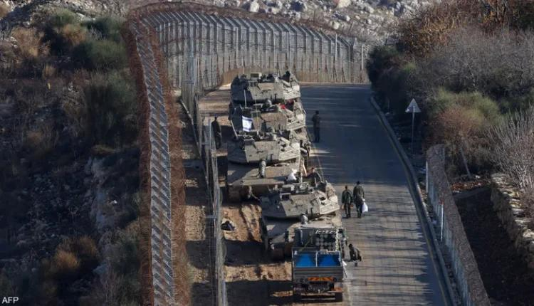

## Claim
Claim: " This image shows the Israeli army reaching Damascus in Syria in December 2024."

## Actions
```
reverse_search()
geolocate()
web_search("Israeli army tanks Damascus Syria")
```

## Evidence
### Evidence from `reverse_search`
The image () appears in multiple articles. One article from the Chicago Council on Global Affairs, discusses Russian views on the Israeli-Palestinian conflict, but does not specify the location of the image. Another article from NBC News, published on October 30, 2023, discusses a video that appears to show an Israeli tank firing at a car in Gaza. An article from ABC News, published on October 12, 2023, discusses an anticipated ground invasion into Gaza by the Israeli army.

The sources are: [https://globalaffairs.org/commentary-and-analysis/blogs/russian-youth-more-favorable-toward-israel-older-generations](https://globalaffairs.org/commentary-and-analysis/blogs/russian-youth-more-favorable-toward-israel-older-generations), [https://www.nbcnews.com/news/world/israel-hamas-war-tank-fires-at-car-gaza-strip-rcna122801](https://www.nbcnews.com/news/world/israel-hamas-war-tank-fires-at-car-gaza-strip-rcna122801), and [https://www.abc.net.au/news/2023-10-13/israeli-to-confront-resilient-foe-in-anticipated-gaza-invasion/102971722](https://www.abc.net.au/news/2023-10-13/israeli-to-confront-resilient-foe-in-anticipated-gaza-invasion/102971722).


### Evidence from `geolocate`
The most likely countries where the image was taken are: {'Israel': 0.78, 'Palestine': 0.2, 'Jordan': 0.01, 'Albania': 0.0, 'Andorra': 0.0, 'Argentina': 0.0, 'Australia': 0.0, 'Austria': 0.0, 'Bangladesh': 0.0, 'Belgium': 0.0}

### Evidence from `web_search`
The North Press Agency reported on August 30, 2025, that Israeli forces entered the village of al-Asha in the Quneitra countryside, southern Syria (). Wikipedia discusses the Israeli invasion of Syria (2024–present), stating that on December 8, 2024, Israeli armored units entered the buffer zone and were reported as far as Qatana, 26 kilometers from Damascus (). A PBS News article from July 14, 2025, reported on Israeli strikes on military tanks in southern Syria and mentioned clashes in Syria's Sweida province and a strike near the presidential palace in Damascus ().

*   [https://npasyria.com/en/128999/](https://npasyria.com/en/128999/)
*   [https://en.wikipedia.org/wiki/Israeli\_invasion\_of\_Syria\_(2024%E2%80%93present)](https://en.wikipedia.org/wiki/Israeli_invasion_of_Syria_(2024%E2%80%93present))
*   [https://www.pbs.org/newshour/world/israel-strikes-military-tanks-in-southern-syria](https://www.pbs.org/newshour/world/israel-strikes-military-tanks-in-southern-syria)


## Elaboration
The claim is partially supported by the evidence. The reverse image search and geolocation data do not provide definitive information about the image's location. However, the web search results indicate that Israeli forces have been active in Syria, including entering the buffer zone and reaching Qatana, which is near Damascus, in December 2024. Therefore, the claim that the image shows the Israeli army in Syria in December 2024 is plausible. However, the evidence does not confirm that the image was taken in Damascus.


## Final Judgement
The image is likely taken in the vicinity of the Israeli-Syrian border, and the Israeli army has been active in Syria. While the claim states the image shows the Israeli army reaching Damascus, the evidence does not confirm the exact location. Therefore, the claim is not entirely accurate. `false`

### Verdict: FALSE

### Justification
The image depicts Israeli tanks, and while the Israeli army has been active in Syria, including near Damascus, the evidence does not confirm the image's exact location. Therefore, the claim is likely false.
