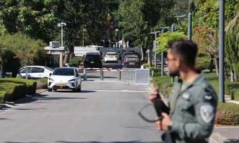

## Claim
Claim: "Netanyahu’s son Yair was killed in a drone attack on October 19, 2024 that targeted the Israeli PM’s home in Caesarea, Israel."

## Actions
```
web_search("Yair Netanyahu drone attack October 19 2024")
web_search("drone attack Caesarea Israel October 19 2024")
```

## Evidence
### Evidence from `web_search`
On October 19, 2024, a drone attack targeted the residence of Israeli Prime Minister Benjamin Netanyahu in Caesarea, Israel, as reported by Wikipedia ([https://en.wikipedia.org/wiki/2024_drone_attack_on_Benjamin_Netanyahu%27s_residence](https://en.wikipedia.org/wiki/2024_drone_attack_on_Benjamin_Netanyahu%27s_residence)), The Times of Israel ([https://www.timesofisrael.com/drones-moans-and-groans-hezbollah-attacks-pms-home-petty-politics-continue-unintercepted/](https://www.timesofisrael.com/drones-moans-and-groans-hezbollah-attacks-pms-home-petty-politics-continue-unintercepted/)), and NPR ([https://www.npr.org/2024/10/19/nx-s1-5158375/netanyahu-house-drone-israel](https://www.npr.org/2024/10/19/nx-s1-5158375/netanyahu-house-drone-israel)). The Times of Israel article includes images , .

The attack was attributed to Hezbollah and was described as an attempted assassination. The Times of Israel and NPR reported that Netanyahu and his wife were not present and there were no injuries. The NPR article includes an image .


### Evidence from `web_search`
CBS News reports that a drone targeted Prime Minister Benjamin Netanyahu's house in Caesarea, Israel, on Saturday, with no casualties (, ). The article mentions that the attack occurred after the killing of the Hamas mastermind of last year's Oct. 7 attack. The Guardian published an article on October 19, 2024, reporting that Benjamin Netanyahu's house in Caesarea was hit by a drone (). The article mentions that the attack caused superficial damage and no casualties. The article also mentions that the attack was the latest in a series of assassinations in northern Lebanon and was not claimed by Hezbollah.

Sources: [https://www.cbsnews.com/news/drone-strike-benjamin-netanyahu-israel-gaza-lebanon-hamas/](https://www.cbsnews.com/news/drone-strike-benjamin-netanyahu-israel-gaza-lebanon-hamas/), [https://www.theguardian.com/world/2024/oct/19/netanyahus-house-hit-by-drone-as-israel-and-hezbollah-trade-blows-in-lebanon](https://www.theguardian.com/world/2024/oct/19/netanyahus-house-hit-by-drone-as-israel-and-hezbollah-trade-blows-in-lebanon)


## Elaboration
The evidence confirms that a drone attack targeted Benjamin Netanyahu's residence in Caesarea, Israel, on October 19, 2024. However, multiple sources explicitly state that there were no casualties. Therefore, the claim that Yair Netanyahu was killed in the attack is false.


## Final Judgement
The evidence confirms a drone attack on Benjamin Netanyahu's residence on October 19, 2024, but multiple sources state there were no casualties. The claim that Yair Netanyahu was killed in the attack is therefore demonstrably false.

`false`

### Verdict: FALSE

### Justification
The claim is false. While a drone attack did target Benjamin Netanyahu's residence in Caesarea, Israel, on October 19, 2024, as reported by sources like [Wikipedia](https://en.wikipedia.org/wiki/2024_drone_attack_on_Benjamin_Netanyahu%27s_residence), [The Times of Israel](https://www.timesofisrael.com/drones-moans-and-groans-hezbollah-attacks-pms-home-petty-politics-continue-unintercepted/), [NPR](https://www.npr.org/2024/10/19/nx-s1-5158375/netanyahu-house-drone-israel), [CBS News](https://www.cbsnews.com/news/drone-strike-benjamin-netanyahu-israel-gaza-lebanon-hamas/), and [The Guardian](https://www.theguardian.com/world/2024/oct/19/netanyahus-house-hit-by-drone-as-israel-and-hezbollah-trade-blows-in-lebanon), these sources also state there were no casualties.
