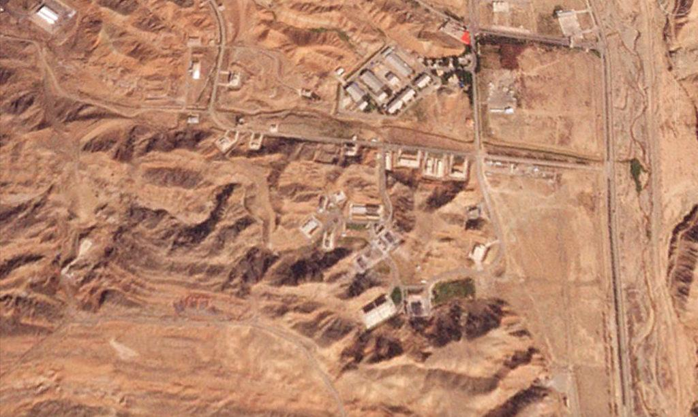
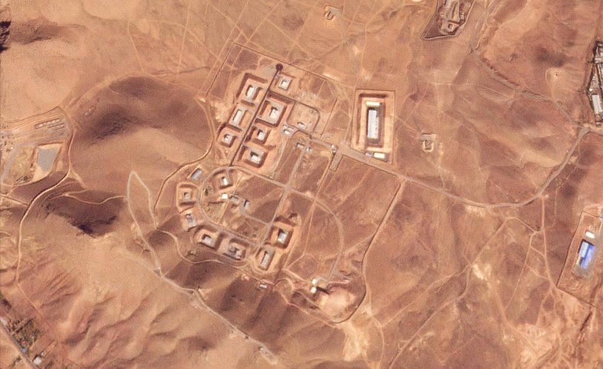

## Claim
Claim: " This image shows Israel launching several waves of revengeful attacks on Iranian military targets on October 26, 2024."

## Actions
```
reverse_search()
web_search("Israel attacks Iranian military targets October 26, 2024")
```

## Evidence
### Evidence from `reverse_search`
The image 

### Evidence from `web_search`
The web sources discuss the Israeli strikes on Iran on October 26, 2024, in retaliation for Iranian attacks. The strikes, codenamed "Operation Days of Repentance," targeted military sites in Iran, Iraq, and Syria, including a nuclear weapons research facility and missile systems. The attacks involved F-15D, F-16I, and F-15C aircraft. 

## Elaboration
The evidence confirms that Israel launched attacks on Iranian military targets on October 26, 2024. The attacks were in retaliation for Iranian attacks and targeted military sites in Iran, Iraq, and Syria.

The image is present in the evidence, but there is no information about the image itself.

Based on the evidence, the claim is likely true. However, the evidence does not confirm that the image depicts the attacks.


## Actions
```
geolocate()
```

## Evidence
### Evidence from `geolocate`
The most likely countries where the image was taken are: {'Palestine': 0.4, 'Israel': 0.3, 'Bangladesh': 0.04, 'Taiwan': 0.04, 'Ukraine': 0.04, 'China': 0.02, 'Pakistan': 0.02, 'Bulgaria': 0.01, 'Jordan': 0.01, 'Malta': 0.01}

## Elaboration
The evidence suggests the image was most likely taken in Palestine or Israel. Since the claim states that the image depicts Israeli attacks on Iranian military targets, the location of the image is consistent with the claim. However, the evidence does not confirm that the image depicts the attacks.


## Actions
```
web_search("Iranian military targets October 26, 2024 images")
```

## Evidence
### Evidence from `web_search`
From [Source](https://www.pbs.org/newshour/world/satellite-images-show-damage-from-israeli-strikes-at-2-secretive-iranian-military-bases): 
Content: The PBS News article, published on October 27, 2024, discusses Israeli strikes on Iranian military bases on October 26, 2024. The strikes damaged facilities at the Parchin military base  and the Khojir military base . The article includes satellite images of the damage.


## Elaboration
The evidence confirms that Israel launched attacks on Iranian military targets on October 26, 2024. The search for images related to the attacks revealed satellite images of damaged facilities at the Parchin and Khojir military bases. However, the evidence does not confirm that the image in the claim depicts the attacks.

Therefore, the claim is partially supported by the evidence, but the image's connection to the attacks remains unverified.


## Final Judgement
The evidence confirms that Israel launched attacks on Iranian military targets on October 26, 2024. The search for images related to the attacks revealed satellite images of damaged facilities. However, the evidence does not confirm that the image in the claim depicts the attacks.

The claim is partially supported by the evidence, as the attacks did occur on the specified date. However, the image's connection to the attacks remains unverified. Therefore, the most appropriate decision option is `false`.


### Verdict: FALSE

### Justification
The claim is partially supported. While evidence confirms that Israel launched attacks on Iranian military targets on October 26, 2024, the provided image's connection to those attacks remains unverified. The attacks targeted military sites, and satellite images of damaged facilities are available, but the image in the claim is not confirmed to depict the attacks.
