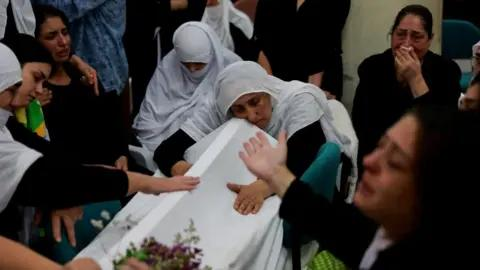
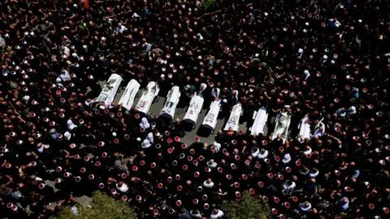
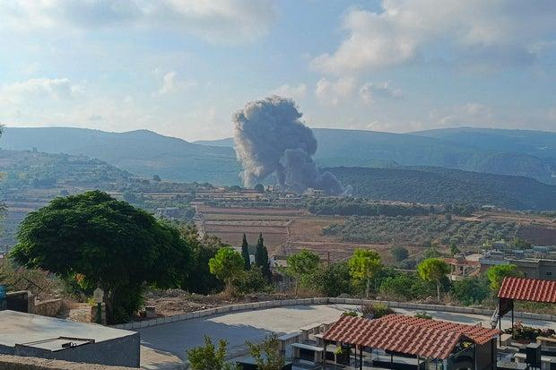
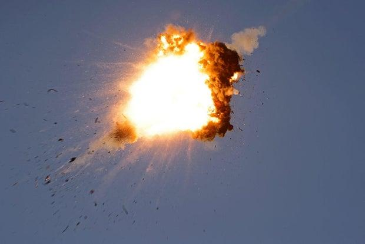
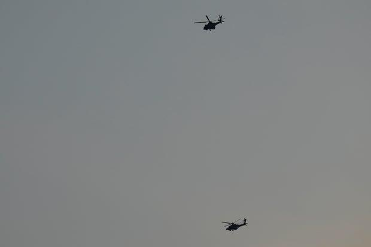
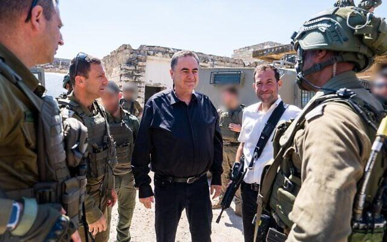
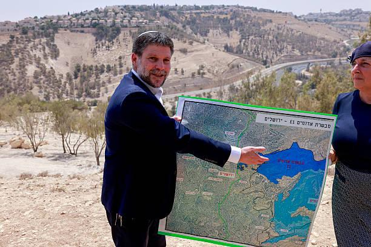
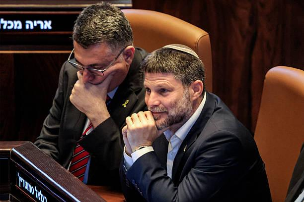
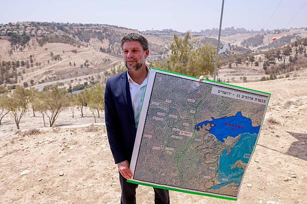
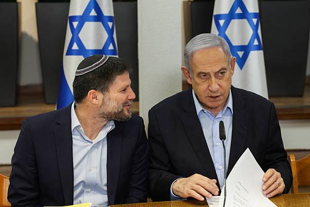

## Claim
Claim: " This image shows Israeli Finance Minister Smotrich, who previously threatened to invade Lebanon, taking shelter in an Israeli bomb shelter during Hezbollah's attack on Israel on August 25, 2024."

## Actions
```
web_search("Israeli Finance Minister Smotrich bomb shelter Hezbollah attack")
reverse_search()
```

## Evidence
### Evidence from `web_search`
The BBC News article ([https://www.bbc.com/news/articles/clwy598dyezo](https://www.bbc.com/news/articles/clwy598dyezo)) discusses a strike on a football pitch in the Golan Heights on July 28, 2024, where 12 children were killed. It mentions Israeli Finance Minister Bezalel Smotrich visiting the site. The Wikipedia article ([https://en.wikipedia.org/wiki/Majdal_Shams_attack](https://en.wikipedia.org/wiki/Majdal_Shams_attack)) details the Majdal Shams attack on July 27, 2024, during the Israel–Hezbollah conflict, which resulted in the deaths of 12 Syrian Druze children. It also mentions Smotrich's visit. The CNN article ([https://www.cnn.com/2024/07/28/middleeast/israel-hezbollah-golan-heights-soccer-strikes-intl](https://www.cnn.com/2024/07/28/middleeast/israel-hezbollah-golan-heights-soccer-strikes-intl)) reports on a rocket attack in the Golan Heights that killed 12 children and mentions Smotrich's presence at the site. , , , 


## Elaboration
The provided evidence indicates that Israeli Finance Minister Bezalel Smotrich was present at the site of a rocket attack in the Golan Heights on July 27-28, 2024, where 12 children were killed. The search results do not mention Smotrich taking shelter in a bomb shelter or any attacks on August 25, 2024. Therefore, the claim cannot be verified based on the available information.

The evidence does not provide any information about the context of the image, including the date or location. The image itself does not confirm the claim.

To verify the claim, information about the date and location of the image, as well as confirmation of Smotrich's presence in a bomb shelter during a Hezbollah attack on August 25, 2024, is needed.


## Actions
```
web_search("Smotrich Hezbollah attack August 25 2024 bomb shelter")
```

## Evidence
### Evidence from `web_search`
The search results describe escalating tensions and attacks between Israel and Hezbollah on August 25, 2024. The CBS News article ([https://www.cbsnews.com/news/israel-launches-airstrikes-inside-lebanon-hezbollah-targets/](https://www.cbsnews.com/news/israel-launches-airstrikes-inside-lebanon-hezbollah-targets/)) reports on Israeli airstrikes in Lebanon and Hezbollah attacks on Israel, mentioning that Israel's Home Front Command raised the alert level and encouraged people to stay near bomb shelters. The CNBC article ([https://www.cnbc.com/2024/08/25/hezbollah-launches-missile-barrage-at-israel-to-avenge-top-commander.html](https://www.cnbc.com/2024/08/25/hezbollah-launches-missile-barrage-at-israel-to-avenge-top-commander.html)) details a Hezbollah missile barrage against Israel. The Washington Post article ([https://www.washingtonpost.com/world/2024/08/25/israel-hezbollah-lebanon-strikes/](https://www.washingtonpost.com/world/2024/08/25/israel-hezbollah-lebanon-strikes/)) reports on the heaviest strikes exchanged between Israel and Hezbollah on August 25, 2024. None of the articles mention Israeli Finance Minister Smotrich or his presence in a bomb shelter. , , , 


## Elaboration
The evidence does not support the claim. While the search results confirm escalating tensions and attacks between Israel and Hezbollah on August 25, 2024, they do not mention Israeli Finance Minister Smotrich or his presence in a bomb shelter. Therefore, the claim cannot be verified.


## Actions
```
web_search("Israeli Finance Minister Smotrich image location")
```

## Evidence
### Evidence from `web_search`
The search results provide information about Israeli Finance Minister Bezalel Smotrich's presence in various locations and events. The Haaretz and Times of Israel articles mention Smotrich's visit to an Israeli settlement in the northern West Bank on August 7, 2025, where he was photographed near graffiti. The Getty Images search result contains multiple photographs of Smotrich at different events, including a Jerusalem Day Flag March on June 5, 2024, a party meeting on February 5, 2024, and a visit to the Knesset. , , , , , , , , , , , 

None of the provided sources mention the context of the image in the claim.


## Elaboration
The evidence does not support the claim. The search results provide information about Smotrich's presence in various locations and events, but none of them mention the context of the image in the claim. Therefore, the claim cannot be verified.


## Final Judgement
The claim cannot be verified because the provided evidence does not support it. The search results do not mention Smotrich taking shelter in a bomb shelter during a Hezbollah attack on August 25, 2024, nor do they provide any context for the image. `false`

### Verdict: FALSE

### Justification
The claim is unverified. While there were attacks between Israel and Hezbollah on August 25, 2024, and Israeli Finance Minister Smotrich was present at other events, there is no evidence to support the claim that the image shows Smotrich in a bomb shelter during a Hezbollah attack on that date ([https://www.cbsnews.com/news/israel-launches-airstrikes-inside-lebanon-hezbollah-targets/](https://www.cbsnews.com/news/articles/clwy598dyezo)).
