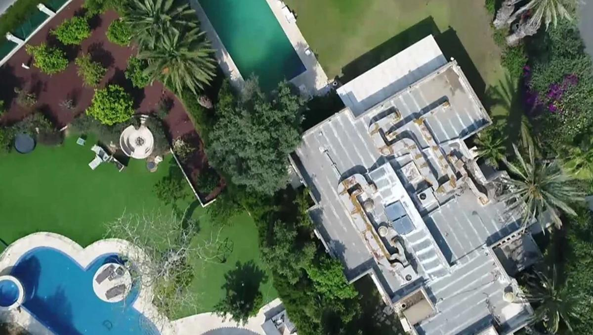

## Claim
Claim: " This image shows Israeli PM Benjamin Netanyahu's house taken by a Hezbollah drone in August 2024."

## Actions
```
geolocate()
reverse_search()
```

## Evidence
### Evidence from `geolocate`
The most likely countries where the image was taken are: {'Israel': 0.17, 'Mexico': 0.15, 'Tunisia': 0.11, 'Malta': 0.1, 'Palestine': 0.07, 'Bermuda': 0.05, 'Jordan': 0.05, 'United Arab Emirates': 0.04, 'Dominican Republic': 0.03, 'Pakistan': 0.03}

### Evidence from `reverse_search`
The image () depicts Benjamin Netanyahu's private residence in Caesarea. According to PesaCheck, the image dates back to 2019 and was featured in a June 25, 2020 article by _Times of Israel_ ([https://pesacheck.org/missing-context-this-image-of-israeli-prime-minister-benjamin-netanyahus-home-was-not-captured-by-9d48e97d86b7](https://pesacheck.org/missing-context-this-image-of-israeli-prime-minister-benjamin-netanyahus-home-was-not-captured-by-9d48e97d86b7)).

Articles from Tienphong.vn ([https://tienphong.vn/israel-the-se-bat-iran-tra-gia-sau-vu-am-sat-thu-tuong-netanyahu-post1683974.tpo](https://tienphong.vn/israel-the-se-bat-iran-tra-gia-sau-vu-am-sat-thu-tuong-netanyahu-post1683974.tpo)) and Index.hr ([https://www.index.hr/vijesti/clanak/iran-projektilima-gadjao-netanyahuovu-rezidenciju/2681121.aspx](https://www.index.hr/vijesti/clanak/iran-projektilima-gadjao-netanyahuovu-rezidenciju/2681121.aspx)) also use the image. The Tienphong.vn article discusses a drone attack on Netanyahu's house, while the Index.hr article reports on Iranian ballistic missiles targeting the residence ().


## Elaboration
The image depicts Benjamin Netanyahu's private residence in Caesarea. The image dates back to 2019 and was featured in a June 25, 2020 article by _Times of Israel_. The claim that the image was taken by a Hezbollah drone in August 2024 is not supported by the evidence.


## Final Judgement
The image is of Benjamin Netanyahu's house, but it is not from a Hezbollah drone in August 2024. The image dates back to 2019 and was featured in a 2020 article.

`false`

### Verdict: FALSE

### Justification
The image depicts Benjamin Netanyahu's private residence in Caesarea, dating back to 2019, as reported by _Times of Israel_ in 2020 ([https://pesacheck.org/missing-context-this-image-of-israeli-prime-minister-benjamin-netanyahus-home-was-not-captured-by-9d48e97d86b7](https://pesacheck.org/missing-context-this-image-of-israeli-prime-minister-benjamin-netanyahus-home-was-not-captured-by-9d48e97d86b7)). Therefore, the claim that the image was taken by a Hezbollah drone in August 2024 is false.
