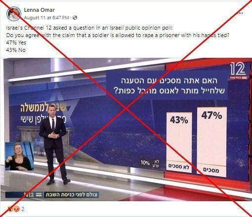

## Claim
Claim: " The image shows a screenshot of an authentic question from Israel's Channel 12 public opinion poll: 'Do you agree with the claim that a solder is allowed to rape a prisoner with his hands tied?'"

## Actions
```
web_search("Channel 12 Israel public opinion poll rape prisoner")
```

## Evidence
### Evidence from `web_search`
The image in the claim is a doctored screenshot of a poll from Israel's Channel 12 (). The original poll, broadcast on May 27, 2022, asked about the government's reliance on supporters of terrorism. The altered image, which falsely presented a question about soldiers and rape, was shared on Facebook and X. Channel 12 denied broadcasting the poll and debunked the false posts.

The original poll and the doctored image are discussed in articles from cedmohub.eu ([https://cedmohub.eu/posts-share-doctored-prisoner-abuse-poll-from-israeli-tv-channel/](https://cedmohub.eu/posts-share-doctored-prisoner-abuse-poll-from-israeli-tv-channel/)) and cbsaustin.com ([https://cbsaustin.com/news/nation-world/squad-member-shares-fake-poll-claiming-most-israelis-support-rape-of-palestinians-rashida-tlaib-noura-erakat-alex-zeldin-ritchie-torres-israel-palestine-hamas-war-terrorism-gaza](https://cbsaustin.com/news/nation-world/squad-member-shares-fake-poll-claiming-most-israelis-support-rape-of-palestinians-rashida-tlaib-noura-erakat-alex-zeldin-ritchie-torres-israel-palestine-hamas-war-terrorism-gaza)). Mondoweiss ([https://mondoweiss.net/2024/08/65-of-israeli-jews-oppose-criminal-prosecution-for-soldiers-suspected-of-raping-palestinian-detainees/](https://mondoweiss.net/2024/08/65-of-israeli-jews-oppose-criminal-prosecution-for-soldiers-suspected-of-raping-palestinian-detainees/)) discusses a separate poll about the prosecution of soldiers. , , , 


## Elaboration
The claim is false. The image is a doctored screenshot of a poll from Israel's Channel 12. The original poll, broadcast on May 27, 2022, did not ask the question about soldiers and rape. Channel 12 denied broadcasting the poll and debunked the false posts.


## Final Judgement
The claim is demonstrably false. The image is a manipulated screenshot of a poll from Israel's Channel 12. The original poll did not contain the question about soldiers and rape. Channel 12 has debunked the false posts. `false`

### Verdict: FALSE

### Justification
The claim is demonstrably false. The image is a doctored screenshot of a poll from Israel's Channel 12, as confirmed by multiple sources, including cedmohub.eu ([https://cedmohub.eu/posts-share-doctored-prisoner-abuse-poll-from-israeli-tv-channel/](https://cedmohub.eu/posts-share-doctored-prisoner-abuse-poll-from-israeli-tv-channel/)) and cbsaustin.com ([https://cbsaustin.com/news/nation-world/squad-member-shares-fake-poll-claiming-most-israelis-support-rape-of-palestinians-rashida-tlaib-noura-erakat-alex-zeldin-ritchie-torres-israel-palestine-hamas-war-terrorism-gaza](https://cbsaustin.com/news/nation-world/squad-member-shares-fake-poll-claiming-most-israelis-support-rape-of-palestinians-rashida-tlaib-noura-erakat-alex-zeldin-ritchie-torres-israel-palestine-hamas-war-terrorism-gaza)). The original poll did not ask the question about soldiers and rape, and Channel 12 denied broadcasting the poll.
