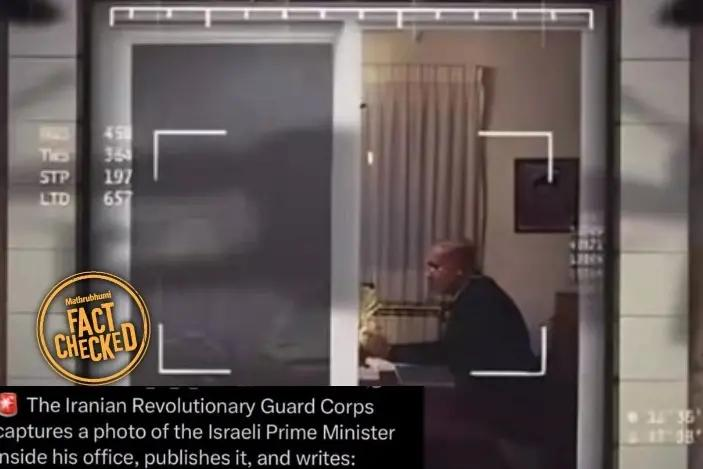

## Claim
Claim: " This image shows Israeli PM Benjamin Netanyahu inside his office and was captured and published by Hezbollah in August 2024."

## Actions
```
reverse_search()
web_search("Hezbollah Benjamin Netanyahu office video")
```

## Evidence
### Evidence from `reverse_search`
From [Source](https://english.mathrubhumi.com/news/world/fact-check-netanyahu-iran-drone-photo-l8xdt4wd): Found exact image on website with title: Viral post claiming Iranian drone tracked Netanyahu proven false
Content: The search result from Mathrubhumi English, published on July 25, 2025, fact-checks a viral post claiming an Iranian drone tracked Benjamin Netanyahu.  The image in the viral post is an edited version of a photo taken by Michael Fattal in February 2009. The original photo shows Benjamin Netanyahu with his father.


## Elaboration
The image is an edited version of a photo taken by Michael Fattal in February 2009. The original photo shows Benjamin Netanyahu with his father. The claim that the image was captured and published by Hezbollah in August 2024 is false.


## Final Judgement
The image is an edited version of a photo taken in 2009, not a recent capture by Hezbollah. The claim misrepresents the origin and context of the image.

`false`

### Verdict: FALSE

### Justification
The image is an edited version of a photo taken in February 2009, as reported by [Mathrubhumi English](https://english.mathrubhumi.com/news/world/fact-check-netanyahu-iran-drone-photo-l8xdt4wd). The original photo shows Benjamin Netanyahu with his father, and the claim that it was captured and published by Hezbollah in August 2024 is false.
