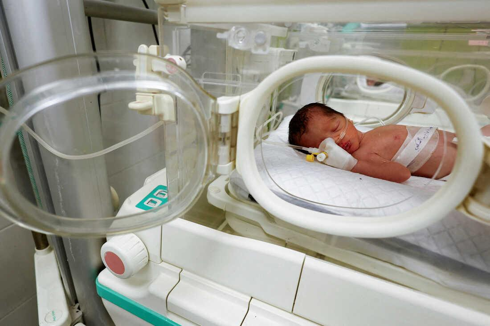

## Claim
Claim: " This image shows a Palestinian girl in the Gaza war in July 2024. She was holding her sister's oxygen mask inside the ambulance. She had already passed away, yet her hand remained on the mask firmly."

## Actions
```
reverse_search()
web_search("Palestinian girl Gaza war oxygen mask")
```

## Evidence
### Evidence from `reverse_search`
The image in the claim () appears in multiple sources. The Guardian published an article on June 19, 2022, discussing a network of conspiracy theorists and includes the image of a Syrian girl holding an oxygen mask over the face of an infant at a makeshift hospital after a reported gas attack on the rebel-held town of Douma, Syria, on 22 January 2018. ([https://www.theguardian.com/world/2022/jun/19/russia-backed-network-of-syria-conspiracy-theorists-identified](https://www.theguardian.com/world/2022/jun/19/russia-backed-network-of-syria-conspiracy-theorists-identified))

Arms Control Today also uses the image in an article from January/February 2021, discussing the use of chemical weapons, with the same caption. ([https://www.armscontrol.org/act/2021-01/features/strengthen-norms-against-chemical-weapons-use](https://www.armscontrol.org/act/2021-01/features/strengthen-norms-against-chemical-weapons-use)) Fanack published an article on April 19, 2018, discussing an alleged chemical attack in Douma, Syria, and includes the image. ([https://fanack.com/politics/features-insights/douma-chemical-attack~97685/](https://fanack.com/politics/features-insights/douma-chemical-attack~97685/))


### Evidence from `web_search`
The search results include articles about Palestinian children in Gaza. One article from NPR, published on April 26, 2024, discusses a baby girl who died after an Israeli airstrike, with images of the baby in an incubator 

## Elaboration
The image in the claim is not from the Gaza war in July 2024. Reverse image searches indicate that the image was taken in Douma, Syria, in 2018, and depicts a Syrian girl holding an oxygen mask. The claim is therefore false.


## Final Judgement
The image in the claim is from Douma, Syria, in 2018, and not from the Gaza war in July 2024. The claim misrepresents the origin and context of the image. `false`

### Verdict: FALSE

### Justification
The image in the claim is not from the Gaza war in July 2024. Reverse image searches reveal that the image was taken in Douma, Syria, in 2018, and depicts a Syrian girl holding an oxygen mask, as reported by sources like The Guardian ([https://www.theguardian.com/world/2022/jun/19/russia-backed-network-of-syria-conspiracy-theorists-identified](https://www.theguardian.com/world/2022/jun/19/russia-backed-network-of-syria-conspiracy-theorists-identified)).
