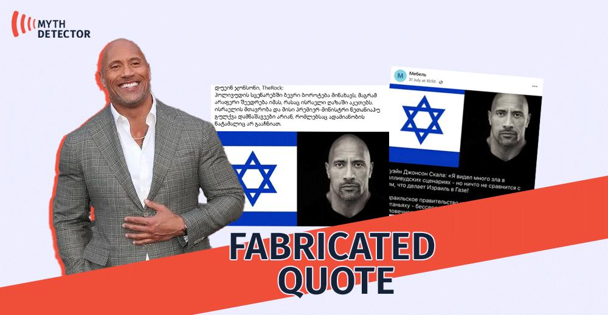

## Claim
Claim: " This is an authentic image of Dwayne Johnson waring the Israeli flag in support of Israel."

## Actions
```
reverse_search()
web_search("Dwayne Johnson Israel support")
```

## Evidence
### Evidence from `reverse_search`
From [Source](https://music.apple.com/us/song/jewish-rock/1406634253): Found exact image on website with title: ‎Jewish Rock - Song by Shawn Pelofsky - Apple Music
Content: The search result is from Apple Music and features the image in the claim. The image is used as the cover art for the song "Jewish Rock" by Shawn Pelofsky, released on August 24, 2018. 


### Evidence from `web_search`
Myth Detector ([https://mythdetector.com/en/dwayne-johnson-about-israel/](https://mythdetector.com/en/dwayne-johnson-about-israel/)) states that a quote attributed to Dwayne Johnson about Israel is fake, including images of the fabricated quote . Yahoo News ([https://www.yahoo.com/news/articles/fact-check-fake-dwayne-johnson-234700368.html](https://www.yahoo.com/news/articles/fact-check-fake-dwayne-johnson-234700368.html)) fact-checks a claim about Dwayne "The Rock" Johnson and rates it as "Incorrect Attribution," stating there is no credible record of Johnson making such a statement, and includes an image of Johnson  and an image of the claim with Johnson's photo and the Israeli flag .

Variety ([https://variety.com/2023/film/news/hollywood-stars-support-israel-palestine-conflict-1235749537/](https://variety.com/2023/film/news/hollywood-stars-support-israel-palestine-conflict-1235749537/)) reports that Dwayne "The Rock" Johnson, along with other Hollywood stars, has shown support for Israel amid the conflict .


## Elaboration
The image in the claim is used as the cover art for the song "Jewish Rock" by Shawn Pelofsky. The image is not an authentic image of Dwayne Johnson wearing the Israeli flag in support of Israel. The evidence also shows that a quote attributed to Dwayne Johnson about Israel is fake. However, Dwayne Johnson has shown support for Israel.

Therefore, the claim is not entirely accurate.


## Final Judgement
The image in the claim is used as cover art for a song and is not an authentic image of Dwayne Johnson wearing the Israeli flag in support of Israel. While Dwayne Johnson has shown support for Israel, the image is not authentic.

`false`

### Verdict: FALSE

### Justification
The image in the claim is used as cover art for a song and is not an authentic image of Dwayne Johnson wearing the Israeli flag. While Dwayne Johnson has shown support for Israel, the image is not authentic, as confirmed by a reverse image search ([Source](https://music.apple.com/us/song/jewish-rock/1406634253)) and fact-check articles ([Myth Detector](https://mythdetector.com/en/dwayne-johnson-about-israel/) and [Yahoo News](https://www.yahoo.com/news/articles/fact-check-fake-dwayne-johnson-234700368.html)).
