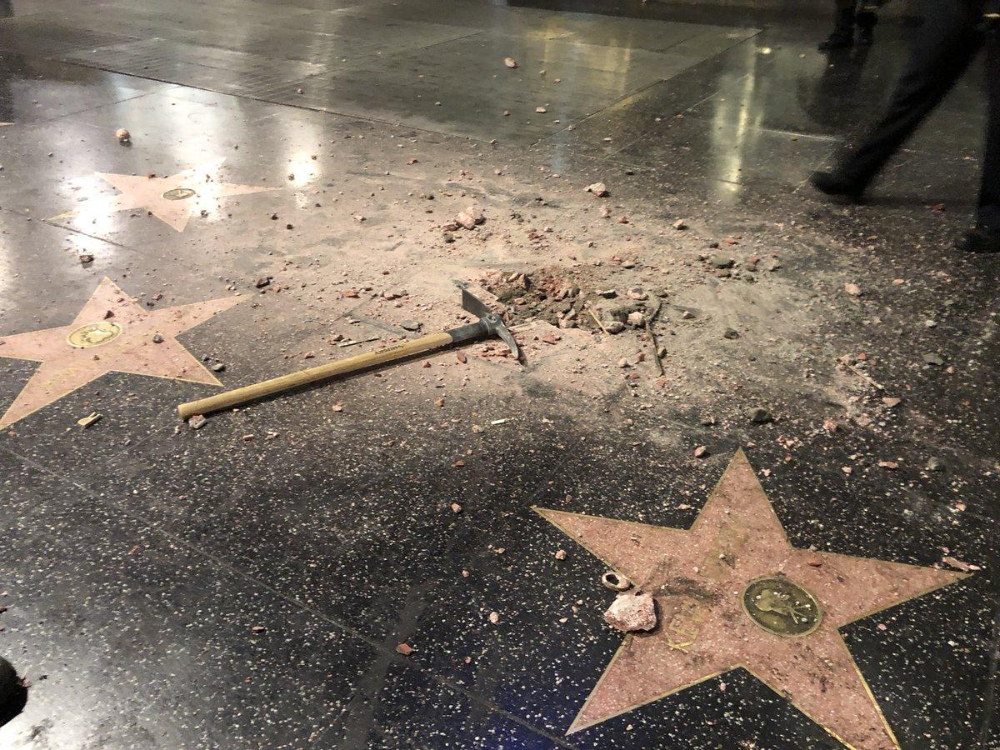

## Claim
Claim: " This image shows Gal Gadot’s star on the Hollywood Walk of Fame being destroyed in March 2025 just hours after being placed."

## Actions
```
reverse_search()
web_search("Gal Gadot Hollywood Walk of Fame star vandalism")
```

## Evidence
No new evidence found.

## Elaboration
The provided evidence does not contain any information about the image or the claim. Therefore, I cannot verify the claim. I need more information, such as the date when Gal Gadot's star was placed on the Hollywood Walk of Fame and whether it was vandalized.


## Actions
```
web_search("Gal Gadot Hollywood Walk of Fame star")
```

## Evidence
### Evidence from `web_search`
Gal Gadot received a star on the Hollywood Walk of Fame on March 18, 2025. The ceremony was disrupted by protests. An image () shows the aftermath of vandalism.

Sources: [CBS News Los Angeles](https://www.cbsnews.com/losangeles/news/gal-gadots-hollywood-walk-of-fame-ceremony-disrupted-by-protest/), [Entertainment Weekly](https://ew.com/fact-check-was-gal-gadot-s-hollywood-star-destroyed-11700747?srsltid=AfmBOoo7g3WwUP2f7uer9W65UCkaRrRDmIl8avola9pgneNK7JO8TGsJ), and [Los Angeles Times](https://www.latimes.com/entertainment-arts/story/2025-03-18/gal-gadot-walk-of-fame-pro-palestine-pro-israel-protesters-snow-white).


## Elaboration
The claim is partially accurate. Gal Gadot received a star on the Hollywood Walk of Fame on March 18, 2025. The ceremony was disrupted by protests. The image provided does show vandalism. However, the evidence does not explicitly state that the star was destroyed hours after being placed.


## Final Judgement
The image shows vandalism of a star on the Hollywood Walk of Fame, and Gal Gadot received a star on March 18, 2025. The ceremony was disrupted by protests. However, the evidence does not explicitly state that the star was destroyed hours after being placed.

The claim is partially accurate as it correctly identifies Gal Gadot's star and the vandalism. However, the claim that the star was destroyed hours after being placed is not explicitly supported by the evidence. Therefore, the claim is not entirely accurate. `false`


### Verdict: FALSE

### Justification
The image depicts vandalism on the Hollywood Walk of Fame, and Gal Gadot received her star on March 18, 2025, with the ceremony disrupted by protests, as reported by [CBS News Los Angeles](https://www.cbsnews.com/losangeles/news/gal-gadots-hollywood-walk-of-fame-ceremony-disrupted-by-protest/), [Entertainment Weekly](https://ew.com/fact-check-was-gal-gadot-s-hollywood-star-destroyed-11700747?srsltid=AfmBOoo7g3WwUP2f7uer9W65UCkaRrRDmIl8avola9pgneNK7JO8TGsJ), and [Los Angeles Times](https://www.latimes.com/entertainment-arts/story/2025-03-18/gal-gadot-walk-of-fame-pro-palestine-pro-israel-protesters-snow-white). However, the claim that the star was destroyed hours after being placed is not explicitly supported by the evidence.
