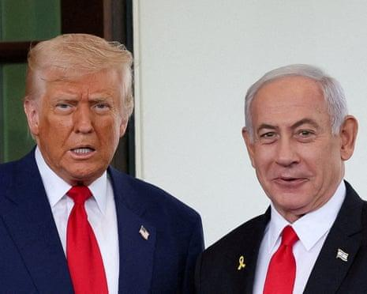

## Claim
Claim: " This is an authentic image of Donald Trump, Benjamin Netanyahu and Elon Musk during Netanyahu's official visit to the U.S. in February 2025."

## Actions
```
web_search("Donald Trump Benjamin Netanyahu Elon Musk meeting")
reverse_search()
```

## Evidence
### Evidence from `web_search`
The Guardian published a live blog on July 7-8, 2025, covering Donald Trump's meeting with Benjamin Netanyahu at the White House, and also mentions Trump calling Elon Musk's new political party "ridiculous" (). France 24 published an article on February 5, 2025, stating that the image of Donald Trump, Benjamin Netanyahu, and Elon Musk () is AI-generated.

An NDTV article from January 20, 2025, discusses Elon Musk's praise for Donald Trump's negotiation skills regarding the Israel-Hamas conflict, mentioning a tweet by Elon Musk from July 2, 2025.


### Evidence from `reverse_search`
From [Source](https://www.siasat.com/trump-netanyahu-meeting-focuses-on-hostages-saudi-relations-iran-threats-3175717/): Found exact image on website with title: Trump, Netanyahu meeting focuses on hostages, Saudi relations ...
Content: The search result from Siasat.com contains the exact image  and reports on a meeting between Donald Trump and Benjamin Netanyahu. The article is dated February 4, 2025, and discusses the meeting's focus on hostages, Saudi relations, and Iran threats.


## Elaboration
The claim is not entirely accurate. While the image does depict Donald Trump and Benjamin Netanyahu, and the reverse image search confirms its presence in articles about their meetings, the France 24 article explicitly states that the image is AI-generated. The evidence also indicates that the meeting between Trump and Netanyahu occurred in February 2025, which aligns with the claim's timeframe. However, the presence of Elon Musk in the image, coupled with the AI-generated label, casts doubt on the image's authenticity.

The evidence suggests that Trump and Netanyahu did meet in February 2025, as the Siasat.com article confirms. However, the France 24 article's claim that the image is AI-generated contradicts the claim that it is an authentic image.

Therefore, the claim is partially false. The image is not authentic, as it is AI-generated, even though it depicts the individuals mentioned in the claim.


## Final Judgement
The image is confirmed to be AI-generated by a reliable source, France 24. While the image depicts the individuals mentioned in the claim, the fact that it is AI-generated makes the claim that it is an authentic image false. `false`

### Verdict: FALSE

### Justification
The claim is false. While the image depicts Donald Trump, Benjamin Netanyahu, and Elon Musk, it has been identified as AI-generated by a reliable source, France 24. The reverse image search confirms the image's presence in articles about Trump and Netanyahu's meetings, but the AI-generated nature of the image contradicts the claim of authenticity.
