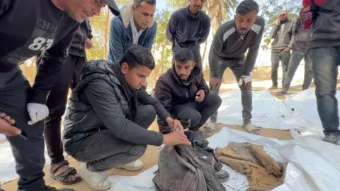

## Claim
Claim: " This is an authentic image of a mother holding the bones of her son in Gaza in March 2025. After more than a year and a half of searching for him under the rubble of their bombed-out house."

## Actions
```
reverse_search()
web_search("woman holding skeleton Gaza")
```

## Evidence
### Evidence from `web_search`
The BBC published an article on January 23, 2025, about the search for missing people in Gaza, including images of human remains and the search for them in the rubble in Rafah. ([https://www.bbc.com/news/articles/c6269pd5y2ko](https://www.bbc.com/news/articles/c6269pd5y2ko)) , , 

ABP Live reported on March 25, 2025, that the image  is AI-generated. Al Jazeera published an article on April 30, 2024, about a family finding bone fragments in Gaza. ([https://www.aljazeera.com/news/longform/2024/4/30/we-didnt-expect-to-find-bones-inside-one-gaza-familys-nightmare](https://www.aljazeera.com/news/longform/2024/4/30/we-didnt-expect-to-find-bones-inside-one-gaza-familys-nightmare)) , 


## Elaboration
The claim that the image is authentic is false. According to ABP Live, the image is AI-generated. While the BBC reported on the search for human remains in Gaza, and Al Jazeera reported on a family finding bone fragments, these reports do not validate the authenticity of the image in question.


## Final Judgement
The claim is demonstrably false. The image has been identified as AI-generated by ABP Live. While there are reports of human remains being found in Gaza, the image itself is not authentic. `false`

### Verdict: FALSE

### Justification
The claim is false. The image is AI-generated, as reported by ABP Live. While there are reports of human remains being found in Gaza, such as the one published by the BBC ([https://www.bbc.com/news/articles/c6269pd5y2ko](https://www.bbc.com/news/articles/c6269pd5y2ko)), the image itself is not authentic.
