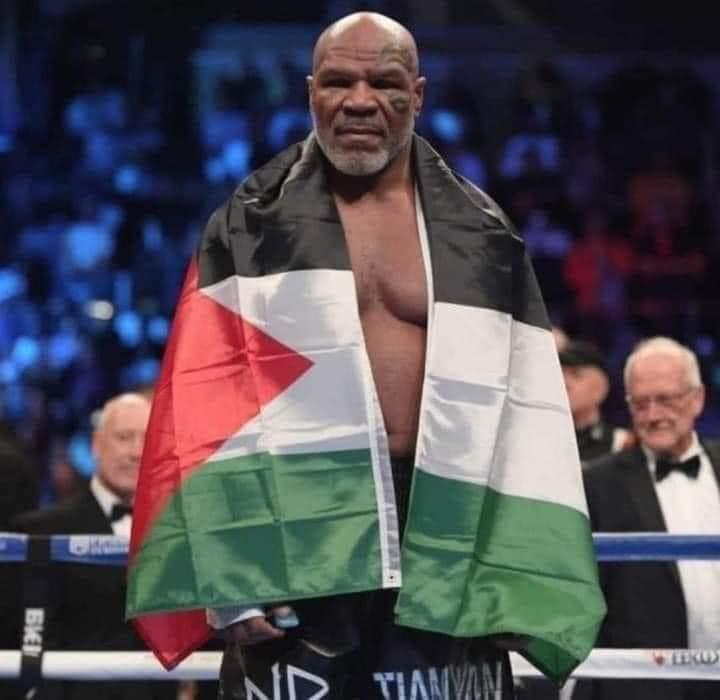
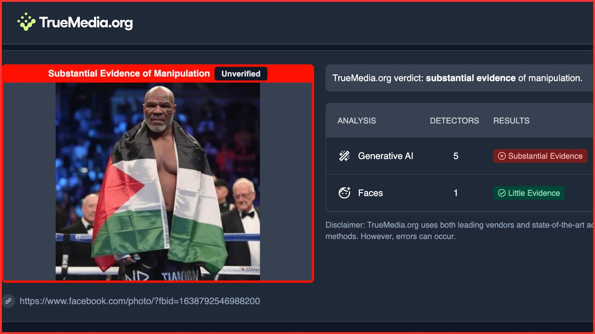
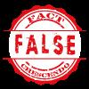

## Claim
Claim: " This is an authentic image of Mike Tyson posing with the Palestinian flag in the ring before his fight against Jake Paul on November, 15, 2024."

## Actions
```
web_search("Mike Tyson Jake Paul fight Palestinian flag")
reverse_search()
```

## Evidence
### Evidence from `web_search`
Reuters published a fact-check article stating that Mike Tyson did not pose with the Palestinian flag before his fight against Jake Paul ([https://engineering.buffalo.edu/computer-science-engineering/news-and-events/news.host.html/content/shared/engineering/home/articles/media-mentions/2024-media-coverage/fact-check--mike-tyson-did-not-pose-with-palestinian-flag-ahead-.detail.html](https://engineering.buffalo.edu/computer-science-engineering/news-and-events/news.host.html/content/shared/engineering/home/articles/media-mentions/2024-media-coverage/fact-check--mike-tyson-did-not-pose-with-palestinian-flag-ahead-.detail.html)). Yahoo News, published by USA TODAY, confirms the image is fabricated, with a spokesperson for Tyson confirming its falsity ([https://www.yahoo.com/news/no-mike-tyson-didnt-wear-224333706.html](https://www.yahoo.com/news/no-mike-tyson-didnt-wear-224333706.html)).

The Independent reports that the image is likely AI-generated, with no evidence of Tyson displaying the flag at the event and his publicist confirming the image's falsity ([https://www.independent.co.uk/news/uk/mike-tyson-labour-angela-eagle-palestinian-jake-paul-b2652116.html](https://www.independent.co.uk/news/uk/mike-tyson-labour-angela-eagle-palestinian-jake-paul-b2652116.html)). The image shows .


### Evidence from `reverse_search`
From [Source](https://srilanka.factcrescendo.com/english/ai-generated-image-falsely-shows-mike-tyson-with-palestinian-flag/): Found exact image on website with title: Mike Tyson did not pose with the Palestine flag
Content: The website srilanka.factcrescendo.com published on July 20, 2025, states that the image of Mike Tyson with the Palestinian flag is AI-generated and not an authentic photo. , , , , . The website also mentions that the image was widely shared on social media, and that Fact Crescendo's team watched the fight and did not see Tyson with the flag. The website also provides a link to a TrueMedia.org analysis that indicates substantial evidence of manipulation. . The website also includes a Getty Images photo of Mike Tyson at the event without the flag. . The conclusion is that the image is false. .


## Elaboration
The claim is false. Multiple sources, including Reuters, Yahoo News, and The Independent, confirm that the image is fabricated and not an authentic photo of Mike Tyson. The image has been identified as AI-generated, and Tyson's publicist has confirmed its falsity. Furthermore, the reverse image search reveals that the image has been fact-checked and debunked by multiple sources, including Fact Crescendo, which also provides a Getty Images photo of Tyson at the event without the flag.


## Final Judgement
The evidence indicates that the image is fabricated and not an authentic photo of Mike Tyson. Multiple sources confirm the image's falsity, and it has been identified as AI-generated.

`false`

### Verdict: FALSE

### Justification
The claim is false. Multiple sources, including Reuters ([https://engineering.buffalo.edu/computer-science-engineering/news-and-events/news.host.html/content/shared/engineering/home/articles/media-mentions/2024-media-coverage/fact-check--mike-tyson-did-not-pose-with-palestinian-flag-ahead-.detail.html](https://engineering.buffalo.edu/computer-science-engineering/news-and-events/news.host.html/content/shared/engineering/home/articles/media-mentions/2024-media-coverage/fact-check--mike-tyson-did-not-pose-with-palestinian-flag-ahead-.detail.html)) and Yahoo News ([https://www.yahoo.com/news/no-mike-tyson-didnt-wear-224333706.html](https://www.yahoo.com/news/no-mike-tyson-didnt-wear-224333706.html)), confirm that the image is fabricated and not an authentic photo of Mike Tyson. The image has been identified as AI-generated, and Tyson's publicist has confirmed its falsity.
