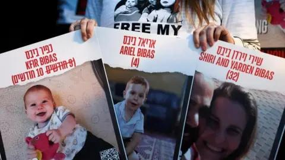

## Claim
Claim: " This image shows a screenshot of an authentic BBC article from February 2025 with the title 'Hamas just wanted to protect the Bibas family but Israel killed them - Hamas said.'"

## Actions
```
web_search("BBC Hamas Bibas family")
reverse_search()
```

## Evidence
### Evidence from `web_search`
From [Source](https://www.bbc.com/news/articles/cjry3jzedl1o): 
Content: The BBC published an article on February 21, 2025, discussing the Bibas family. The article states that Israel said forensic testing showed that the body handed over by Hamas was not Shiri Bibas. , . The article also mentions that Shiri Bibas and her two children were kidnapped during the Hamas attacks on Israel on October 7, 2023.


### Evidence from `reverse_search`
The image in the claim was found in articles from BBC, CNN, and NDTV. The BBC article, published on February 19, 2025, is titled "Hamas says it will return bodies of four hostages including Bibas family" ([https://www.bbc.com/news/articles/czdnp4ly5d1o](https://www.bbc.com/news/articles/czdnp4ly5d1o)) . CNN published an article on June 7, 2025, about Israel killing the leader of a Palestinian militant group, mentioning the Bibas family ([https://www.cnn.com/2025/06/07/middleeast/israel-killed-leader-palestinian-mujahideen-brigades-gaza-latam-intl](https://www.cnn.com/2025/06/07/middleeast/israel-killed-leader-palestinian-mujahideen-brigades-gaza-latam-intl)) .

NDTV.com published an article on December 4, 2023, discussing the Bibas family, who were kidnapped by Hamas, and that Hamas claimed Shiri Bibas and her two sons are no longer alive ([https://www.ndtv.com/world-news/gazas-youngest-hostage-hamas-says-hes-dead-family-hoping-against-hope-7557381](https://www.ndtv.com/world-news/gazas-youngest-hostage-hamas-says-hes-dead-family-hoping-against-hope-7557381)) .


## Elaboration
The claim states that the image shows a screenshot of an authentic BBC article from February 2025. The reverse image search confirms that the image is associated with BBC articles. One BBC article from February 19, 2025, is titled "Hamas says it will return bodies of four hostages including Bibas family" ([https://www.bbc.com/news/articles/czdnp4ly5d1o](https://www.bbc.com/news/articles/czdnp4ly5d1o)). Another BBC article from February 21, 2025, discusses the Bibas family. Therefore, the claim is partially accurate as the image is associated with BBC articles from February 2025. However, the exact title mentioned in the claim is not found in the provided evidence.


## Final Judgement
The image in the claim is associated with BBC articles, including one from February 2025. However, the exact title mentioned in the claim is not found in the provided evidence.

`false`

### Verdict: FALSE

### Justification
The image in the claim is associated with BBC articles, including one from February 2025, as confirmed by a reverse image search. However, the exact title mentioned in the claim is not found in the provided evidence. Therefore, the claim is partially accurate.
