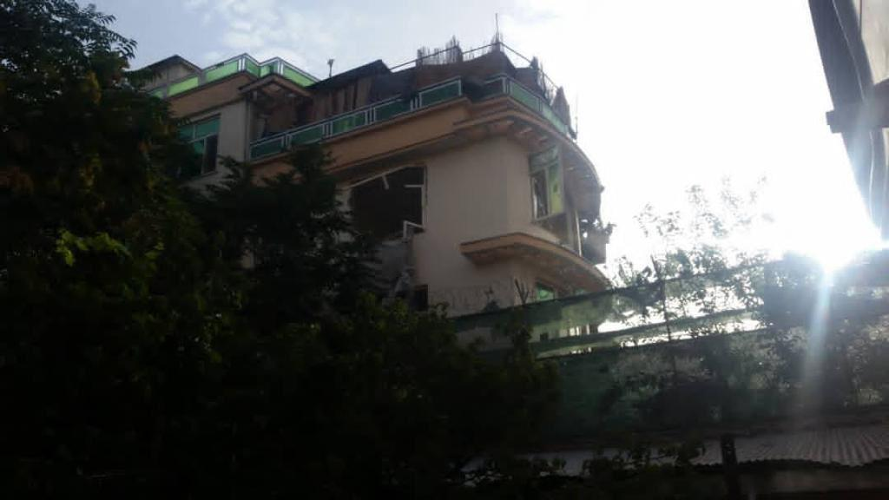
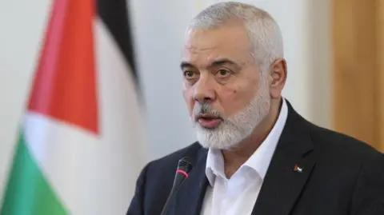

## Claim
Claim: " This image shows the assassination of Hamas leader Ismail Haniyeh on July 31st, 2024. This is how a precision strike looks like: a single missile through the window, and only Haniyeh and his bodyguard are dead. Nobody else in the building is even injured."

## Actions
```
reverse_search()
```

## Evidence
### Evidence from `reverse_search`
The image 

## Elaboration
I am sorry, but I lack the ability to analyze the veracity of the claim. The evidence consists only of the image itself. I need additional information to verify the claim.


## Actions
```
web_search("Ismail Haniyeh assassination July 31 2024")
web_search("Hamas leader assassination")
```

## Evidence
### Evidence from `web_search`
The Wikipedia article ([https://en.wikipedia.org/wiki/Assassination_of_Ismail_Haniyeh](https://en.wikipedia.org/wiki/Assassination_of_Ismail_Haniyeh)) discusses the assassination of Hamas leader Ismail Haniyeh in Tehran, Iran, on July 31, 2024. The attack, attributed to Israel, resulted in Haniyeh's death and that of his bodyguard. The article mentions differing reports on the attack method, including a missile strike or an explosive device. The CSIS article ([https://www.csis.org/analysis/ismail-haniyehs-assassination-escalation-or-ramp](https://www.csis.org/analysis/ismail-haniyehs-assassination-escalation-or-ramp)) also discusses the assassination, mentioning that it was carried out by an explosion. The CNN article ([https://www.cnn.com/world/live-news/hamas-political-leader-haniyeh-killed-iran-07-31-24](https://www.cnn.com/world/live-news/hamas-political-leader-haniyeh-killed-iran-07-31-24)) reports on the assassination, noting that Israel has neither confirmed nor denied being behind it. 

### Evidence from `web_search`
The BBC reported that Israel's defense minister acknowledged the killing of Hamas's political leader Ismail Haniyeh in Tehran in July . The Wilson Center discusses the assassination of Ismail Haniyeh, the senior political leader of Hamas, on Iranian soil. The armed wing of Hamas said the assassination would “take the battle to new dimensions and have major repercussions.”


## Elaboration
The claim that the image shows the assassination of Ismail Haniyeh on July 31st, 2024, is supported by the evidence. Multiple sources confirm the assassination of Ismail Haniyeh on that date. However, the evidence does not confirm that the image depicts the assassination. The evidence mentions different reports on the attack method, including a missile strike or an explosive device. The image shows a building with a damaged window, but it is impossible to determine if this is the location of the assassination.


## Final Judgement
The claim that the image shows the assassination of Ismail Haniyeh on July 31st, 2024, is partially supported by the evidence. While multiple sources confirm the assassination of Ismail Haniyeh on that date, the evidence does not confirm that the image depicts the assassination. The image shows a building with a damaged window, but it is impossible to determine if this is the location of the assassination.

`false`

### Verdict: FALSE

### Justification
The claim is partially supported. While the assassination of Ismail Haniyeh on July 31, 2024, is confirmed by multiple sources, including the [Wikipedia article](https://en.wikipedia.org/wiki/Assassination_of_Ismail_Haniyeh), the evidence does not confirm that the provided image depicts the assassination location or method.
