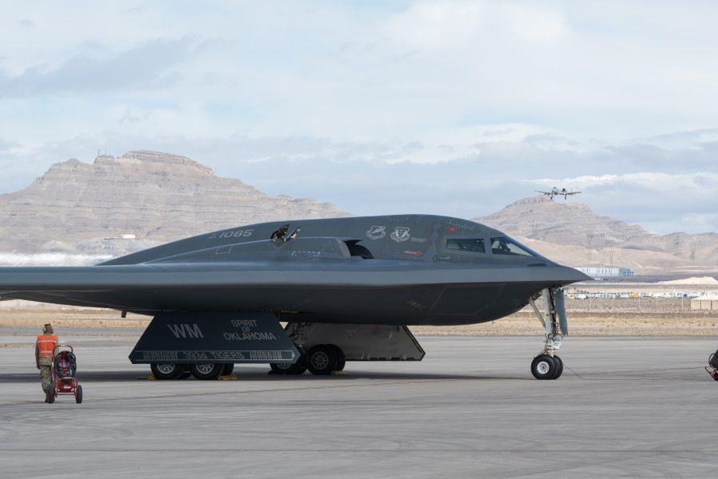

## Claim
Claim: "The Huthi rebels announced the final cessation of their military operations in international waters after Trump won the 2024 US presidential election."

## Actions
```
web_search("Huthi rebels military operations cessation Trump 2024")
```

## Evidence
### Evidence from `web_search`
According to a Wikipedia article, a U.S.-Houthi ceasefire took effect on May 6, 2025, ending U.S. attacks in Yemen. The Houthis had halted attacks on vessels following the 2025 Gaza war ceasefire but resumed them after Israel ended the ceasefire. ([https://en.wikipedia.org/wiki/2025_United_States%E2%80%93Houthi_ceasefire](https://en.wikipedia.org/wiki/2025_United_States%E2%80%93Houthi_ceasefire)) <image:i>

Reuters reports that Donald Trump announced the U.S. would stop bombing the Houthis, and the Houthis agreed to stop interrupting shipping lanes in the Middle East. ([https://www.reuters.com/world/trump-says-us-will-stop-bombing-houthis-after-agreement-struck-2025-05-06/](https://www.reuters.com/world/trump-says-us-will-stop-bombing-houthis-after-agreement-struck-2025-05-06/))  Air & Space Forces Magazine states that Trump announced the U.S. would halt airstrikes against the Houthis, citing promises from the rebel group to stop attacking commercial shipping lanes. ([https://www.airandspaceforces.com/trump-us-halting-military-campaign-houthis/](https://www.airandspaceforces.com/trump-us-halting-military-campaign-houthis/)) 


## Elaboration
The evidence indicates that a U.S.-Houthi ceasefire took effect on May 6, 2025, after Donald Trump announced the U.S. would stop bombing the Houthis. In return, the Houthis agreed to cease attacks on shipping lanes.

The claim states that the cessation of military operations occurred after Trump won the 2024 election. However, the provided evidence suggests the ceasefire and cessation of operations happened in 2025.

Therefore, the claim is likely false because the timeline does not align with the provided evidence.


## Final Judgement
The evidence suggests that the cessation of military operations occurred in 2025, after Trump announced the U.S. would stop bombing the Houthis, and the Houthis agreed to stop attacking shipping lanes. This contradicts the claim that the cessation happened after Trump won the 2024 election.

`false`

### Verdict: FALSE

### Justification
The claim is false. According to the provided evidence, the U.S.-Houthi ceasefire and cessation of military operations occurred in 2025, not after Trump won the 2024 election. Specifically, Donald Trump announced the U.S. would stop bombing the Houthis, and the Houthis agreed to stop interrupting shipping lanes in the Middle East, as reported by [Reuters](https://www.reuters.com/world/trump-says-us-will-stop-bombing-houthis-after-agreement-struck-2025-05-06/) and [Air & Space Forces Magazine](https://www.airandspaceforces.com/trump-us-halting-military-campaign-houthis/).
