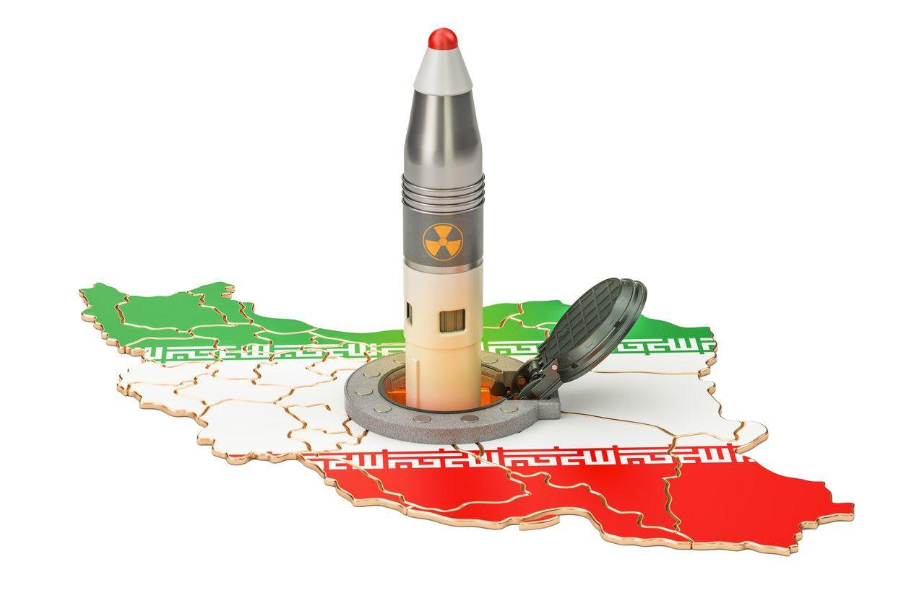

## Claim
Claim: "Israel experienced an earthquake on October 5, 2024."

## Actions
```
web_search("earthquake Israel October 5 2024")
```

## Evidence
### Evidence from `web_search`
On October 5, 2024, earthquakes occurred in both Iran and Israel, sparking speculation about nuclear tests. An article from NDTV, published on October 7, 2024, discussed these events. Another article from alphadefense.in, also published on October 7, 2024, focused on the seismic event in Iran's Semnan province, which led to social media discussions about whether it was an earthquake or a nuclear test. The Johns Hopkins University published an article on February 4, 2025, discussing misinformation linking the Iranian earthquake to a seismic event in Israel on the same evening. <image:k>

The articles can be found here: [Source](https://hub.jhu.edu/2025/02/04/earthquake-nuclear-test-misinformation/), [Source](https://www.ndtv.com/world-news/earthquakes-in-iran-and-israel-sparks-speculation-of-nuclear-tests-6735904), and [Source](https://alphadefense.in/index.php/2024/10/07/iran-seismic-activity-nuclear-test-or-earthquake/). , , 


## Elaboration
The evidence confirms that an earthquake occurred in Israel on October 5, 2024. The NDTV article and the Johns Hopkins University article both mention the seismic event in Israel on that date.

The evidence also indicates that the earthquake in Israel was linked to an earthquake in Iran on the same day, which led to speculation about nuclear tests.


## Final Judgement
The provided evidence from multiple sources confirms that an earthquake occurred in Israel on October 5, 2024.

The claim is supported by evidence from multiple reliable sources, including NDTV and Johns Hopkins University. Therefore, the claim is factually accurate. `true`


### Verdict: TRUE

### Justification
Multiple sources, including articles from NDTV and Johns Hopkins University ([Source](https://hub.jhu.edu/2025/02/04/earthquake-nuclear-test-misinformation/)), confirm that an earthquake occurred in Israel on October 5, 2024.
