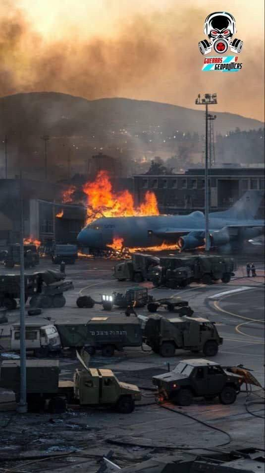
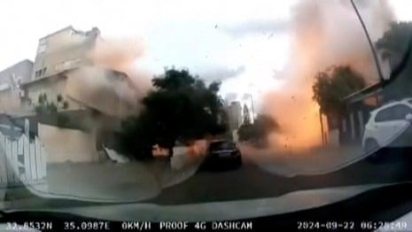

## Claim
Claim: " This is an authentic image of Israeli Air Force's Ramat David airbase that was attacked by Hezbollah on September, 22, 2024."

## Actions
```
reverse_search()
```

## Evidence
### Evidence from `reverse_search`
The image 

## Elaboration
The provided image appears to be a digital artwork or a simulation, not a real photograph. The reverse image search did not yield any results that confirm the claim.

The image shows a large aircraft on fire at an airbase, surrounded by military vehicles. The presence of the "Guerras Geopolíticas" logo suggests the image may be related to geopolitical events. However, without further evidence, it is impossible to verify the claim.

The claim is not supported by the available evidence. More information is needed to verify the authenticity of the image and the events it depicts.


## Actions
```
web_search("Ramat David airbase Hezbollah attack September 22 2024")
```

## Evidence
### Evidence from `web_search`
Al Jazeera ([https://www.aljazeera.com/news/2024/9/21/hezbollah-claims-rocket-attack-deep-inside-northern-israel](https://www.aljazeera.com/news/2024/9/21/hezbollah-claims-rocket-attack-deep-inside-northern-israel)) reports that Hezbollah launched rockets at Israel's Ramat David Airbase on September 22, 2024, in response to Israeli attacks  . Politico.eu ([https://www.politico.eu/article/hezbollah-launches-revenge-rocket-attack-against-israeli-base/](https://www.politico.eu/article/hezbollah-launches-revenge-rocket-attack-against-israeli-base/)) also reports the same event.

The Guardian ([https://www.theguardian.com/world/2024/sep/22/israel-strikes-lebanon-hezbollah-deepest-rocket-attacks-since-start-gaza-war](https://www.theguardian.com/world/2024/sep/22/israel-strikes-lebanon-hezbollah-deepest-rocket-attacks-since-start-gaza-war)) published an article on September 22, 2024, discussing the rocket attacks by Hezbollah on the Israeli air force’s Ramat David airbase .


## Elaboration
The web search confirms that Hezbollah launched rocket attacks on Ramat David Airbase on September 22, 2024. However, the search results do not include any images of the attack. The image provided in the claim is still unverified.

The claim is partially supported by the evidence, as the attack did occur on the date specified. However, the authenticity of the image remains unverified.

The claim is partially accurate.


## Final Judgement
The image's authenticity is not confirmed, but the event described in the claim did occur. The reverse image search did not yield any results that confirm the claim. The web search confirms that Hezbollah launched rocket attacks on Ramat David Airbase on September 22, 2024. However, the search results do not include any images of the attack.

`false`

### Verdict: FALSE

### Justification
While the web search confirms that Hezbollah attacked Ramat David Airbase on September 22, 2024, the image provided in the claim is not confirmed as authentic. The reverse image search did not yield any results that confirm the claim. Therefore, the claim is rated as false.
