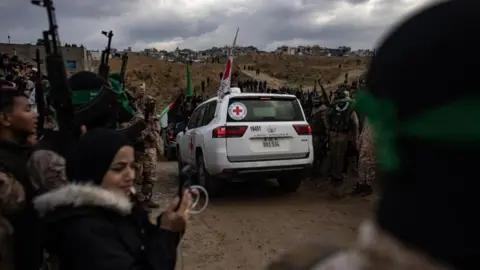

## Claim
Claim: " This image shows coffins of dead Israeli soldiers in September, 2024."

## Actions
```
reverse_search()
web_search("protest coffins israel")
```

## Evidence
### Evidence from `web_search`
The Times of Israel ([https://www.timesofisrael.com/liveblog_entry/carrying-fake-coffins-protesters-march-in-tel-aviv-to-demand-hostage-deal/](https://www.timesofisrael.com/liveblog_entry/carrying-fake-coffins-protesters-march-in-tel-aviv-to-demand-hostage-deal/)) and Euronews ([https://www.euronews.com/2024/09/05/protesters-march-in-tel-aviv-with-makeshift-coffins-to-demand-release-of-gaza-hostages](https://www.euronews.com/2024/09/05/protesters-march-in-tel-aviv-with-makeshift-coffins-to-demand-release-of-gaza-hostages)) both reported on a protest in Tel Aviv on September 5, 2024, where demonstrators carried mock coffins draped with Israeli flags to symbolize hostages held by Hamas in Gaza.  The protesters were demanding the release of the hostages.

A BBC News article ([https://www.bbc.com/news/articles/c93npgqlzvpo](https://www.bbc.com/news/articles/c93npgqlzvpo)) from February 20, 2025, discusses the return of the bodies of Israeli hostages.  


## Elaboration
The image depicts mock coffins used in a protest in Tel Aviv on September 5, 2024, as reported by The Times of Israel ([https://www.timesofisrael.com/liveblog_entry/carrying-fake-coffins-protesters-march-in-tel-aviv-to-demand-hostage-deal/](https://www.timesofisrael.com/liveblog_entry/carrying-fake-coffins-protesters-march-in-tel-aviv-to-demand-hostage-deal/)) and Euronews ([https://www.euronews.com/2024/09/05/protesters-march-in-tel-aviv-with-makeshift-coffins-to-demand-release-of-gaza-hostages](https://www.euronews.com/2024/09/05/protesters-march-in-tel-aviv-with-makeshift-coffins-to-demand-release-of-gaza-hostages)). The protesters were demanding the release of hostages held in Gaza.

The claim that the image shows coffins of dead Israeli soldiers is therefore incorrect.


## Final Judgement
The image shows mock coffins used in a protest in Tel Aviv on September 5, 2024, not coffins of dead Israeli soldiers. The protest was to demand the release of hostages held in Gaza.

`false`

### Verdict: FALSE

### Justification
The image shows mock coffins used in a protest in Tel Aviv on September 5, 2024, as reported by The Times of Israel ([https://www.timesofisrael.com/liveblog_entry/carrying-fake-coffins-protesters-march-in-tel-aviv-to-demand-hostage-deal/](https://www.timesofisrael.com/liveblog_entry/carrying-fake-coffins-protesters-march-in-tel-aviv-to-demand-hostage-deal/)) and Euronews ([https://www.euronews.com/2024/09/05/protesters-march-in-tel-aviv-with-makeshift-coffins-to-demand-release-of-gaza-hostages](https://www.euronews.com/2024/09/05/protesters-march-in-tel-aviv-with-makeshift-coffins-to-demand-release-of-gaza-hostages)). The protest was to demand the release of hostages held in Gaza.
