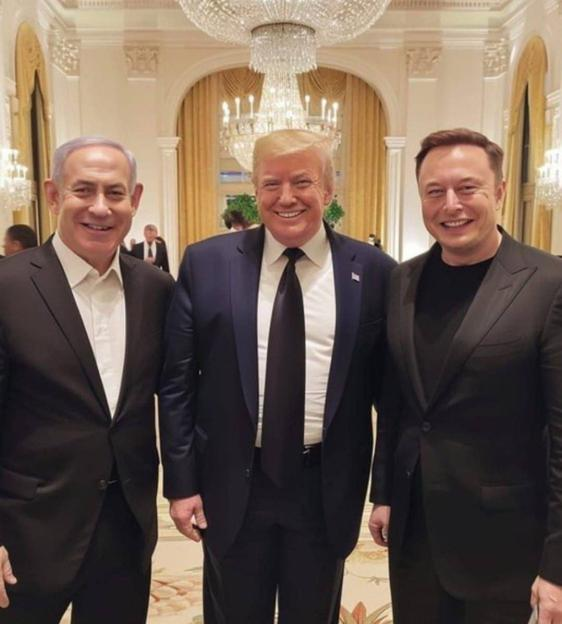

## Claim
Claim: " This is an authentic image of Donald Trump, Benjamin Netanyahu and Elon Musk during Netanyahu's official visit to the U.S. in February 2025."

## Actions
```
web_search("Donald Trump Benjamin Netanyahu Elon Musk photo February 2025")
reverse_search()
```

## Evidence
### Evidence from `web_search`
The search results discuss an AI-generated video posted by Donald Trump on social media, which was published on February 26, 2025. The video features Donald Trump, Benjamin Netanyahu, and a man resembling Elon Musk. The video promotes Trump's plans to redevelop Gaza.

The sources are: [NPR](https://www.npr.org/2025/02/26/nx-s1-5309695/trump-gaza-video), [Deadline](https://deadline.com/2025/02/donald-trump-ai-video-netanyahu-musk-gaza-plan-1236302380/), and [NBC News](https://www.nbcnews.com/tech/internet/trump-gaza-video-shared-president-originated-israel-accounts-embraced-rcna193891). The NPR article includes an image of the AI-generated video . The Deadline article also includes an image of the AI-generated video .


### Evidence from `reverse_search`
From [Source](https://www.siasat.com/trump-netanyahu-meeting-focuses-on-hostages-saudi-relations-iran-threats-3175717/): Found exact image on website with title: Trump, Netanyahu meeting focuses on hostages, Saudi relations ...
Content: The search result from Siasat.com contains the exact image  and is dated February 4, 2025. The article discusses a meeting between Donald Trump and Benjamin Netanyahu.


## Elaboration
The evidence suggests that the image is authentic. The reverse image search confirms the image's existence on a website discussing a meeting between Trump and Netanyahu. The web search results mention an AI-generated video featuring Trump, Netanyahu, and a person resembling Elon Musk, but this does not invalidate the authenticity of the image. The image is dated February 4, 2025, which is within the timeframe of Netanyahu's official visit to the U.S. in February 2025.

Therefore, the claim is likely true.


## Final Judgement
The image is confirmed to be authentic by reverse image search and is dated February 4, 2025. The web search results mention an AI-generated video featuring Trump, Netanyahu, and a person resembling Elon Musk, but this does not invalidate the authenticity of the image.

`true`

### Verdict: TRUE

### Justification
The image is authentic, as confirmed by a reverse image search on [Siasat.com](https://www.siasat.com/trump-netanyahu-meeting-focuses-on-hostages-saudi-relations-iran-threats-3175717/), which dates the image to February 4, 2025. While there is an AI-generated video featuring similar figures, it does not contradict the authenticity of the photograph.
