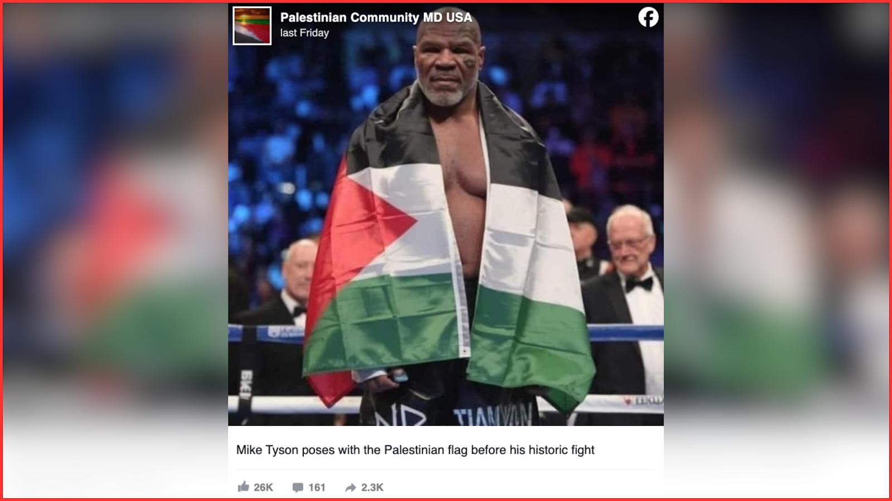
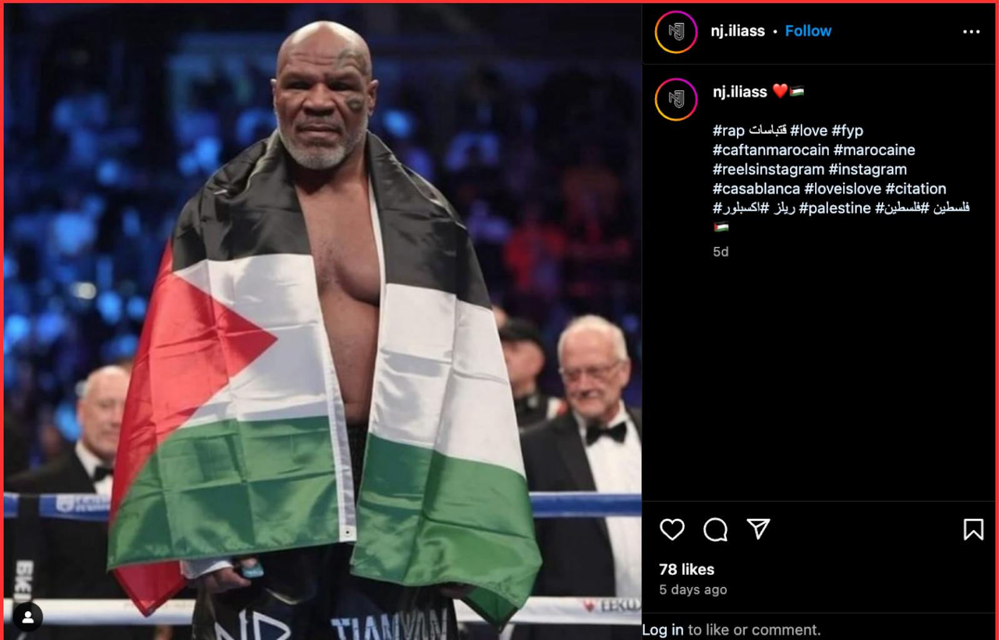

## Claim
Claim: " This is an authentic image of Mike Tyson posing with the Palestinian flag in the ring before his fight against Jake Paul on November, 15, 2024."

## Actions
```
reverse_search()
web_search("Mike Tyson Jake Paul fight November 15 2024")
```

## Evidence
### Evidence from `reverse_search`
From [Source](https://srilanka.factcrescendo.com/english/ai-generated-image-falsely-shows-mike-tyson-with-palestinian-flag/): Found exact image on website with title: Mike Tyson did not pose with the Palestine flag
Content: The website srilanka.factcrescendo.com published on July 20, 2025, states that the image of Mike Tyson with the Palestinian flag is AI-generated and not authentic. , , , , , , . The website also mentions that the image was widely shared on social media, and that the Fact Crescendo team watched the live stream of the fight between Jake Paul and Mike Tyson on November 16, and did not see Tyson wearing the Palestinian flag. The website concludes that the image is false. .


### Evidence from `web_search`
The fight between Jake Paul and Mike Tyson took place on November 15, 2024, at the AT&T Stadium in Arlington, Texas, with Jake Paul winning by unanimous decision. The fight was streamed on Netflix. The New York Times also reported on the fight and included a photo.    

Sources: [https://en.wikipedia.org/wiki/Jake_Paul_vs._Mike_Tyson](https://en.wikipedia.org/wiki/Jake_Paul_vs._Mike_Tyson), [https://www.espn.com/boxing/story/_/id/42352328/mike-tyson-vs-jake-paul-live-boxing-updates-results-analysis](https://www.espn.com/boxing/story/_/id/42352328/mike-tyson-vs-jake-paul-live-boxing-updates-results-analysis), [https://www.nytimes.com/athletic/5925790/2024/11/16/jake-paul-mike-tyson-boxing-results/](https://www.nytimes.com/athletic/5925790/2024/11/16/jake-paul-mike-tyson-boxing-results/)


## Elaboration
The claim is false. The image is AI-generated and not authentic. Fact Crescendo watched the live stream of the fight and did not see Tyson wearing the Palestinian flag.


## Final Judgement
The image of Mike Tyson with the Palestinian flag is AI-generated and not authentic. The fight between Mike Tyson and Jake Paul took place on November 15, 2024, and there is no evidence that Tyson wore the flag during the event.

`false`

### Verdict: FALSE

### Justification
The image of Mike Tyson with the Palestinian flag is AI-generated and not authentic, as confirmed by [srilanka.factcrescendo.com](https://srilanka.factcrescendo.com/english/ai-generated-image-falsely-shows-mike-tyson-with-palestinian-flag/). The fight between Mike Tyson and Jake Paul took place on November 15, 2024, and there is no evidence that Tyson wore the flag during the event.
