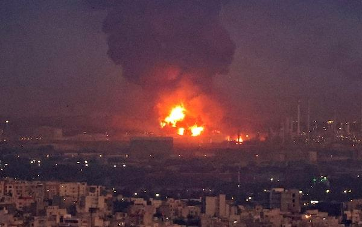

## Claim
Claim: " This image shows Israel bombing Tehran on October 26, 2024."

## Actions
```
reverse_search()
web_search("Tehran bombing October 26, 2024")
```

## Evidence
### Evidence from `reverse_search`
The image in the claim () appears in articles about a fire at an oil refinery near Tehran. The Times of Israel ([https://www.timesofisrael.com/liveblog_entry/huge-fire-at-refinery-near-tehran-extinguished-after-20-hours-report/](https://www.timesofisrael.com/liveblog_entry/huge-fire-at-refinery-near-tehran-extinguished-after-20-hours-report/)) and The Globe and Mail ([https://www.theglobeandmail.com/world/article-massive-fire-breaks-out-at-oil-refinery-south-of-tehran/](https://www.theglobeandmail.com/world/article-massive-fire-breaks-out-at-oil-refinery-south-of-tehran/)) published articles on June 2, 2021, about the fire.

The New Arab ([https://www.newarab.com/news/massive-fire-breaks-out-oil-refinery-near-irans-capital](https://www.newarab.com/news/massive-fire-breaks-out-oil-refinery-near-irans-capital)) also published an article about the fire. The fire occurred at the state-owned Tondgooyan Petrochemical Co.  


### Evidence from `web_search`
The web sources discuss Israeli strikes on Iran on October 26, 2024, including the codenamed "Operation Days of Repentance." 

## Elaboration
The image in the claim depicts a fire at an oil refinery near Tehran. The reverse image search indicates that the image was taken on June 2, 2021. The web search confirms that there were Israeli strikes on Iran on October 26, 2024.

The claim is therefore false. The image is not from October 26, 2024, and it does not depict a bombing.


## Final Judgement
The image is from a fire at an oil refinery near Tehran in June 2021, not a bombing on October 26, 2024. The claim misrepresents the origin and context of the image. `false`

### Verdict: FALSE

### Justification
The image in the claim is from a fire at an oil refinery near Tehran in June 2021, as reported by sources like [The Times of Israel](https://www.timesofisrael.com/liveblog_entry/huge-fire-at-refinery-near-tehran-extinguished-after-20-hours-report/). The claim incorrectly states that the image depicts an Israeli bombing on October 26, 2024.
