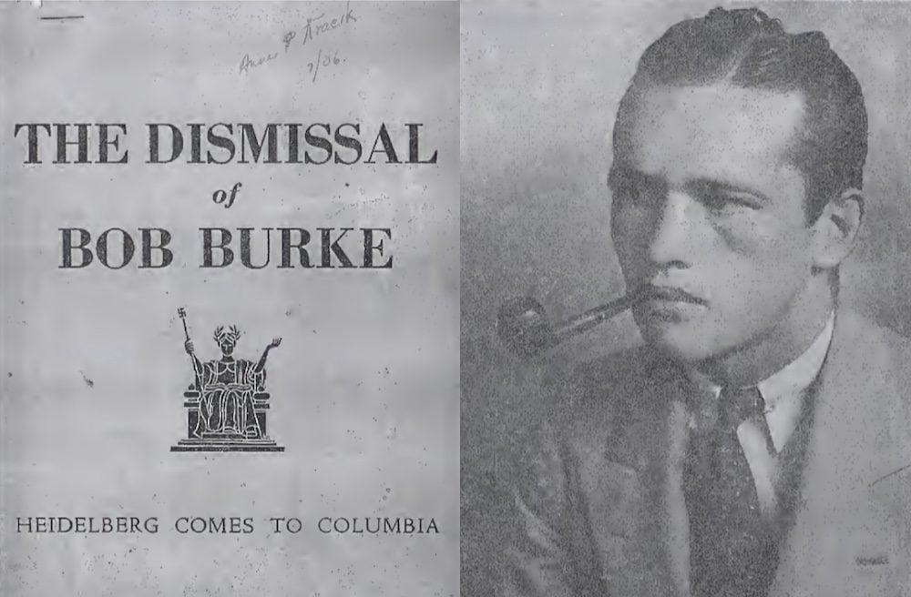

## Claim
Claim: "In June 1936, Columbia University expelled student activist Robert Burke for leading an anti-Nazi demonstration."

## Actions
```
web_search("Columbia University Robert Burke expelled anti-Nazi demonstration 1936")
```

## Evidence
### Evidence from `web_search`
Two articles from Blurred Bylines ([https://blurredbylines.com/articles/robert-burke-columbia-university-expulsion-1936-protest/](https://blurredbylines.com/articles/robert-burke-columbia-university-expulsion-1936-protest/)) and Medium ([https://medium.com/@blurredbylines/when-columbia-university-expelled-robert-burke-for-anti-nazi-protests-in-1936-d9f236c91794](https://medium.com/@blurredbylines/when-columbia-university-expelled-robert-burke-for-anti-nazi-protests-in-1936-d9f236c91794)) discuss the expulsion of Robert Burke from Columbia University in June 1936 for leading an anti-Nazi protest. The Blurred Bylines article includes an image  related to the event.

Columbia Magazine ([https://magazine.columbia.edu/article/book-review-third-reich-ivory-tower](https://magazine.columbia.edu/article/book-review-third-reich-ivory-tower)) also mentions Burke's expulsion for participating in a mock book burning and anti-Nazi picket in 1936 <image:k>.


## Elaboration
The evidence confirms the claim. Multiple sources, including Blurred Bylines ([https://blurredbylines.com/articles/robert-burke-columbia-university-expulsion-1936-protest/](https://blurredbylines.com/articles/robert-burke-columbia-university-expulsion-1936-protest/)) and Medium ([https://medium.com/@blurredbylines/when-columbia-university-expelled-robert-burke-for-anti-nazi-protests-in-1936-d9f236c91794](https://medium.com/@blurredbylines/when-columbia-university-expelled-robert-burke-for-anti-nazi-protests-in-1936-d9f236c91794)), and Columbia Magazine ([https://magazine.columbia.edu/article/book-review-third-reich-ivory-tower](https://magazine.columbia.edu/article/book-review-third-reich-ivory-tower)) support the expulsion of Robert Burke from Columbia University in June 1936 for his involvement in anti-Nazi activities.


## Final Judgement
The claim is supported by multiple sources. These sources confirm that Robert Burke was expelled from Columbia University in June 1936 for leading an anti-Nazi demonstration.

`true`


### Verdict: TRUE

### Justification
The claim is supported by multiple sources, including articles from Blurred Bylines ([https://blurredbylines.com/articles/robert-burke-columbia-university-expulsion-1936-protest/](https://blurredbylines.com/articles/robert-burke-columbia-university-expulsion-1936-protest/)) and Medium ([https://medium.com/@blurredbylines/when-columbia-university-expelled-robert-burke-for-anti-nazi-protests-in-1936-d9f236c91794](https://medium.com/@blurredbylines/when-columbia-university-expelled-robert-burke-for-anti-nazi-protests-in-1936-d9f236c91794)), and Columbia Magazine ([https://magazine.columbia.edu/article/book-review-third-reich-ivory-tower](https://magazine.columbia.edu/article/book-review-third-reich-ivory-tower)), which confirm that Robert Burke was expelled from Columbia University in June 1936 for leading an anti-Nazi demonstration.
