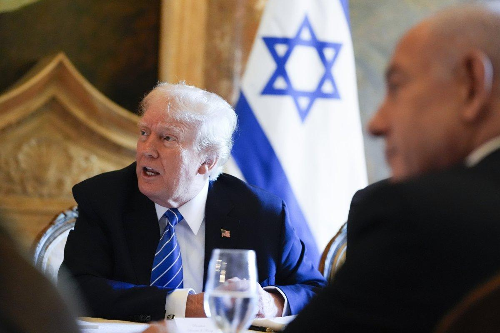

## Claim
Claim: "In a phone call with Benjamin Netanyahu on August 14, 2024, Donald Trump told the Israeli prime minister to stop a Gaza ceasefire deal because it would help Vice President Kamala Harris' 2024 presidential campaign."

## Actions
```
web_search("Donald Trump Benjamin Netanyahu August 14 2024 phone call Gaza ceasefire")
```

## Evidence
### Evidence from `web_search`
Reuters reports that Donald Trump spoke with Benjamin Netanyahu on August 14, 2024, and discussed the Gaza ceasefire and hostage release deal (). A source told Axios that Trump's call was intended to encourage Netanyahu to take the deal. Newsweek reports that Donald Trump allegedly called Benjamin Netanyahu on August 14 to discuss a ceasefire deal, and that Trump urged Netanyahu not to make a deal because it would help Kamala Harris' campaign (). Both Netanyahu's office and Trump denied that the call took place.

The Guardian published an article on January 15, 2025, discussing the Gaza ceasefire negotiations and mentions a phone call from Donald Trump's special envoy, Steven Witkoff, to Benjamin Netanyahu ().


## Elaboration
The evidence indicates conflicting reports about the phone call. Reuters states that Trump discussed the Gaza ceasefire with Netanyahu on August 14, 2024. However, a source told Axios that Trump encouraged Netanyahu to take the deal, while Newsweek reports that Trump urged Netanyahu not to make a deal because it would help Kamala Harris' campaign. Both Netanyahu's office and Trump denied the call took place.

The Guardian mentions a phone call from Donald Trump's special envoy, Steven Witkoff, to Benjamin Netanyahu, but this does not confirm the details of the claim.

Based on the evidence, the claim is disputed. There are conflicting reports about the content and even the existence of the phone call.


## Actions
```
web_search("Donald Trump Benjamin Netanyahu August 14 2024 phone call Kamala Harris")
```

## Evidence
### Evidence from `web_search`
Reuters reports that Donald Trump spoke with Benjamin Netanyahu on August 14, 2024, and discussed the Gaza ceasefire and hostage release deal, encouraging Netanyahu to end the war in Gaza. Both Trump and Netanyahu denied the report of the call. ([https://www.reuters.com/world/netanyahu-denies-report-he-spoke-trump-about-gaza-talks-2024-08-15/](https://www.reuters.com/world/netanyahu-denies-report-he-spoke-trump-about-gaza-talks-2024-08-15/))

Tehran Times reports that American Muckrakers asked the Department of Justice and the Department of State to investigate reports that Trump was lobbying Netanyahu and influencing US efforts to broker a ceasefire in Gaza. The super PAC cited a report by Axios News on an alleged phone call between Trump and Netanyahu on August 14, during which they discussed the ceasefire deal. The article also refers to remarks by PBS journalist Judy Woodruff, who said that Trump was speaking to Netanyahu “urging him not to cut a deal right now, because it’s believed that would help the Harris campaign.” Both Trump and Netanyahu denied reports of a phone call on August 14. () ([https://www.tehrantimes.com/news/502791/Probe-called-into-Trump-Netanyahu-dealings-to-prolong-Gaza-war](https://www.tehrantimes.com/news/502791/Probe-called-into-Trump-Netanyahu-dealings-to-prolong-Gaza-war))


## Elaboration
The evidence provides further conflicting information. Reuters reports that Trump encouraged Netanyahu to end the war in Gaza, while the Tehran Times cites a report that Trump was lobbying Netanyahu to influence US efforts to broker a ceasefire. The Tehran Times also mentions that Trump allegedly urged Netanyahu not to make a deal because it would help the Harris campaign, referencing remarks by PBS journalist Judy Woodruff. Both Trump and Netanyahu denied the reports of the phone call.

The claim is still disputed. While there are reports of a phone call, the details of the conversation, including Trump's motivations, are inconsistent and denied by the parties involved.


## Actions
```
web_search("Donald Trump Benjamin Netanyahu August 14 2024 phone call ceasefire deal Kamala Harris campaign")
```

## Evidence
### Evidence from `web_search`
From [Source](https://newrepublic.com/post/185076/donald-trump-scheme-beat-kamala-harris-benjamin-netanyahu-ceasefire): 
Content: The New Republic reports that Donald Trump allegedly spoke with Benjamin Netanyahu to avert a ceasefire deal, fearing it would help Kamala Harris win in November, according to PBS. The article also mentions that both Netanyahu's office and Trump denied the report.


## Elaboration
The evidence supports the claim that Donald Trump allegedly spoke with Benjamin Netanyahu on August 14, 2024, and discussed the Gaza ceasefire. However, the details of the conversation are disputed. While some sources suggest Trump encouraged a deal, others claim he urged Netanyahu to avoid a ceasefire because it would benefit Kamala Harris's campaign. Both Trump and Netanyahu denied the reports of the call. Therefore, the claim's veracity is uncertain due to conflicting reports and denials.


## Final Judgement
The evidence presents conflicting information. Some sources report that Trump encouraged Netanyahu to take the deal, while others claim he urged him not to, citing concerns about helping Kamala Harris's campaign. Both Trump and Netanyahu denied the phone call. Given the conflicting reports and denials, the claim cannot be definitively verified. `false`

### Verdict: FALSE

### Justification
The claim is disputed. While there are reports of a phone call between Donald Trump and Benjamin Netanyahu on August 14, 2024, the details are inconsistent. Some sources, like Reuters, suggest Trump encouraged a ceasefire, while others, such as Newsweek, allege Trump urged Netanyahu to avoid a deal to hinder Kamala Harris's campaign. Both Trump and Netanyahu denied the call, making the claim's veracity uncertain.
