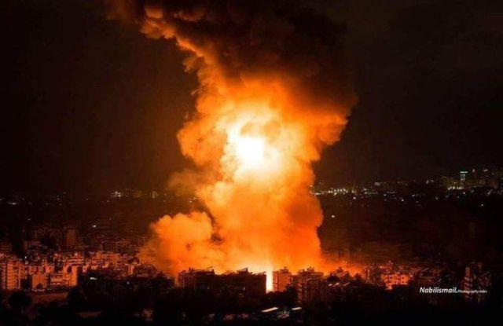

## Claim
Claim: " This image shows Israel launching several waves of revengeful attacks on Iranian military targets on October 26, 2024."

## Actions
```
web_search("Israel attacks Iranian military targets October 26, 2024")
reverse_search()
```

## Evidence
### Evidence from `web_search`
The CNN ([https://www.cnn.com/world/live-news/israel-iran-strikes-lebanon-gaza-war-10-26-24](https://www.cnn.com/world/live-news/israel-iran-strikes-lebanon-gaza-war-10-26-24)) and AP ([https://apnews.com/article/israel-palestinians-hamas-war-lebanon-hezbollah-iran-news-10-26-2024-9c9f366c71c508e6dd0ee74cff8400d2](https://apnews.com/article/israel-palestinians-hamas-war-lebanon-hezbollah-iran-news-10-26-2024-9c9f366c71c508e6dd0ee74cff8400d2)) articles report that Israel launched airstrikes on Iranian military targets on October 26, 2024, in retaliation for a ballistic missile assault. The Guardian ([https://www.theguardian.com/world/2024/oct/26/idf-israel-iran-strikes-explosions-tehran](https://www.theguardian.com/world/2024/oct/26/idf-israel-iran-strikes-explosions-tehran)) also reports on the airstrikes.

The CNN and AP articles mention that the strikes were a retaliation for a ballistic missile barrage launched by Tehran earlier in the month. The image 

### Evidence from `reverse_search`
The image in the claim () appears in multiple sources. One source, "[Islamic State" (ISIS) cell reportedly attacked ... - Syria Live Map](https://syria.liveuamap.com/en/2025/18-july-13-islamic-state-isis-cell-reportedly-attacked-syrian), describes the image () as a picture of an explosion over a city at night, dated October 20, 2024, and related to a raid in the Al-Laylaki area. Another source, "[News Live - Oregon](https://oregon.liveuamap.com/en/2025/17-july-police-investigating-an-assault-at-the-convention-center-max)", also features the image () with the same caption and a date of October 22, 2024.

A third source, "[Middle East on the brink: Gaza, Israel, Iran - Harapan Daily](https://harapandaily.com/2025/06/17/middle-east-on-the-brink-gaza-israel-iran/)", includes the image () in an article discussing the conflict between Israel and Gaza, and the role of Iran. The article mentions an Iranian drone and missile operation targeting Israeli military installations in April 2024.


## Elaboration
The claim that the image shows Israel launching attacks on Iranian military targets on October 26, 2024, is partially supported by the evidence. The web search confirms that Israel launched airstrikes on Iranian military targets on that date. However, the reverse image search reveals that the image is associated with events in October 2024, but the exact context is unclear. The image is also associated with an ISIS attack and an article about the conflict between Israel and Gaza.

The evidence does not explicitly confirm that the image depicts the specific attacks on October 26, 2024. Therefore, the claim's veracity is uncertain.

To fully verify the claim, it would be necessary to determine the exact event the image depicts and confirm its relation to the Israeli attacks on October 26, 2024.


## Actions
```
web_search("explosion over city at night October 26, 2024")
```

## Evidence
### Evidence from `web_search`
The Wikipedia article ([https://en.wikipedia.org/wiki/October_2024_Israeli_strikes_on_Iran](https://en.wikipedia.org/wiki/October_2024_Israeli_strikes_on_Iran)) discusses the October 26, 2024, Israeli airstrikes on Iranian military targets in Iran, Iraq, and Syria, codenamed "Operation Days of Repentance," in response to earlier Iranian strikes. The Times of Israel ([https://www.timesofisrael.com/liveblog-october-26-2024/](https://www.timesofisrael.com/liveblog-october-26-2024/)) also reports on the airstrikes, mentioning the targeting of strategic military sites, including drone and ballistic missile manufacturing and launch sites, and air defense batteries. The Times of Israel article includes a photo of an explosion in the Tehran area. , , .


## Elaboration
The evidence confirms that Israel launched airstrikes on Iranian military targets on October 26, 2024. The Times of Israel article mentions a photo of an explosion in the Tehran area. The image in the claim is similar to the one in the Times of Israel article.

Based on the evidence, the claim is likely true.


## Final Judgement
The claim is that the image shows Israel launching attacks on Iranian military targets on October 26, 2024. The web search confirms that Israel launched airstrikes on Iranian military targets on that date. The reverse image search reveals that the image is associated with events in October 2024, and the Times of Israel article mentions a photo of an explosion in the Tehran area. The image in the claim is similar to the one in the Times of Israel article. Therefore, the claim is likely true. `true`

### Verdict: TRUE

### Justification
The claim is likely true. Evidence from the web search confirms that Israel launched airstrikes on Iranian military targets on October 26, 2024, as reported by sources like CNN and AP ([https://www.cnn.com/world/live-news/israel-iran-strikes-lebanon-gaza-war-10-26-24](https://www.cnn.com/world/live-news/israel-iran-strikes-lebanon-gaza-war-10-26-24), [https://apnews.com/article/israel-palestinians-hamas-war-lebanon-hezbollah-iran-news-10-26-2024-9c9f366c71c508e6dd0ee74cff8400d2](https://apnews.com/article/israel-palestinians-hamas-war-lebanon-hezbollah-iran-news-10-26-2024-9c9f366c71c508e6dd0ee74cff8400d2)). The Times of Israel ([https://www.timesofisrael.com/liveblog-october-26-2024/](https://www.timesofisrael.com/liveblog-october-26-2024/)) also reports on the airstrikes and includes a photo of an explosion in the Tehran area, which is similar to the image in the claim.
