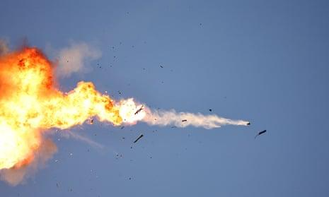

## Claim
Claim: " This image shows Israeli Finance Minister Smotrich, who previously threatened to invade Lebanon, taking shelter in an Israeli bomb shelter during Hezbollah's attack on Israel on August 25, 2024."

## Actions
```
web_search("Israeli Finance Minister Smotrich bomb shelter Hezbollah attack")
reverse_search()
```

## Evidence
### Evidence from `web_search`
The BBC News article from July 28, 2024, discusses the tensions between Israel and Hezbollah, including Israeli Finance Minister Bezalel Smotrich's warning about an all-out war. ([https://www.bbc.com/news/articles/c2e4m6m1r4eo](https://www.bbc.com/news/articles/c2e4m6m1r4eo)) The Wikipedia article discusses the Majdal Shams attack on July 27, 2024, which Israel blamed on Hezbollah.  shows Israeli Finance Minister Bezalel Smotrich visiting the site of the attack. The Times of Israel also reports on the rocket strike in the Golan Heights on July 27, 2024, which Israel and the United States blamed on Hezbollah, and mentions that Finance Minister Bezalel Smotrich abstained from the vote on the response to the attack. ([https://www.timesofisrael.com/ministers-okay-netanyahu-gallant-to-decide-on-retaliation-for-deadly-rocket-strike/](https://www.timesofisrael.com/ministers-okay-netanyahu-gallant-to-decide-on-retaliation-for-deadly-rocket-strike/))


## Elaboration
The evidence confirms that Bezalel Smotrich is the Israeli Finance Minister. The BBC News article from July 28, 2024, and The Times of Israel report on the tensions between Israel and Hezbollah, including Smotrich's involvement. The Times of Israel also mentions a rocket strike on July 27, 2024, in the Golan Heights, which Israel blamed on Hezbollah. The image shows Smotrich at the site of the attack.

The evidence does not mention an attack on August 25, 2024, nor does it mention Smotrich taking shelter in a bomb shelter.

Therefore, the claim cannot be verified due to a lack of information.


## Actions
```
web_search("Bezalel Smotrich Hezbollah attack August 25 2024 bomb shelter")
```

## Evidence
### Evidence from `web_search`
The Kashif article from August 25, 2024, discusses an old photo of Israeli ministers, including Bezalel Smotrich, in a shelter, which was falsely claimed to be taken during Hezbollah's recent bombing. The photo was actually taken on October 7, 2023. The article also mentions that the Israeli occupation army launched preemptive strikes on southern Lebanon on August 25, 2024. ([https://kashif.ps/en/index.php/2024/08/25/old-photo-of-israeli-ministers-in-shelter-republished-as-during-hezbollahs-recent-bombing-of-sites-in-israel/](https://kashif.ps/en/index.php/2024/08/25/old-photo-of-israeli-ministers-in-shelter-republished-as-during-hezbollahs-recent-bombing-of-sites-in-israel/)) The Guardian article from August 25, 2024, discusses the escalation of fighting between Israel and Hezbollah in Lebanon, mentioning Bezalel Smotrich. ([https://www.theguardian.com/commentisfree/article/2024/aug/25/israels-attack-lebanon-peace-further-out-of-reach](https://www.theguardian.com/commentisfree/article/2024/aug/25/israels-attack-lebanon-peace-further-out-of-reach)) The Times of Israel's live blog from September 27, 2024, reports on the ongoing conflict between Israel and Hezbollah, mentioning rocket sirens and airstrikes, and that Smotrich hailed Netanyahu's UN speech. ([https://www.timesofisrael.com/liveblog-september-27-2024/](https://www.timesofisrael.com/liveblog-september-27-2024/)) , , , , 


## Elaboration
The Kashif article states that the image in the claim was falsely claimed to be taken during Hezbollah's recent bombing and was actually taken on October 7, 2023. The article also mentions that the Israeli occupation army launched preemptive strikes on southern Lebanon on August 25, 2024.

Therefore, the claim is false.


## Final Judgement
The image in the claim was taken on October 7, 2023, and not during an attack on August 25, 2024, as the claim suggests. The claim is therefore misleading. `false`

### Verdict: FALSE

### Justification
The claim is false. The image depicts Israeli Finance Minister Smotrich, but the photo was taken on October 7, 2023, not during an attack on August 25, 2024, as stated in the claim, according to the [Kashif article](https://kashif.ps/en/index.php/2024/08/25/old-photo-of-israeli-ministers-in-shelter-republished-as-during-hezbollahs-recent-bombing-of-sites-in-israel/).
