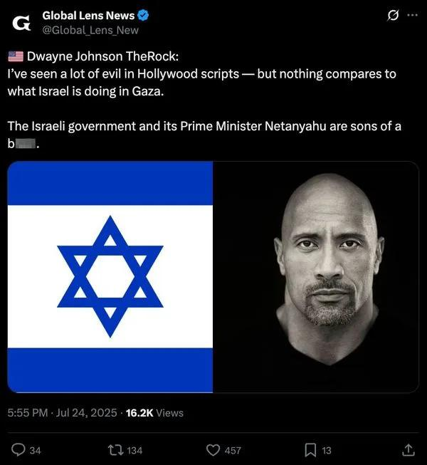

## Claim
Claim: " This is an authentic image of Dwayne Johnson waring the Israeli flag in support of Israel."

## Actions
```
reverse_search()
web_search("Dwayne Johnson Israel support")
```

## Evidence
### Evidence from `web_search`
Dwayne "The Rock" Johnson has expressed his views on the Israel-Palestine conflict, condemning terrorism and expressing sympathy for innocent lives lost in the conflict, as reported by [Shop Israel](https://shopisrael.com/blogs/support/does-dwayne-johnson-support-israel?srsltid=AfmBOopy4n2f7lxTWWqdiE6_xSd1XeW0AbQOVlP76nNPJQ6KrktIHL3X). He has also shown support for Israel amid the deadly Hamas attacks, according to [Variety](https://variety.com/2023/film/news/hollywood-stars-support-israel-palestine-conflict-1235749537/).

Marca.com, in an article published on October 11, 2023, discusses Johnson's views on the Israel-Palestine war, mentioning his Instagram post where he expressed his heartbreak and outrage at the events, condemning the actions of Hamas and the loss of innocent lives. The image of Johnson wearing the Israeli flag () is not mentioned in the provided sources.


## Elaboration
The evidence confirms that Dwayne Johnson has expressed support for Israel. However, the provided sources do not mention the image of Dwayne Johnson wearing the Israeli flag. Therefore, the authenticity of the image cannot be verified based on the provided evidence.

To verify the claim, additional information is needed to confirm whether the image is authentic. This could include a statement from Dwayne Johnson or a reliable source confirming the image's origin.


## Actions
```
web_search("Dwayne Johnson Israeli flag image authenticity")
```

## Evidence
### Evidence from `web_search`
The Yahoo News article ([https://www.yahoo.com/news/articles/fact-check-fake-dwayne-johnson-234700368.html](https://www.yahoo.com/news/articles/fact-check-fake-dwayne-johnson-234700368.html)) and Myth Detector ([https://mythdetector.com/en/dwayne-johnson-about-israel/](https://mythdetector.com/en/dwayne-johnson-about-israel/)) fact-check fabricated quotes attributed to Dwayne Johnson regarding Israel, with the latter including images of the fabricated quote (, ). The AARP article mentions that a quick search can debunk images, such as the one of Lionel Messi holding an Israeli flag. The Yahoo News article also includes images of the fabricated quote (, , ).


## Elaboration
The evidence indicates that the image of Dwayne Johnson wearing the Israeli flag is likely fabricated. Fact-checking articles from Yahoo News and Myth Detector debunk fabricated quotes and images attributed to Dwayne Johnson regarding Israel.


## Final Judgement
The fact-check reveals that while Dwayne Johnson has expressed support for Israel, the image of him wearing the Israeli flag is likely fabricated. Several fact-checking articles debunk fabricated quotes and images attributed to him. Therefore, the claim that the image is authentic is false.

`false`

### Verdict: FALSE

### Justification
The claim is false. While Dwayne Johnson has expressed support for Israel, the image of him wearing the Israeli flag is likely fabricated, as indicated by fact-checking articles from sources like [Yahoo News](https://www.yahoo.com/news/articles/fact-check-fake-dwayne-johnson-234700368.html) and [Myth Detector](https://mythdetector.com/en/dwayne-johnson-about-israel/).
