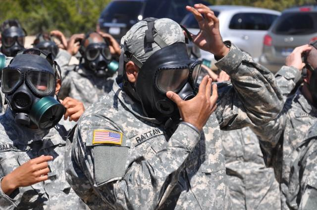

## Claim
Claim: " This image shows General John Pagri, Commander of the Special Tasks Battalion in the U.S. Army, which has died in the Gaza Strip in April 2025."

## Actions
```
reverse_search()
web_search("General John Pagri U.S. Army")
web_search("General John Pagri death Gaza April 2025")
```

## Evidence
### Evidence from `reverse_search`
From [Source](https://en.wikipedia.org/wiki/File:Two_19th_Group_Special_Forces_Soldiers_in_Babil_Province_Iraq.jpg): Found exact image on website with title: File:Two 19th Group Special Forces Soldiers in Babil Province Iraq.jpg
Content: The image is from Wikimedia Commons and is titled "Two 19th Group Special Forces Soldiers in Babil Province Iraq.jpg". The image shows two soldiers in Babil Province Iraq in 2007. The file was uploaded on June 21, 2011, and the author is the United States Army. 


### Evidence from `web_search`
The search results include a biography of Brigadier General John I. Pray Jr. on the Air Force website, mentioning his current position as Director of the White House Situation Room ([https://www.af.mil/About-Us/Biographies/Display/Article/107918/brigadier-general-john-i-pray-jr/](https://www.af.mil/About-Us/Biographies/Display/Article/107918/brigadier-general-john-i-pray-jr/)). Another article from the U.S. Army discusses Sikh soldiers serving while retaining their articles of faith, with several images (, , , , ) included ([https://www.army.mil/article/36339/sikh_soldiers_allowed_to_serve_retain_their_articles_of_faith](https://www.army.mil/article/36339/sikh_soldiers_allowed_to_serve_retain_their_articles_of_faith)).

Additionally, there is a biography of Brigadier General John J. Campo, detailing his military career and awards ([https://dc.ng.mil/News/Biographies/Article/1512717/brigadier-general-john-j-campo/](https://dc.ng.mil/News/Biographies/Article/1512717/brigadier-general-john-j-campo/)).


### Evidence from `web_search`
The image () is old and was taken in Iraq, not in Gaza. The uniform in the photo was retired in 2019. The Office of the Secretary of Defense confirmed that the posts are false and that there are no US service members in Gaza. The search result from Yahoo News can be found here: [https://uk.news.yahoo.com/photo-us-army-general-killed-110919596.html](https://uk.news.yahoo.com/photo-us-army-general-killed-110919596.html).

A tweet from SilencedSirs◼️, published on April 6, 2025, reported the death of General John Pagri, Commander of the Special Tasks Battalion in the U.S. Army, in the Gaza Strip.


## Elaboration
The claim is false. The image is from Iraq, not Gaza. The uniform in the photo was retired in 2019. The Office of the Secretary of Defense confirmed that the posts are false and that there are no US service members in Gaza.


## Final Judgement
The image is from Iraq, not Gaza, and the uniform is outdated. The claim of General John Pagri's death in Gaza is false, as confirmed by the Office of the Secretary of Defense.

`false`

### Verdict: FALSE

### Justification
The claim is false. The image used in the claim is from Iraq, not Gaza, and the uniform is outdated. The Office of the Secretary of Defense confirmed that the claim is false and that there are no US service members in Gaza ([https://uk.news.yahoo.com/photo-us-army-general-killed-110919596.html](https://uk.news.yahoo.com/photo-us-army-general-killed-110919596.html)).
