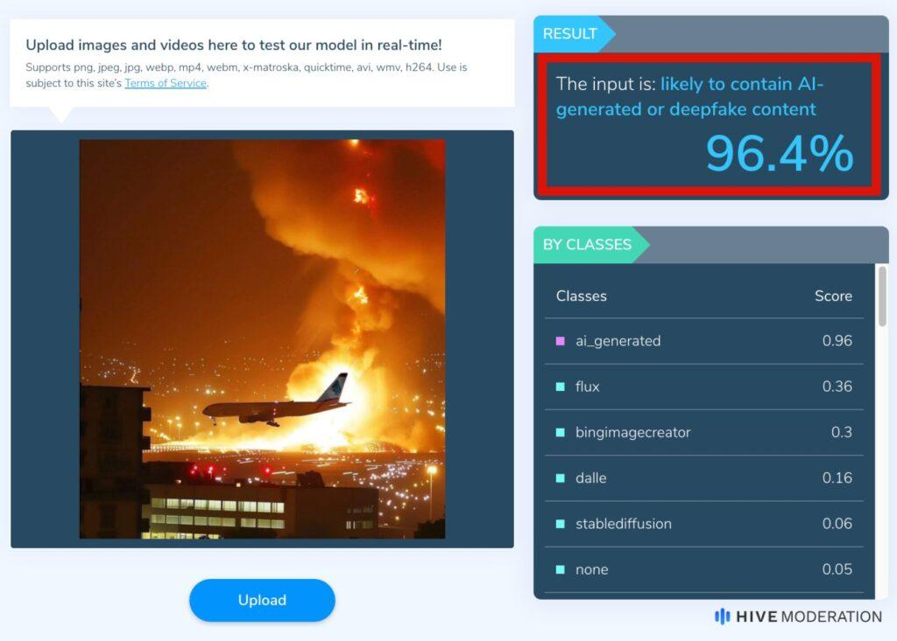

## Claim
Claim: " This is an authentic image of Israel bombing Beirut's International Airport in October 2024."

## Actions
```
reverse_search()
web_search("Beirut airport bombing date")
```

## Evidence
### Evidence from `reverse_search`
The image  is AI-generated and does not depict a real event. According to [India Today](https://www.indiatoday.in/fact-check/story/fact-check-photo-middle-east-airlines-flight-israel-airstrikes-beirut-lebanon-ai-generated-2622766-2024-10-24), the image was posted on Instagram on October 21, 2024.

[Factly.in](https://factly.in/an-ai-generated-image-of-a-plane-landing-at-beirut-international-airport-surrounded-by-fire-and-smoke-is-falsely-shared-as-real/) also confirms the image is AI-generated, with the original poster, "eyesoflebanon," confirming it. The article includes other AI-generated images ,  and results from AI detection tools , .


### Evidence from `web_search`
The U.S. Marine Corps website ([https://www.marines.mil/News/Marines-TV/videoid/634642/dvpTag/Beirut/](https://www.marines.mil/News/Marines-TV/videoid/634642/dvpTag/Beirut/)) discusses the 40th anniversary of the Beirut bombing, which occurred on October 23, 2023. PBS.org ([https://www.pbs.org/frontlineworld/stories/lebanon/tl03.html](https://www.pbs.org/frontlineworld/stories/lebanon/tl03.html)) discusses the bombing of the Marine barracks at the Beirut airport and the United States Embassy building in Beirut.

Wikipedia ([https://en.wikipedia.org/wiki/1968_Israeli_raid_on_Beirut_Airport](https://en.wikipedia.org/wiki/1968_Israeli_raid_on_Beirut_Airport)) discusses the 1968 Israeli raid on Beirut Airport, which took place on December 28, 1968. The image 

## Elaboration
The claim is false. The image is AI-generated, and therefore, it does not depict a real event. The image was posted on Instagram on October 21, 2024. The search results also show that there have been bombings in Beirut, but not in October 2024.


## Final Judgement
The image is AI-generated and does not depict a real event. The claim is therefore false. `false`

### Verdict: FALSE

### Justification
The image is AI-generated, as confirmed by reverse image searches and reports from [India Today](https://www.indiatoday.in/fact-check/story/fact-check-photo-middle-east-airlines-flight-israel-airstrikes-beirut-lebanon-ai-generated-2622766-2024-10-24) and [Factly.in](https://factly.in/an-ai-generated-image-of-a-plane-landing-at-beirut-international-airport-surrounded-by-fire-and-smoke-is-falsely-shared-as-real/). The image was posted on Instagram on October 21, 2024.
