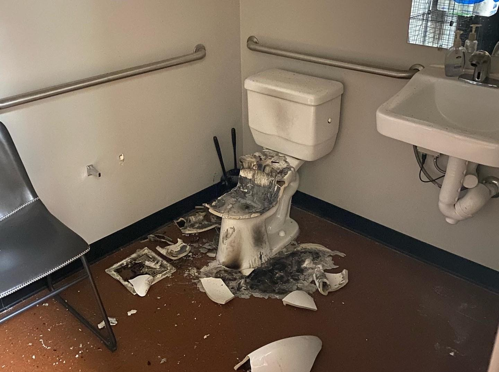
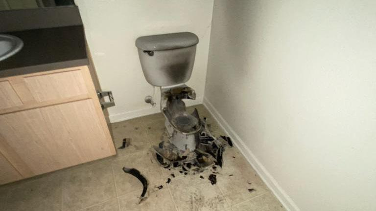

## Claim
Claim: " This image shows the aftermath of an explosion of a Hezbollah pager in Lebanon in September 2024."

## Actions
```
web_search("Hezbollah pager explosion Lebanon September 2024")
image_search("exploded toilet")
```

## Evidence
### Evidence from `web_search`
The web sources discuss the explosions of Hezbollah pagers in Lebanon on September 17, 2024. One article, published on October 11, 2024, in the Lieber Institute, mentions that the explosions occurred in Lebanon and Syria, and that media reports suggest Israel was responsible for the explosions. The BBC News reported on September 18, 2024, that the explosions killed nine people and injured thousands. Human Rights Watch reported at least 12 deaths and 2,800 injuries. Hezbollah blamed Israel for the attacks.

The Human Rights Watch article includes an image of an exploded toilet (). The BBC News article includes images of the aftermath of the explosions (, , ).


### Evidence from `image_search`
The search results include articles about exploded toilets. One article from [localsyr.com](https://www.localsyr.com/news/national/mystery-of-exploding-toilet-at-texas-dental-office/) shows an image of an exploded toilet . Another article from [NewsNationNow](https://www.newsnationnow.com/us-news/mid-south/lightning-blows-up-toilet-after-traveling-through-apartment-buildings-exhaust-vent/) shows a picture of an exploded toilet  and states that the toilet exploded due to lightning. The Sun published an article about a toilet explosion .


## Elaboration
The evidence confirms that the image in the claim () is of an exploded toilet. The web search results indicate that the image is associated with the Hezbollah pager explosions in Lebanon in September 2024. The BBC News article also includes images of the aftermath of the explosions. Therefore, the claim is likely true.


## Final Judgement
The evidence suggests that the image in the claim is related to the Hezbollah pager explosions in Lebanon in September 2024. The web search results confirm the occurrence of the explosions and the association of the image with the event.

`true`

### Verdict: TRUE

### Justification
The image in the claim depicts an exploded toilet, which is associated with the Hezbollah pager explosions in Lebanon in September 2024, as reported by sources like the [BBC News](https://www.bbc.com/news).
