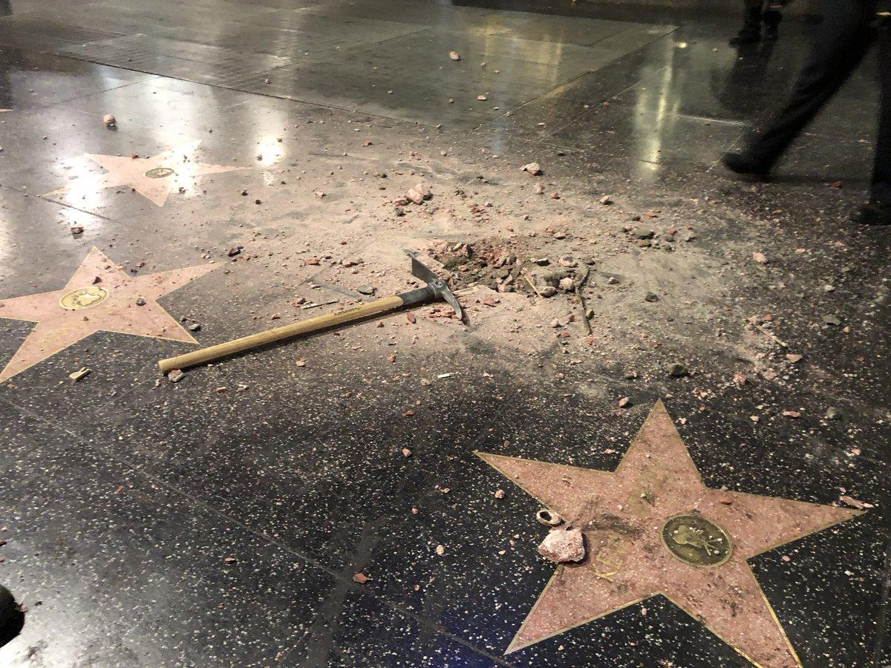

## Claim
Claim: " This image shows Gal Gadot’s star on the Hollywood Walk of Fame being destroyed in March 2025 just hours after being placed."

## Actions
```
web_search("Gal Gadot Hollywood Walk of Fame star vandalism")
image_search("Gal Gadot Hollywood Walk of Fame star damage")
```

## Evidence
### Evidence from `image_search`
An NDTV article shows an image of Gal Gadot's star on the Hollywood Walk of Fame being damaged . The Los Angeles Times published an article on March 18, 2025, about Gal Gadot's star on the Hollywood Walk of Fame .

*   [https://www.ndtv.com/world-news/gal-gadots-hollywood-walk-of-fame-star-smashed-amid-pro-palestinian-protests-photo-is-viral-7966341](https://www.ndtv.com/world-news/gal-gadots-hollywood-walk-of-fame-star-smashed-amid-pro-palestinian-protests-photo-is-viral-7966341)
*   [https://ew.com/fact-check-was-gal-gadot-s-hollywood-star-destroyed-11700747?srsltid=AfmBOopi5B\_4SFyMzbFXffAmqa\_7xa\_aZ2Vfvsn4yz9Ml3DFGpY9xM1O](https://ew.com/fact-check-was-gal-gadot-s-hollywood-star-destroyed-11700747?srsltid=AfmBOopi5B_4SFyMzbFXffAmqa_7xa_aZ2Vfvsn4yz9Ml3DFGpY9xM1O)
*   [https://www.latimes.com/entertainment-arts/story/2025-03-18/gal-gadot-walk-of-fame-pro-palestine-pro-israel-protesters-snow-white](https://www.latimes.com/entertainment-arts/story/2025-03-18/gal-gadot-walk-of-fame-pro-palestine-pro-israel-protesters-snow-white)


## Elaboration
The evidence confirms that Gal Gadot's star on the Hollywood Walk of Fame was damaged. The Los Angeles Times published an article on March 18, 2025, about the star. The NDTV article shows an image of the damaged star.

The claim states the star was destroyed hours after being placed. The evidence does not explicitly state the star was destroyed hours after being placed.

Therefore, the claim is partially supported. The evidence confirms the star was damaged, but the timing of the damage is not confirmed.


## Final Judgement
The evidence confirms that Gal Gadot's star on the Hollywood Walk of Fame was damaged. However, the claim states the star was destroyed hours after being placed, which is not explicitly confirmed by the evidence.

`false`

### Verdict: FALSE

### Justification
The image shows Gal Gadot's star on the Hollywood Walk of Fame being damaged, as confirmed by an NDTV article and a Los Angeles Times article from March 18, 2025. However, the claim that the damage occurred hours after the star was placed is not explicitly supported by the evidence.
