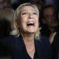
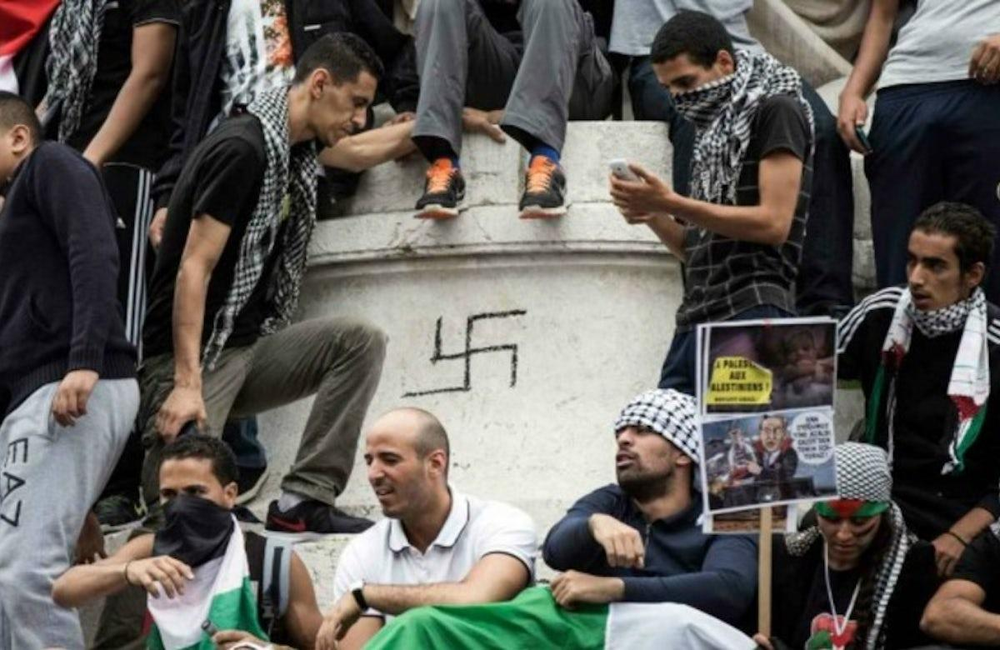

## Claim
Claim: " This image shows the 'French' Left who is rioting against Le Pen's victory in the first round of the French parliamentary elections in 2024."

## Actions
```
web_search("French parliamentary elections 2024 Le Pen")
image_search("protest Palestine swastika")
```

## Evidence
### Evidence from `web_search`
The NPR article ([Source](https://www.npr.org/2024/07/01/nx-s1-5025215/france-elections-2024-analysis)) discusses the first round of the 2024 French legislative elections, where Marine Le Pen's National Rally party won with 33.15% of the vote. The New Popular Front came in second with 28.14%. The Economist ([Source](https://www.economist.com/interactive/france-elections-2024-polls-macron-le-pen)) also reports on the 2024 French parliamentary elections, mentioning Marine Le Pen's National Rally (RN) and the New Popular Front (NFP).

Politico ([Source](https://www.politico.eu/article/france-legislative-election-2024-second-round-front-populaire-jean-luc-melenchon-raphael-glucksmann-shock-victory/)) reports that the left-wing alliance won the most seats in the 2024 French legislative election, dealing a blow to Marine Le Pen's far-right party. The election results show the NFP with 188 seats, ENS with 161 seats, and RN with 142 seats. , 


### Evidence from `image_search`
The Independent published an article about a protest in Times Square, which included an image of protesters holding Palestinian flags and a sign with a swastika (). The Ottawa Citizen reports on a police investigation after a swastika was spotted at a Gaza protest ().


## Elaboration
The evidence confirms that Marine Le Pen's party participated in the 2024 French parliamentary elections. The New Popular Front, a left-wing alliance, won the most seats in the election. The image search results show that swastikas have appeared at protests related to Palestine.

The claim states that the image shows the "French" Left rioting against Le Pen's victory. However, the evidence does not confirm that the image depicts a protest in France or that the people in the image are rioting. The image contains a swastika, which has been associated with protests related to Palestine.

Therefore, the claim is not supported by the evidence. More information is needed to verify the claim.


## Actions
```
reverse_search()
```

## Evidence
### Evidence from `reverse_search`
The reverse image search found the image in a Vanity Fair article from July 2015, discussing rising antisemitism in France and a pro-Palestinian demonstration in Paris on July 26, 2014, where a swastika was painted on the Statue de la République. The image was also found in a World Jewish Congress article from June 19, 2017, about a German TV documentary on European anti-Semitism. The Jerusalem Post published an article by Adam Milstein on July 27, 2023, discussing antisemitism in Europe, which also included the image. All sources mention the image depicts a protest with a swastika. (, <image:546154>)


## Elaboration
The reverse image search confirms that the image depicts a pro-Palestinian demonstration in Paris from July 26, 2014, where a swastika was painted on the Statue de la République. This contradicts the claim that the image is related to the 2024 French parliamentary elections. The image is from 2014, not 2024.


## Final Judgement
The image is from a 2014 pro-Palestinian demonstration in Paris, not a protest related to the 2024 French elections. The claim is therefore inaccurate. `false`

### Verdict: FALSE

### Justification
The image depicts a pro-Palestinian demonstration in Paris from July 26, 2014, as confirmed by a reverse image search, which contradicts the claim that it is related to the 2024 French parliamentary elections. The image predates the election by a decade and is unrelated to the event.
