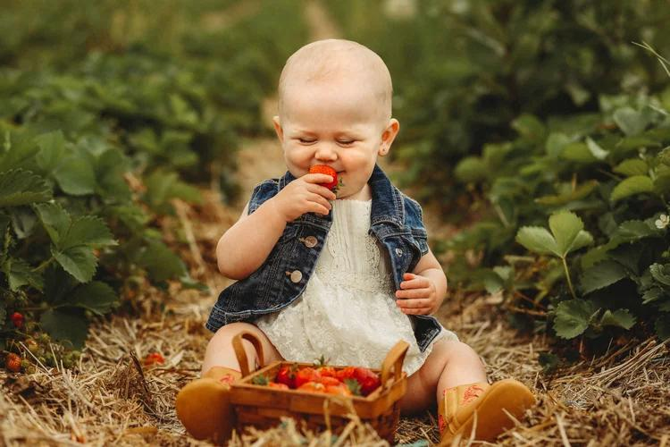
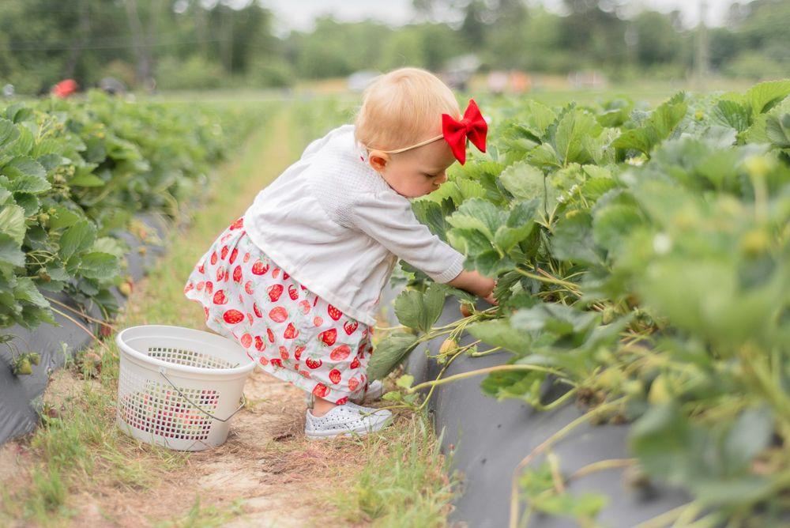

## Claim
Claim: " This image shows the youngest victim of the Hezbollah rocket that murdered 12 children playing soccer in Israel on July 27, 2024."

## Actions
```
reverse_search()
web_search("Hezbollah rocket Israel July 27 2024")
```

## Evidence
### Evidence from `reverse_search`
The Anadolu Agency fact-checked the claim that the image 

### Evidence from `web_search`
The search results include a Wikipedia article about the timeline of the Israel–Hezbollah conflict from July 27, 2024, to September 16, 2024, which mentions a Hezbollah rocket striking a soccer field in Majdal Shams on July 27, 2024, killing 12 children. The image 

## Elaboration
The Anadolu Agency fact-checked the image. The search results confirm that a Hezbollah rocket did strike a soccer field in Israel on July 27, 2024, killing 12 children.

I need to determine if the image is related to the event. The evidence does not provide information about the image's origin or connection to the event.

Insufficient information to verify the claim.


## Actions
```
image_search("Malak baby strawberry field")
```

## Evidence
### Evidence from `image_search`
The search results include images of babies in strawberry fields. One image is from [Allie Liko Photography](https://www.allielikophotography.com/new-fullsessions/blog-3)  and another is from [Sarah Marchwiany Photography](https://www.sarahmarchwianyphotography.com/blog/strawberry-picking-in-the-triad/) .


## Elaboration
The image search results show that babies are photographed in strawberry fields. This suggests that the image 

## Final Judgement
The fact-check reveals that the image is of a baby in a strawberry field. While a Hezbollah rocket did strike a soccer field in Israel on July 27, 2024, killing 12 children, there is no evidence to connect the image to this event.

The claim is demonstrably false because the image is not related to the event described. `false`

### Verdict: FALSE

### Justification
The claim is demonstrably false. While a Hezbollah rocket did strike a soccer field in Israel on July 27, 2024, killing 12 children, the image in question is of a baby in a strawberry field, and there is no evidence to connect the image to the event.
