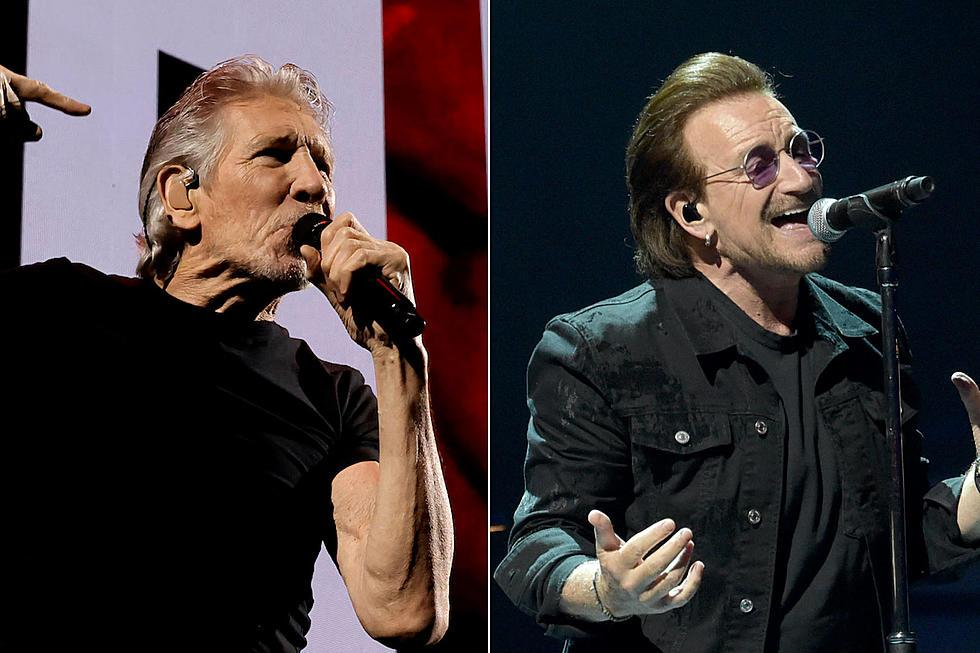

## Claim
Claim: "In November 2024, rock band U2 and singer Bob Geldof announced a multi-stadium tour to aid the Israeli army."

## Actions
```
web_search("U2 Bob Geldof tour Israeli army November 2024")
```

## Evidence
### Evidence from `web_search`
The Wikipedia page for Bob Geldof mentions his work with U2's Bono for debt relief in developing countries and that in November 2014, Geldof announced a new Band Aid project. <image:k> The Dublin Live article, published on November 3, 2024, discusses Mary Coughlan criticizing Bono and Bob Geldof for their silence on the situation in Gaza.

*   [https://en.wikipedia.org/wiki/Bob\_Geldof](https://en.wikipedia.org/wiki/Bob_Geldof)
*   [https://www.dublinlive.ie/news/celebs/music-legend-hits-out-bono-30287394](https://www.dublinlive.ie/news/celebs/music-legend-hits-out-bono-30287394)


## Elaboration
1.  The evidence indicates that Bob Geldof and Bono (U2's lead singer) have collaborated on projects, but there is no mention of a tour in November 2024.
2.  The Dublin Live article from November 2024 discusses criticism of Bono and Geldof regarding their silence on the situation in Gaza, which contradicts the claim of a tour to aid the Israeli army.
3.  The evidence does not support the claim. The information is missing about a tour in November 2024.


## Actions
```
web_search("U2 Bob Geldof tour Israeli army")
```

## Evidence
### Evidence from `web_search`
From [Source](https://loudwire.com/roger-waters-calls-out-u2-bono-israel-tribute/): 
Content: The Loudwire article discusses Roger Waters' criticism of Bono for a tribute to the victims of the Hamas-led attack in Israel.  The article does not mention a tour by U2 and Bob Geldof to aid the Israeli army.


## Elaboration
The evidence does not support the claim. The Loudwire article discusses Roger Waters' criticism of Bono for a tribute to the victims of the Hamas-led attack in Israel, but it does not mention a tour by U2 and Bob Geldof to aid the Israeli army.


## Final Judgement
The search results do not provide any evidence to support the claim that U2 and Bob Geldof announced a multi-stadium tour to aid the Israeli army in November 2024. The evidence suggests that Bono and Geldof have been involved in other projects, and there is criticism of Bono's actions related to Israel, but no mention of the claimed tour.

`false`

### Verdict: FALSE

### Justification
The claim is unsubstantiated. While there is evidence of collaborations between Bono and Bob Geldof, and criticism of Bono's actions related to Israel, the search results from [Wikipedia](https://en.wikipedia.org/wiki/Bob_Geldof) and [Dublin Live](https://www.dublinlive.ie/news/celebs/music-legend-hits-out-bono-30287394) do not mention a tour in November 2024. Furthermore, a Loudwire article discusses Roger Waters' criticism of Bono, but not the claimed tour.
