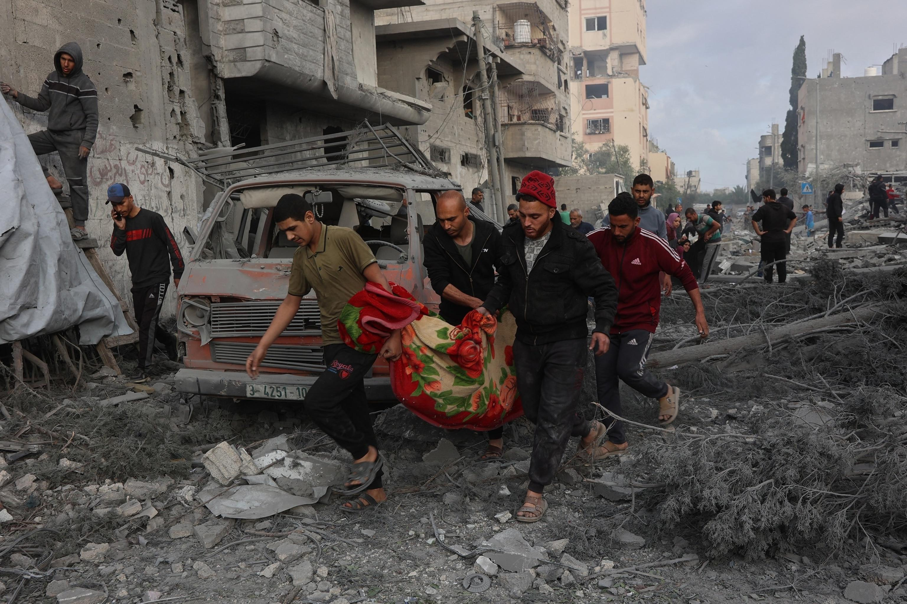
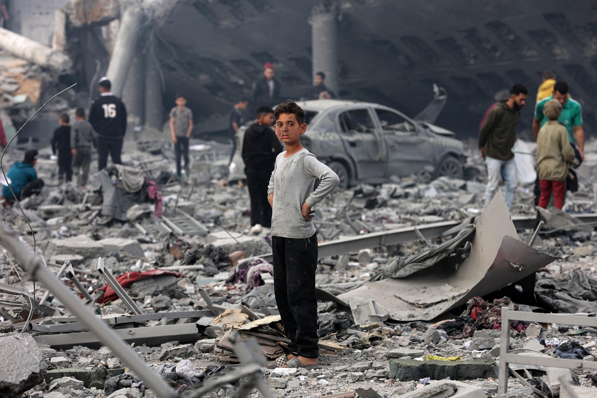

## Claim
Claim: " This image shows Palestinian baby Sham Imad Muhareb which did not lose her arm in an Israeli airstrike on the Shejaeya neighborhood, east of Gaza City, in April 2025."

## Actions
```
web_search("Palestinian baby Sham Imad Muhareb")
web_search("Shejaeya neighborhood Gaza City airstrike April 2025")
```

## Evidence
### Evidence from `web_search`
From [Source](https://www.un.org/unispal/wp-content/uploads/2025/04/196-20250428-ora-01-00-bi.pdf): 
Content: The UN.org document mentions baby Sham Muhareb, whose arm was amputated following a strike on her home.


### Evidence from `web_search`
The provided web sources discuss the April 2025 Israeli airstrikes in the Shejaeya neighborhood of Gaza City. One source, a Wikipedia article, mentions an airstrike on April 9, 2025, that resulted in over 35 Palestinian deaths and at least 70 injuries in a four-story residential building. Another source, a BBC News article published on April 9, 2025, reports on an Israeli air strike on a residential building in the Shejaiya neighborhood of Gaza City, which resulted in the deaths of at least 29 Palestinians, including children. , .

An ABC News article from April 4, 2025, discusses the expansion of Israeli ground operations in the Shejaiya area. , . The ABC News article also mentions an Israeli airstrike on a school in the nearby Tuffah neighborhood of Gaza City on April 4, 2025.

*   [https://en.wikipedia.org/wiki/April\_2025\_Shuja%27iyya\_airstrike](https://en.wikipedia.org/wiki/April_2025_Shuja%27iyya_airstrike)
*   [https://www.bbc.com/news/articles/cy5rrnzw0kwo](https://www.bbc.com/news/articles/cy5rrnzw0kwo)
*   [https://abcnews.go.com/International/israel-expands-ground-operations-north-gaza-after-deadly/story?id=120481080](https://abcnews.go.com/International/israel-expands-ground-operations-north-gaza-after-deadly/story?id=120481080)


## Elaboration
The evidence indicates that baby Sham Muhareb's arm was amputated following a strike on her home. The claim states that the baby did not lose her arm. Therefore, the claim is false.


## Final Judgement
The search results confirm that baby Sham Muhareb's arm was amputated. The claim states that the baby did not lose her arm.

`false`

### Verdict: FALSE

### Justification
The claim is false. According to a UN document, baby Sham Muhareb's arm was amputated following a strike on her home, contradicting the claim that she did not lose her arm.
