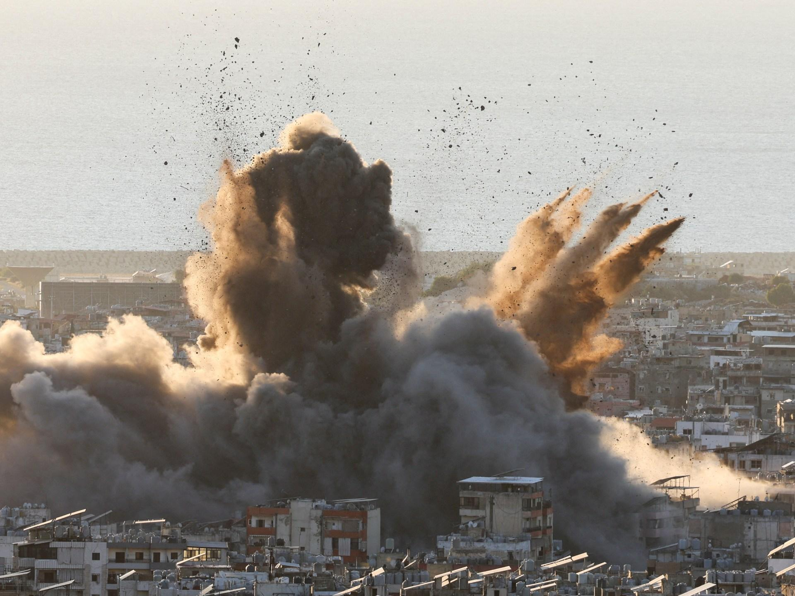
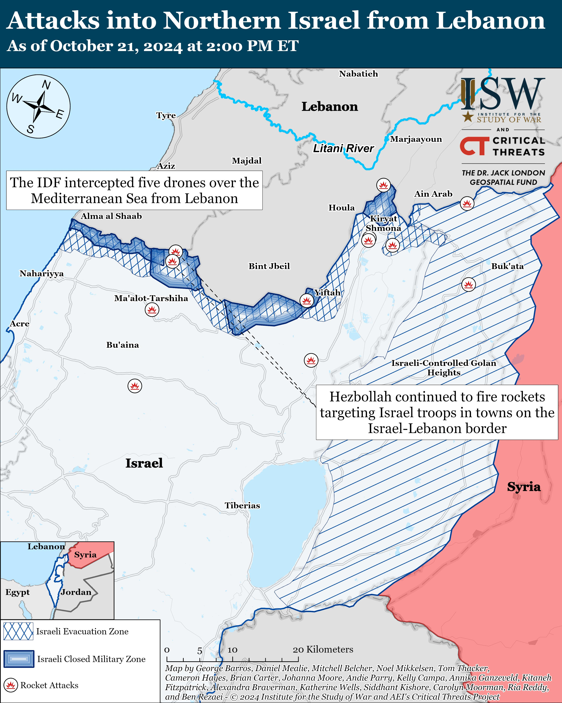

## Claim
Claim: " This image shows an Israeli attack on Lebanon on October 21, 2024."

## Actions
```
web_search("Israeli attack Lebanon October 21 2024")
image_search("Israeli attack Lebanon October 21 2024")
reverse_search()
```

## Evidence
### Evidence from `web_search`
The CNN article ([https://www.cnn.com/world/live-news/israel-iran-lebanon-gaza-war-10-21-24-intl-hnk](https://www.cnn.com/world/live-news/israel-iran-lebanon-gaza-war-10-21-24-intl-hnk)) discusses the ongoing conflict between Israel and Hezbollah, including an Israeli strike near Rafik Hariri University Hospital in Beirut on October 21, 2024. The Wikipedia article ([https://en.wikipedia.org/wiki/2024_Israeli_invasion_of_Lebanon](https://en.wikipedia.org/wiki/2024_Israeli_invasion_of_Lebanon)) details the 2024 Israeli invasion of Lebanon, which began on October 1, 2024, and mentions a bomb that hit a residential building on October 21, 2024.

The Guardian article ([https://www.theguardian.com/world/2024/oct/21/israeli-airstrikes-on-lebanon-hit-branches-of-hezbollah-linked-bank-al-qard-al-hassan](https://www.theguardian.com/world/2024/oct/21/israeli-airstrikes-on-lebanon-hit-branches-of-hezbollah-linked-bank-al-qard-al-hassan)) reports on Israeli airstrikes on Lebanon on October 21, 2024, targeting branches of the Hezbollah-linked bank Al-Qard Al-Hassan, with strikes in the southern suburbs of Beirut, south Lebanon, and the Bekaa valley. 


### Evidence from `image_search`
Al Jazeera published an article on October 21, 2024, about the US seeking an end to the war in Lebanon, including an image of an explosion over a city (). The Institute for the Study of War (ISW) published a map showing attacks into Northern Israel from Lebanon as of October 21, 2024 ().

Le Monde reports on an Israeli attack on October 21, 2024 ().


### Evidence from `reverse_search`
The image 

## Elaboration
The evidence confirms that there were Israeli attacks on Lebanon on October 21, 2024. The CNN, Guardian, and Le Monde articles, along with the image search results, support this. The image search also provided other images of explosions over cities, which is consistent with the claim.

The reverse image search did not provide any additional information.

Based on the evidence, the claim is likely true.


## Final Judgement
The claim is supported by multiple sources that confirm Israeli attacks on Lebanon on October 21, 2024. The image search also provided images of explosions over cities, which is consistent with the claim. Therefore, the claim is factually accurate. `true`

### Verdict: TRUE

### Justification
Multiple sources, including CNN ([https://www.cnn.com/world/live-news/israel-iran-lebanon-gaza-war-10-21-24-intl-hnk](https://www.cnn.com/world/live-news/israel-iran-lebanon-gaza-war-10-21-24-intl-hnk)) and The Guardian ([https://www.theguardian.com/world/2024/oct/21/israeli-airstrikes-on-lebanon-hit-branches-of-hezbollah-linked-bank-al-qard-al-hassan](https://www.theguardian.com/world/2024/oct/21/israeli-airstrikes-on-lebanon-hit-branches-of-hezbollah-linked-bank-al-qard-al-hassan)), confirm Israeli attacks on Lebanon on October 21, 2024. The image search also yielded images of explosions over cities, supporting the claim.
