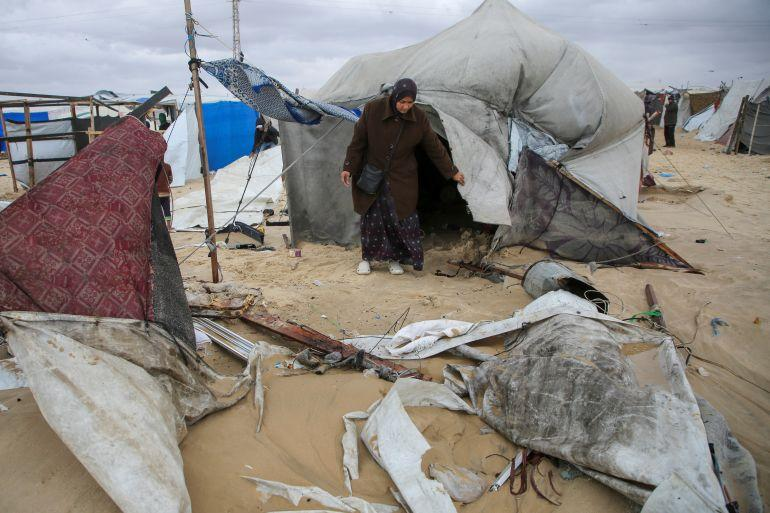

## Claim
Claim: " This image shows a Palestinian woman using an Israeli tank to dry clothes in Gaza in July 2024."

## Actions
```
reverse_search()
web_search("Israeli tank Gaza drying clothes")
```

## Evidence
### Evidence from `web_search`
The Reuters article from March 28, 2024, discusses Israeli soldiers posting photos and videos with lingerie found in Palestinian homes in Gaza (). The BBC reports on the ongoing conflict in Gaza, including the presence of Israeli tanks near hospitals and the impact on civilians (, ). An Al Jazeera article from February 24, 2025, reports on the entry of Israeli tanks into Jenin in the occupied West Bank (<image:i>). None of the articles contain the image in the claim.

*   [https://www.reuters.com/world/middle-east/israeli-soldiers-play-with-gaza-womens-underwear-online-posts-2024-03-28/](https://www.reuters.com/world/middle-east/israeli-soldiers-play-with-gaza-womens-underwear-online-posts-2024-03-28/)
*   [https://www.aljazeera.com/news/2025/2/24/israeli-tanks-roll-jenin-palestinians-prepare-lengthy-invasion](https://www.aljazeera.com/news/2025/2/24/israeli-tanks-roll-jenin-palestinians-prepare-lengthy-invasion)
*   [https://www.bbc.co.uk/news/live/world-middle-east-67400490?page=6](https://www.bbc.co.uk/news/live/world-middle-east-67400490?page=6)


## Elaboration
The evidence does not contain the image in the claim. The search results mention the presence of Israeli tanks in Gaza and the West Bank, and the impact of the conflict on civilians. However, there is no information to verify the claim that the image shows a Palestinian woman using an Israeli tank to dry clothes in Gaza in July 2024.


## Actions
```
image_search("tank drying clothes Gaza")
```

## Evidence
### Evidence from `image_search`
From [Source](https://www.aljazeera.com/news/2024/11/25/flooding-in-gaza-compounds-hardship-of-people-displaced-by-israeli-attacks): 
Content: Al Jazeera published an article on November 25, 2024, about flooding in Gaza, which includes an image of a woman near a tent. 


## Elaboration
The evidence from the image search does not contain the image in the claim. The search results mention flooding in Gaza and show an image of a woman near a tent. There is no information to verify the claim.


## Actions
```
web_search("tank drying clothes Gaza conflict")
```

## Evidence
### Evidence from `web_search`
The Asharq Al-Awsat article from August 18, 2024, discusses the difficulties Gazans face in obtaining clothing due to the ongoing conflict, including the lack of clothing and the impact on the textile industry. The article includes an image of Palestinians waiting for a cobbler to repair their shoes in Khan Younis on July 5, 2024 (). The New Yorker article from November 6, 2023, discusses the Israeli-Gaza conflict, mentioning the presence of tanks and the impact on civilians, and includes an image of a Hamas fighter outside a burned home near the border with Gaza ().


## Elaboration
The evidence does not contain the image in the claim. The search results mention the difficulties Gazans face in obtaining clothing due to the ongoing conflict, and the presence of tanks. However, there is no information to verify the claim that the image shows a Palestinian woman using an Israeli tank to dry clothes in Gaza in July 2024.


## Final Judgement
The search results did not yield any evidence to support the claim. The image was not found in any of the search results. The articles discuss the conflict in Gaza, the presence of tanks, and the impact on civilians, but none of them contain the image in the claim.

`false`

### Verdict: FALSE

### Justification
The provided evidence, including web and image searches, does not contain the image in the claim and fails to corroborate the assertion that the image depicts a Palestinian woman using an Israeli tank to dry clothes in Gaza in July 2024. The search results discuss the conflict in Gaza, the presence of tanks, and the impact on civilians, but do not support the claim.
