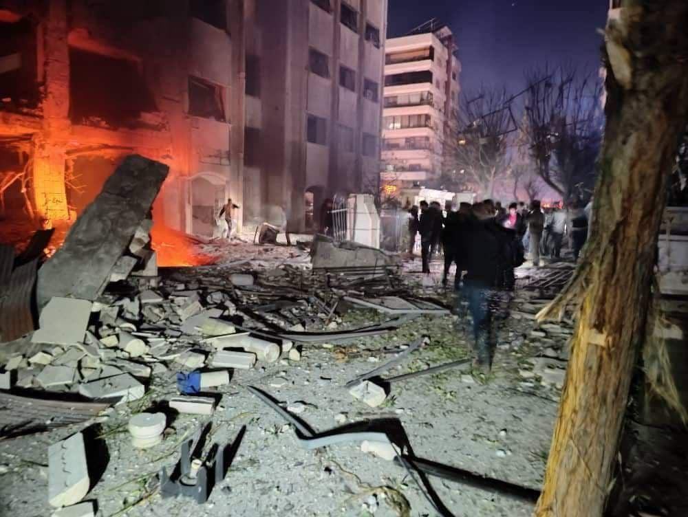

## Claim
Claim: " This image shows Israel bombing the surroundings of Southern Damascus in February 2025, destroying its last remaining army depots."

## Actions
```
reverse_search()
web_search("Israel bombing Damascus February 2025")
```

## Evidence
### Evidence from `reverse_search`
The reverse image search found the image  on two websites. One source is an interview with journalist Mohammad Al-Owaid by Daraa 24, discussing the media landscape in Syria after the fall of the regime. The article was published on the Daraa 24 website. ([https://daraa24.org/%D8%A7%D9%84%D8%B5%D8%AD%D9%81%D9%8A-%D9%85%D8%AD%D9%85%D8%AF-%D8%A7%D9%84%D8%B9%D9%88%D9%8A%D8%AF-%D9%81%D9%8A-%D9%85%D9%82%D8%A7%D8%A8%D9%84%D8%A9-%D9%85%D8%B9-%D8%AF%D8%B1%D8%B9%D8%A7-24/](https://daraa24.org/%D8%A7%D9%84%D8%B5%D8%AD%D9%81%D9%8A-%D9%85%D8%AD%D9%85%D8%AF-%D8%A7%D9%84%D8%B9%D9%88%D9%8A%D8%AF-%D9%81%D9%8A-%D9%85%D9%82%D8%A7%D8%A8%D9%84%D8%A9-%D9%85%D8%B9-%D8%AF%D8%B1%D8%B9%D8%A7-24/)).

The other source from Alghad News reports on an Israeli air attack on Damascus on December 2, 2023. ([https://www.alghad.tv/%D8%A3%D8%AE%D8%A8%D8%A7%D8%B1-%D8%A7%D9%84%D8%BA%D8%AF/news/%D9%88%D8%B2%D8%A7%D8%B1%D8%A9-%D8%A7%D9%84%D8%AF%D9%81%D8%A7%D8%B9-%D8%A7%D9%84%D8%B3%D9%88%D8%B1%D9%8A%D8%A9-%D8%AA%D9%83%D8%B4%D9%81-%D8%AA%D9%81%D8%A7%D8%B5%D9%8A%D9%84-%D8%A7%D9%84%D8%B9%D8%AF%D9%88%D8%A7%D9%86-%D8%A7%D9%84%D8%AC%D9%88%D9%8A-%D8%A7%D9%84%D8%A5%D8%B3%D8%B1%D8%A7%D8%A6%D9%8A%D9%84%D9%8A-%D8%B9%D9%84%D9%89-%D8%AF%D9%85%D8%B4%D9%82](https://www.alghad.tv/%D8%A3%D8%AE%D8%A8%D8%A7%D8%B1-%D8%A7%D9%84%D8%BA%D8%AF/news/%D9%88%D8%B2%D8%A7%D8%B1%D8%A9-%D8%A7%D9%84%D8%AF%D9%81%D8%A7%D8%B9-%D8%A7%D9%84%D8%B3%D9%88%D8%B1%D9%8A%D8%A9-%D8%AA%D9%83%D8%B4%D9%81-%D8%AA%D9%81%D8%A7%D8%B5%D9%8A%D9%84-%D8%A7%D9%84%D8%B9%D8%AF%D9%88%D8%A7%D9%86-%D8%A7%D9%84%D8%AC%D9%88%D9%8A-%D8%A7%D9%84%D8%A5%D8%B3%D8%B1%D8%A7%D8%A6%D9%8A%D9%84%D9%8A-%D8%B9%D9%84%D9%89-%D8%AF%D9%85%D8%B4%D9%82)).


### Evidence from `web_search`
According to a Wikipedia article, the "Israeli invasion of Syria (2024–present)" began in December 2024, with extensive aerial and naval strikes, and mentions the destruction of Syrian military capabilities. Al Jazeera reports that Israel conducted air raids targeting military bases and command centers in southern Syria and outside Damascus on February 26, 2025, hitting the town of Kiswa and the province of Deraa. The Guardian also reported on Israeli airstrikes on military targets in southern Syria, including Kiswah, after the fall of the Assad regime.

The Guardian article mentions that the strikes occurred after the fall of the Assad regime and that Israel's foreign minister called the new rulers of Syria a "jihadist, Islamist terror group". The article is more than 5 months old. The Wikipedia article also mentions the "2025 massacres of Syrian Alawites" and "2025 massacres of Syrian Druze".


## Elaboration
The reverse image search indicates that the image has been used in the context of an interview about the media landscape in Syria and in a report about an Israeli air attack on Damascus on December 2, 2023. The web search reveals that Israel conducted air raids targeting military bases and command centers in southern Syria and outside Damascus on February 26, 2025, hitting the town of Kiswa and the province of Deraa.

Based on the evidence, the claim that the image shows Israel bombing the surroundings of Southern Damascus in February 2025 is plausible. However, the evidence does not explicitly confirm that the image depicts the specific event described in the claim.

Further information is needed to confirm the exact location and date of the bombing depicted in the image.


## Actions
```
image_search("Israel airstrike Damascus February 2025")
```

## Evidence
### Evidence from `image_search`
From [Source](https://www.timesofisrael.com/syrian-media-several-dead-in-israeli-strike-on-damascus-residential-area/): 
Content: The Times of Israel published an article about an Israeli strike on a residential area in Damascus. The article includes an image  of the aftermath of the strike.


## Elaboration
The image search found an image of an Israeli strike on a residential area in Damascus. This new evidence does not provide any information about the image in the claim.

The claim remains unverified due to the lack of evidence directly linking the image to the specific event described.


## Actions
```
web_search("Israel strikes Syria February 2025 image")
```

## Evidence
### Evidence from `web_search`
From [Source](https://www.reuters.com/world/middle-east/low-airplanes-series-blasts-heard-syrian-capital-witnesses-say-2025-02-25/): 
Content: Reuters reports that on February 25, 2025, Israeli warplanes hit a town south of Syria's capital and the southern province of Daraa. The article mentions strikes on Kisweh, approximately 20 kilometers south of Damascus. The Israeli military stated that it attacked military targets in southern Syria. The article was written by Timour Azhari, Khalil Ashawi, and Mahmoud Hasano in Damascus, Seteven Scheer in Jerusalem and Jaidaa Taha in Cairo. The article was published on February 25, 2025.


## Elaboration
The Reuters article confirms that Israel conducted strikes in southern Syria, including Kisweh, on February 25, 2025. This aligns with the claim's timeframe and general location. However, the evidence still does not confirm that the image depicts the specific event described in the claim.

The claim remains unverified.


## Final Judgement
The image has been used in the context of an interview about the media landscape in Syria and in a report about an Israeli air attack on Damascus on December 2, 2023. The web search reveals that Israel conducted air raids targeting military bases and command centers in southern Syria and outside Damascus on February 26, 2025, hitting the town of Kiswa and the province of Deraa. The Reuters article confirms that Israel conducted strikes in southern Syria, including Kisweh, on February 25, 2025. However, the evidence does not explicitly confirm that the image depicts the specific event described in the claim.

The claim is not factually accurate because the evidence does not confirm that the image depicts the specific event described in the claim. `false`

### Verdict: FALSE

### Justification
The claim is not supported by the evidence. While there were Israeli strikes in southern Syria in February 2025, including Kisweh ([Reuters](https://www.reuters.com/world/middle-east/low-airplanes-series-blasts-heard-syrian-capital-witnesses-say-2025-02-25/)), the image's origin and connection to the specific event described in the claim remain unverified. The image has been used in other contexts, such as an interview about the media landscape in Syria and a report about an Israeli air attack on Damascus on December 2, 2023.
