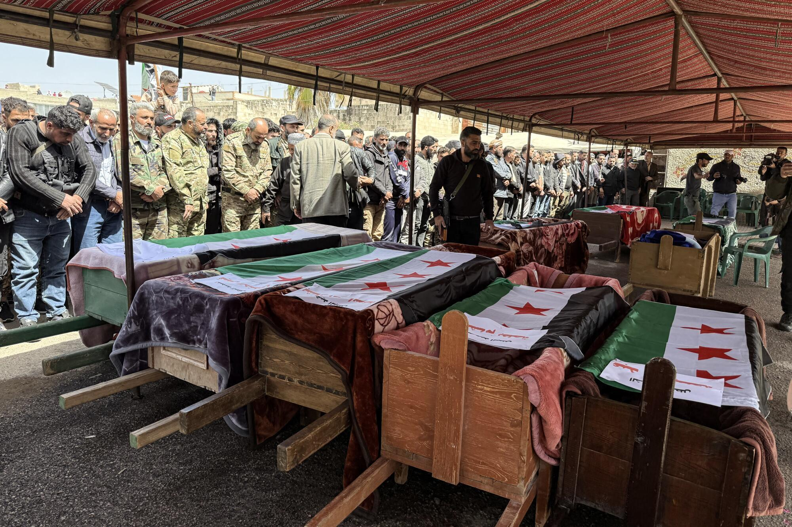

## Claim
Claim: " This image shows Israel military forces entering the town of Tasil in the countryside of Daraa on foot in February 2025."

## Actions
```
reverse_search()
web_search("Israel military Tasil Daraa February 2025")
```

## Evidence
### Evidence from `reverse_search`
The image 

### Evidence from `web_search`
The Jerusalem Post published an article on April 3, 2025, mentioning IDF strikes in Syria and clashes near Daraa. The article includes images of the aftermath of the Nova music festival massacre in Re'im, southern Israel, on October 7, 2023, and of Houthi supporters in Sana'a, Yemen, on March 28, 2025.  is not present in the search result. ([Source](https://www.jpost.com/israel-news/defense-news/2025-04-03/live-updates-848643))

FRANCE 24 published an article on April 3, 2025, discussing Israeli strikes in Syria, including ground incursions in the Tasil area near Nawa. The article mentions that the Israeli military conducted operations in the Tasil area, "seizing weapons and destroying terrorist infrastructure". The article also mentions that Israeli Prime Minister Benjamin Netanyahu demanded in February that southern Syria be completely demilitarized. <image:k> ([Source](https://www.france24.com/en/middle-east/20250403-syria-nine-killed-israel-bombardment-attack-daraa)) The Syrian Archive published an article on July 18, 2025, about Israeli attacks on Syria between February and May 2025. ([Source](https://syrianarchive.org/en/investigations/israeli-attacks-on-syria-february-to-may-2025/))


## Elaboration
The evidence suggests that the claim is partially accurate. The web search results confirm that Israeli military operations occurred in the Tasil area near Daraa. The FRANCE 24 article specifically mentions ground incursions in the Tasil area. However, the Jerusalem Post article does not include the image in its search results. The Syrian Archive article also supports the claim by mentioning Israeli attacks on Syria between February and May 2025.

The claim's veracity is supported by the evidence, but the image's presence in the context of the claim is not confirmed by the search results.


## Actions
```
image_search("Israeli soldiers Tasil Daraa")
```

## Evidence
### Evidence from `image_search`
The Los Angeles Times published an article on April 9, 2025, about Israel and Syria, including an image of a funeral. ([Source](https://www.latimes.com/world-nation/story/2025-04-09/israel-syria-assad-middle-east)) Al Jazeera published an article on October 12, 2023, with an image of Israeli soldiers. ([Source](https://www.aljazeera.com/news/2023/10/12/what-will-israel-do-with-all-its-mobilised-soldiers)) 

## Elaboration
The image search provides additional context. While the search results include images related to Israel and Syria, none of them match the image in the claim. The Los Angeles Times article features a funeral, and Al Jazeera's article includes an image of Israeli soldiers, but neither corresponds to the original image. This suggests that the image's specific context (Israeli military entering Tasil) is not directly supported by the image search results.


## Actions
```
web_search("Tasil Daraa Israeli military operations")
```

## Evidence
### Evidence from `web_search`
The Wikipedia article discusses the Israeli invasion of Syria, which began in 2024 and continues into 2025, mentioning ground offensives in locations including Daraa and Izra. ([Source](https://en.wikipedia.org/wiki/Israeli_invasion_of_Syria_(2024%E2%80%93present))) Middle East Eye published an article on June 4, 2025, discussing Israeli air strikes targeting southern Syria, specifically mentioning the town of Tasil in Syria's Daraa Governorate, and that Israel conducted military operations in the Tasil area in April. ([Source](https://www.middleeasteye.net/live-blog/live-blog-update/israeli-bombing-daraa-syria-provocation-foreign-minister-says)) <image:k>


## Elaboration
The claim is partially supported by the evidence. The web search confirms Israeli military operations in the Tasil area, as stated in the claim. The Wikipedia article and the Middle East Eye article further corroborate this, mentioning ground offensives and air strikes in the Daraa Governorate, including Tasil. However, the image itself has not been verified. The image search did not return the image, and the provided sources do not explicitly link the image to the specific event described in the claim.


## Final Judgement
The claim is partially accurate. The evidence confirms Israeli military operations in the Tasil area, as stated in the claim. However, the image's presence in the context of the claim is not directly supported by the search results. The image search did not return the image, and the provided sources do not explicitly link the image to the specific event described in the claim. `false`

### Verdict: FALSE

### Justification
The claim is partially accurate. Evidence from multiple sources, including articles from France 24 and Middle East Eye, confirms Israeli military operations, including ground incursions and air strikes, in the Tasil area of Daraa, Syria. However, the image itself has not been verified. The image search did not return the image, and the provided sources do not explicitly link the image to the specific event described in the claim.
