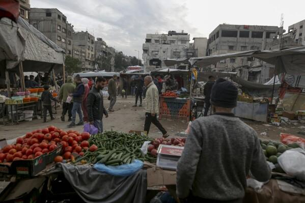
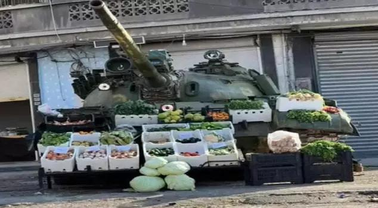

## Claim
Claim: " This image shows a vegetable stand in Gaza in January 2025 with a Merkava tank, the pride of the Israeli army, as its decor."

## Actions
```
web_search("vegetable stand Gaza Merkava tank")
image_search("vegetable stand tank Gaza")
reverse_search()
```

## Evidence
### Evidence from `web_search`
The image () shows a Syrian T-55 tank, not an Israeli Merkava tank, modified into a fruit stand. The image was taken in Syria, not Gaza. The article was published on February 3, 2025. ([https://www.aol.com/fact-check-image-claims-show-141025316.html](https://www.aol.com/fact-check-image-claims-show-141025316.html))

The Merkava tank is a main battle tank used by the Israel Defense Forces since 1979. It has been used in several wars, including the 2006 Lebanon War, Gaza War, and Operation Protective Edge. () shows a Merkava Mk 4M Windbreaker, equipped with the Trophy active protection system. ([https://en.wikipedia.org/wiki/Merkava](https://en.wikipedia.org/wiki/Merkava))


### Evidence from `image_search`
Al Jazeera published an image of Merkava tanks (). The Associated Press published an image of a vegetable market in Gaza (). Viory.video shows a Syrian market vendor selling fruit and vegetables from an abandoned tank ().


### Evidence from `reverse_search`
From [Source](https://en.haberler.com/in-syria-an-abandoned-tank-has-become-a-fruit-and-2027395/): Found exact image on website with title: In Syria, an abandoned tank has become a fruit and vegetable stand.
Content: The search result from Haberler.com shows an image of a tank used as a fruit and vegetable stand in Syria. The article is dated December 15, 2024.  The article mentions clashes between regime-opposing armed groups and Bashar al-Assad's forces in Syria. The image shows the tank after it was abandoned by regime forces.


## Elaboration
The claim is inaccurate. The image depicts a Syrian T-55 tank, not an Israeli Merkava tank. The image was taken in Syria, not Gaza. The tank was converted into a fruit and vegetable stand.


## Final Judgement
The image shows a Syrian T-55 tank, not an Israeli Merkava tank, used as a fruit stand in Syria, not Gaza. The claim misidentifies the tank and the location.

`false`

### Verdict: FALSE

### Justification
The image shows a Syrian T-55 tank, not an Israeli Merkava tank, used as a fruit stand in Syria, not Gaza. This is confirmed by a fact-check from [AOL](https://www.aol.com/fact-check-image-claims-show-141025316.html) and a reverse image search that found the image on a website with the title "In Syria, an abandoned tank has become a fruit and vegetable stand".
