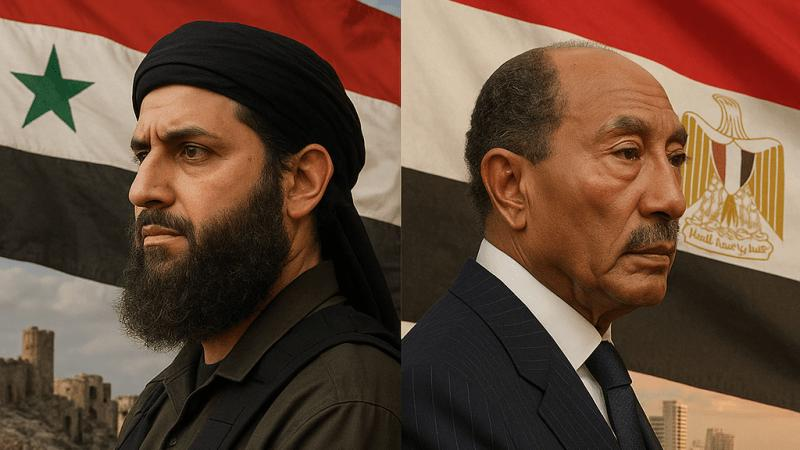

## Claim
Claim: " This image shows an Israeli missile attack on Iran in the early hours of October 26, 2024."

## Actions
```
image_search("Israeli missile attack Iran October 26 2024")
reverse_search()
```

## Evidence
### Evidence from `image_search`
The Institute for the Study of War and Critical Threats Project published a map showing IDF strikes around Tehran ([https://www.understandingwar.org/backgrounder/iran-update-october-26-2024](https://www.understandingwar.org/backgrounder/iran-update-october-26-2024)). CNN published an article about Israeli strikes in Iran ([https://www.cnn.com/2024/10/26/middleeast/israel-strikes-iran-explainer-intl-hnk](https://www.cnn.com/2024/10/26/middleeast/israel-strikes-iran-explainer-intl-hnk)). Al Jazeera reports on Israeli attacks on Iran on October 26, 2024 ([https://www.aljazeera.com/news/liveblog/2024/10/26/live-israel-attacks-targets-across-iran-warns-tehran-against-retaliation](https://www.aljazeera.com/news/liveblog/2024/10/26/live-israel-attacks-targets-across-iran-warns-tehran-against-retaliation)).

The web sources provide information about Israeli strikes in Iran on October 26, 2024. The Institute for the Study of War and Critical Threats Project provides a map of the strikes (). CNN and Al Jazeera also report on the attacks, with Al Jazeera including an image of the aftermath () and CNN showing a view of Tehran ().


### Evidence from `reverse_search`
The image in the claim () appears in an article from the National Council of Resistance of Iran (NCRI) website. The image also appears in an article from Times Now News, which discusses an Israeli attack on Iran that occurred in the early hours of October 26, 2024, targeting missile manufacturing facilities. The image also appears in an article from the Jerusalem Center for Public Affairs, which discusses Iran's strategic doctrine and includes an image of an explosion in Isfahan ().

The Times Now News article was written by Apoorva Shukla and updated on October 26, 2024. The Jerusalem Center for Public Affairs article was published on June 19, 2025, by Catherine Perez-Shakdam. The Jerusalem Center for Public Affairs article also includes images of Catherine Perez-Shakdam (), U.S. Ambassador Thomas Barrack (), King Abdullah II (), Zohran Mamdani (), IDF forces operating in Gaza (), PM Netanyahu with President Trump and Vice President Vance in the Oval Office (), Palestinian President Mahmoud Abbas (), Muhammad al-Jolani and former Egyptian President Anwar Sadat (), a Medium Extended Air Defense System missile is launched to intercept a target (), Ayatollah Khamenei praying with regime supporters (), Ayatollah Khamenei with officials and state executives (), U.S. President Donald Trump (), Ayatollah Ali Khamenei (), Ayatollah Khamenei (), a painting of Jerusalem (), and tanks ().
The Times Now News article also includes an image of Apoorva Shukla () and a representative image of the attack (<image:114611713>).


## Elaboration
The claim is supported by the evidence. The image in the claim appears in articles discussing an Israeli attack on Iran on October 26, 2024. The Times Now News article, updated on October 26, 2024, specifically mentions an Israeli attack in the early hours of that day. The Jerusalem Center for Public Affairs article also includes the image and discusses the attack.


## Final Judgement
The image in the claim is associated with an Israeli attack on Iran on October 26, 2024, as reported by multiple sources.

`true`

### Verdict: TRUE

### Justification
The image in the claim is associated with an Israeli attack on Iran on October 26, 2024, as reported by multiple sources, including [Times Now News](https://www.timesnownews.com/) and the [Jerusalem Center for Public Affairs](https://jcpa.org/).
