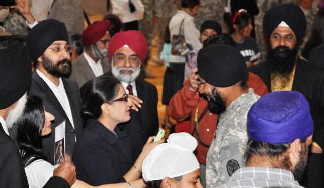

## Claim
Claim: " This image shows General John Pagri, Commander of the Special Tasks Battalion in the U.S. Army, which has died in the Gaza Strip in April 2025."

## Actions
```
reverse_search()
web_search("General John Pagri U.S. Army")
web_search("Special Tasks Battalion U.S. Army")
```

## Evidence
### Evidence from `reverse_search`
From [Source](https://en.wikipedia.org/wiki/File:Two_19th_Group_Special_Forces_Soldiers_in_Babil_Province_Iraq.jpg): Found exact image on website with title: File:Two 19th Group Special Forces Soldiers in Babil Province Iraq.jpg
Content: The image  is found on Wikimedia Commons and is titled "Two 19th Group Special Forces Soldiers in Babil Province Iraq". The image shows two soldiers in Babil Province Iraq in 2007. The image was uploaded on June 21, 2011, and the author is the United States Army. , .


### Evidence from `web_search`
The search results include a biography of Brigadier General John I. Pray Jr. from the Air Force website, detailing his career and role as Director of the White House Situation Room ([https://www.af.mil/About-Us/Biographies/Display/Article/107918/brigadier-general-john-i-pray-jr/](https://www.af.mil/About-Us/Biographies/Display/Article/107918/brigadier-general-john-i-pray-jr/)). Another result from the U.S. Army website discusses the policy regarding Sikh soldiers and their articles of faith, with several images of Sikh soldiers (, , , , ) ([https://www.army.mil/article/36339/sikh_soldiers_allowed_to_serve_retain_their_articles_of_faith](https://www.army.mil/article/36339/sikh_soldiers_allowed_to_serve_retain_their_articles_of_faith)).

Additionally, there is a biography of Brigadier General John J. Campo, who is the Director of the Joint Staff, District of Columbia National Guard, Washington, DC ([https://dc.ng.mil/News/Biographies/Article/1512717/brigadier-general-john-j-campo/](https://dc.ng.mil/News/Biographies/Article/1512717/brigadier-general-john-j-campo/)). The image 

### Evidence from `web_search`
The search results discuss the United States Army Special Operations Command (USASOC), including the 528th Sustainment Brigade, the 75th Ranger Regiment, and the Army Special Operations Aviation Command, but do not mention General John Pagri. [Source](https://en.wikipedia.org/wiki/United_States_Army_Special_Operations_Command) The Special Troops Battalion provides support to Headquarters, United States Army Training and Doctrine Command. [Source](https://www.tradoc.army.mil/specialtroopsbattalion/) The goarmy.com website describes U.S. Army Special Operations, including Army Rangers, Special Forces, Psychological Operations, Civil Affairs, and 160th SOAR. [Source](https://www.goarmy.com/careers-and-jobs/specialty-careers/special-ops)

The provided sources do not mention General John Pagri or his death in the Gaza Strip. <image:i>, <image:j>, <image:k>, <image:l>, <image:m>, 


## Elaboration
The image 

## Final Judgement
The image is of two soldiers in Iraq in 2007. There is no evidence of a General John Pagri, Commander of the Special Tasks Battalion, dying in the Gaza Strip in April 2025.

`false`

### Verdict: FALSE

### Justification
The claim is false. The image depicts soldiers in Iraq in 2007, not General John Pagri. There is no evidence to support the claim that General Pagri died in the Gaza Strip in April 2025. The image was found on Wikimedia Commons and is titled "Two 19th Group Special Forces Soldiers in Babil Province Iraq" ([https://en.wikipedia.org/wiki/File:Two_19th_Group_Special_Forces_Soldiers_in_Babil_Province_Iraq.jpg](https://en.wikipedia.org/wiki/File:Two_19th_Group_Special_Forces_Soldiers_in_Babil_Province_Iraq.jpg)).
