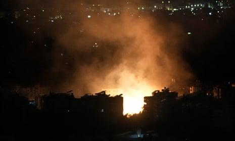

## Claim
Claim: " This is an authentic image of Israel bombing Beirut's International Airport in October 2024."

## Actions
```
reverse_search()
web_search("Beirut International Airport bombing October 2024")
```

## Evidence
### Evidence from `reverse_search`
The image 

### Evidence from `web_search`
The BBC ([https://www.bbc.com/news/articles/c17lpydd842o](https://www.bbc.com/news/articles/c17lpydd842o)) reported on Israeli air strikes on Beirut on October 4, 2024, including near the international airport, with explosions near the airport. NPR ([https://www.npr.org/2024/10/20/nx-s1-5159029/israel-airstrikes-beirut-hezbollahs-financial-lebanon](https://www.npr.org/2024/10/20/nx-s1-5159029/israel-airstrikes-beirut-hezbollahs-financial-lebanon)) reported on October 20, 2024, that Israel launched airstrikes on Beirut. The Guardian ([https://www.theguardian.com/world/live/2024/oct/07/middle-east-crisis-live-updates-israel-hezbollah-strikes-october-7-beirut-lebanon-war-news](https://www.theguardian.com/world/live/2024/oct/07/middle-east-crisis-live-updates-israel-hezbollah-strikes-october-7-beirut-lebanon-war-news)) reported on October 7, 2024, on the ongoing conflict between Israel and Lebanon, mentioning Israeli airstrikes in the southern suburbs of Beirut.

The Guardian article also mentions that the US State Department spokesperson called on Israel not to attack Beirut airport. The image in the claim is credited to Hussein Malla/AP. , , , 


## Elaboration
The evidence confirms that there were Israeli airstrikes near Beirut International Airport in October 2024. The image in the claim is credited to Hussein Malla/AP. Therefore, the image is likely authentic.

The claim is likely true.


## Final Judgement
The evidence confirms that there were Israeli airstrikes near Beirut International Airport in October 2024, and the image is credited to Hussein Malla/AP. This suggests the image is authentic and accurately depicts the events.

`true`

### Verdict: TRUE

### Justification
The claim is supported by evidence of Israeli airstrikes near Beirut International Airport in October 2024, as reported by the BBC ([https://www.bbc.com/news/articles/c17lpydd842o](https://www.bbc.com/news/articles/c17lpydd842o)), NPR ([https://www.npr.org/2024/10/20/nx-s1-5159029/israel-airstrikes-beirut-hezbollahs-financial-lebanon](https://www.npr.org/2024/10/20/nx-s1-5159029/israel-airstrikes-beirut-hezbollahs-financial-lebanon)), and The Guardian ([https://www.theguardian.com/world/live/2024/oct/07/middle-east-crisis-live-updates-israel-hezbollah-strikes-october-7-beirut-lebanon-war-news](https://www.theguardian.com/world/live/2024/oct/07/middle-east-crisis-live-updates-israel-hezbollah-strikes-october-7-beirut-lebanon-war-news)). The image is credited to Hussein Malla/AP, indicating its authenticity.
